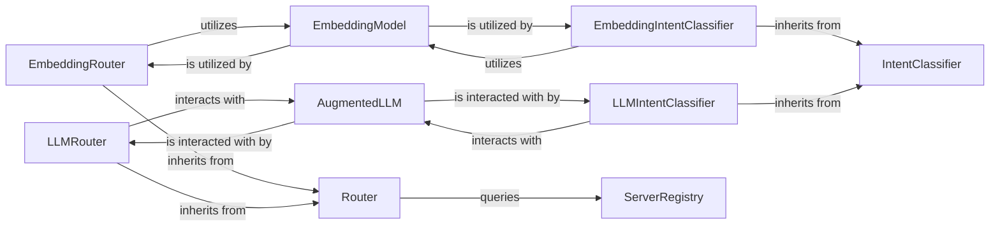

## Component Details

This component is responsible for intelligently directing incoming requests and classifying user intent, leveraging both embedding-based similarity and LLM-based reasoning. It acts as a central decision-making hub, ensuring requests are routed to the most appropriate destination and that the system understands the user's underlying goal.

### Router
The abstract base class defining the fundamental interface for all routing mechanisms within the system. It establishes the contract for how incoming requests are directed to appropriate destinations (e.g., specific MCP servers, agents, or functions).

**Related Classes/Methods**:

- <a href="https://github.com/lastmile-ai/mcp-agent/blob/master/examples/temporal/router.py#L1-L1" target="_blank" rel="noopener noreferrer">`Router` (1:1)</a>

### EmbeddingRouter
A concrete implementation of the `Router` that utilizes embedding-based similarity for routing decisions. It compares the semantic meaning of the input request with that of potential destinations to find the best match.

**Related Classes/Methods**:

- `EmbeddingRouter` (1:1)

### LLMRouter
A concrete implementation of the `Router` that employs Large Language Models (LLMs) for more sophisticated, reasoning-based routing decisions. It can interpret complex queries and contextual information to direct requests.

**Related Classes/Methods**:

- `LLMRouter` (1:1)

### IntentClassifier
The abstract base class for all intent classification mechanisms. It defines the common interface for determining the user's underlying intent or goal from their input.

**Related Classes/Methods**:

- `IntentClassifier` (1:1)

### EmbeddingIntentClassifier
A concrete implementation of `IntentClassifier` that uses embedding-based similarity to classify user intent. It matches the input's semantic representation against a set of predefined intent embeddings.

**Related Classes/Methods**:

- `EmbeddingIntentClassifier` (1:1)

### LLMIntentClassifier
A concrete implementation of `IntentClassifier` that leverages LLM-based reasoning for intent classification. This allows for more nuanced, context-aware, and dynamic intent recognition.

**Related Classes/Methods**:

- `LLMIntentClassifier` (1:1)

### EmbeddingModel
An abstract component that provides a standardized interface for generating vector embeddings from text. These numerical representations of text are fundamental for all similarity-based operations within the routing and intent classification components.

**Related Classes/Methods**:

- `EmbeddingModel` (1:1)

### AugmentedLLM
An abstract component that provides a unified and augmented interface for interacting with various Large Language Models (LLMs). It handles the complexities of different LLM APIs and enhances their capabilities for specific tasks.

**Related Classes/Methods**:

- `AugmentedLLM` (1:1)

### ServerRegistry
This component is responsible for maintaining a dynamic registry of available MCP servers and their associated capabilities. It acts as a lookup service for routing components.

**Related Classes/Methods**:

- `ServerRegistry` (1:1)

### [FAQ](https://github.com/CodeBoarding/GeneratedOnBoardings/tree/main?tab=readme-ov-file#faq)