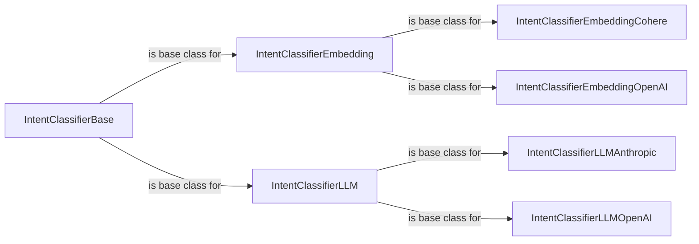

## Component Details

This structure allows the Intent Classification component to be highly adaptable, supporting various underlying AI models and techniques while maintaining a consistent and manageable codebase. It represents a clear separation of concerns and a flexible architecture for intent classification through abstraction, strategy pattern, and provider-specific implementations.

### IntentClassifierBase
This is likely the abstract base class or interface for all intent classification methods. It defines the common contract that all concrete intent classifiers must adhere to, ensuring a consistent API for intent recognition.

**Related Classes/Methods**:

- <a href="https://github.com/lastmile-ai/mcp-agent/blob/master/src/mcp_agent/workflows/intent_classifier/intent_classifier_base.py#L1-L1" target="_blank" rel="noopener noreferrer">`src.mcp_agent.workflows.intent_classifier.intent_classifier_base.IntentClassifierBase` (1:1)</a>

### IntentClassifierEmbedding
This component likely serves as a base for intent classification methods that rely on embedding-based techniques. It would define the common logic for handling embeddings, such as vectorizing input queries and comparing them to known intent embeddings.

**Related Classes/Methods**:

- <a href="https://github.com/lastmile-ai/mcp-agent/blob/master/src/mcp_agent/workflows/intent_classifier/intent_classifier_embedding.py#L1-L1" target="_blank" rel="noopener noreferrer">`src.mcp_agent.workflows.intent_classifier.intent_classifier_embedding.IntentClassifierEmbedding` (1:1)</a>

### IntentClassifierEmbeddingCohere
A concrete implementation of an embedding-based intent classifier that specifically utilizes the Cohere embedding model for semantic similarity calculations.

**Related Classes/Methods**:

- <a href="https://github.com/lastmile-ai/mcp-agent/blob/master/src/mcp_agent/workflows/intent_classifier/intent_classifier_embedding_cohere.py#L1-L1" target="_blank" rel="noopener noreferrer">`src.mcp_agent.workflows.intent_classifier.intent_classifier_embedding_cohere.IntentClassifierEmbeddingCohere` (1:1)</a>

### IntentClassifierEmbeddingOpenAI
A concrete implementation of an embedding-based intent classifier that specifically utilizes OpenAI's embedding models for semantic similarity calculations.

**Related Classes/Methods**:

- <a href="https://github.com/lastmile-ai/mcp-agent/blob/master/src/mcp_agent/workflows/intent_classifier/intent_classifier_embedding_openai.py#L1-L1" target="_blank" rel="noopener noreferrer">`src.mcp_agent.workflows.intent_classifier.intent_classifier_embedding_openai.IntentClassifierEmbeddingOpenAI` (1:1)</a>

### IntentClassifierLLM
This component likely serves as a base for intent classification methods that leverage Large Language Models (LLMs). It would define the common logic for interacting with LLMs for classification tasks, such as prompt engineering and parsing LLM responses.

**Related Classes/Methods**:

- <a href="https://github.com/lastmile-ai/mcp-agent/blob/master/src/mcp_agent/workflows/intent_classifier/intent_classifier_llm.py#L1-L1" target="_blank" rel="noopener noreferrer">`src.mcp_agent.workflows.intent_classifier.intent_classifier_llm.IntentClassifierLLM` (1:1)</a>

### IntentClassifierLLMAnthropic
A concrete implementation of an LLM-based intent classifier that specifically utilizes Anthropic's LLMs (e.g., Claude) for zero-shot or few-shot intent recognition.

**Related Classes/Methods**:

- <a href="https://github.com/lastmile-ai/mcp-agent/blob/master/src/mcp_agent/workflows/intent_classifier/intent_classifier_llm_anthropic.py#L1-L1" target="_blank" rel="noopener noreferrer">`src.mcp_agent.workflows.intent_classifier.intent_classifier_llm_anthropic.IntentClassifierLLMAnthropic` (1:1)</a>

### IntentClassifierLLMOpenAI
A concrete implementation of an LLM-based intent classifier that specifically utilizes OpenAI's LLMs (e.g., GPT series) for zero-shot or few-shot intent recognition.

**Related Classes/Methods**:

- <a href="https://github.com/lastmile-ai/mcp-agent/blob/master/src/mcp_agent/workflows/intent_classifier/intent_classifier_llm_openai.py#L1-L1" target="_blank" rel="noopener noreferrer">`src.mcp_agent.workflows.intent_classifier.intent_classifier_llm_openai.IntentClassifierLLMOpenAI` (1:1)</a>

### [FAQ](https://github.com/CodeBoarding/GeneratedOnBoardings/tree/main?tab=readme-ov-file#faq)