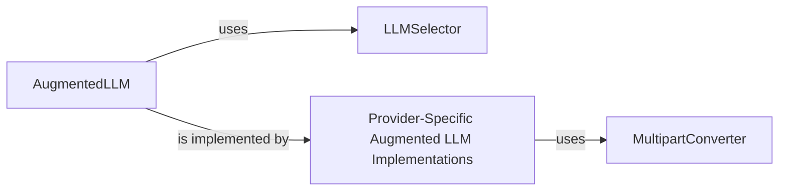

## Component Details

This component provides a standardized and augmented interface for interacting with various Large Language Models (LLMs) from different providers. It handles intelligent model selection, manages diverse request parameters, and converts content formats (e.g., multipart messages) to ensure compatibility with different LLM APIs. It abstracts away provider-specific complexities, offering a unified way to leverage LLM capabilities.

### AugmentedLLM
This is the primary abstract interface and base for all augmented LLM interactions. It defines the core methods for generating responses (`generate`, `generate_str`, `generate_structured`), manages request parameters (`RequestParams`), and handles conversation memory (`Memory`, `SimpleMemory`). It acts as the central orchestrator for LLM calls, abstracting the underlying provider.

**Related Classes/Methods**:

- `AugmentedLLM` (-1:-1)

### LLMSelector
Responsible for intelligently selecting the most appropriate LLM from available options based on predefined `ModelPreferences` and various performance metrics (cost, speed, intelligence benchmarks like MMLU, GSM8K, BBH). It allows the system to dynamically choose the best model for a given task, optimizing for factors like cost or quality.

**Related Classes/Methods**:

- `LLMSelector` (-1:-1)

### Provider-Specific Augmented LLM Implementations
These modules provide concrete implementations of the `AugmentedLLMProtocol` (or similar interface defined by `AugmentedLLM`) for specific LLM providers (e.g., Anthropic, Azure, Bedrock, Google, Ollama, OpenAI). They handle the direct communication with the respective LLM APIs, translating the generic `AugmentedLLM` requests into provider-specific calls and processing their responses.

**Related Classes/Methods**:

- `AugmentedLLMAnthropic` (-1:-1)
- `AugmentedLLMAzure` (-1:-1)
- `AugmentedLLMBedrock` (-1:-1)
- `AugmentedLLMGoogle` (-1:-1)
- `AugmentedLLMOllama` (-1:-1)
- `AugmentedLLMOpenAI` (-1:-1)

### MultipartConverter
These modules implement the `ProviderToMCPConverter` protocol, which is responsible for converting LLM provider-specific message formats (especially complex multipart messages) into a standardized `MCPMessageResult` format. This ensures that responses from different LLMs can be uniformly processed by the rest of the `mcp-agent` system.

**Related Classes/Methods**:

- <a href="https://github.com/lastmile-ai/mcp-agent/blob/master/src/mcp_agent/workflows/llm/multipart_converter_anthropic.py#L-1-L-1" target="_blank" rel="noopener noreferrer">`MultipartConverterAnthropic` (-1:-1)</a>
- <a href="https://github.com/lastmile-ai/mcp-agent/blob/master/src/mcp_agent/workflows/llm/multipart_converter_azure.py#L-1-L-1" target="_blank" rel="noopener noreferrer">`MultipartConverterAzure` (-1:-1)</a>
- <a href="https://github.com/lastmile-ai/mcp-agent/blob/master/src/mcp_agent/workflows/llm/multipart_converter_bedrock.py#L-1-L-1" target="_blank" rel="noopener noreferrer">`MultipartConverterBedrock` (-1:-1)</a>
- <a href="https://github.com/lastmile-ai/mcp-agent/blob/master/src/mcp_agent/workflows/llm/multipart_converter_google.py#L-1-L-1" target="_blank" rel="noopener noreferrer">`MultipartConverterGoogle` (-1:-1)</a>
- `MultipartConverterOpenAI` (-1:-1)

### [FAQ](https://github.com/CodeBoarding/GeneratedOnBoardings/tree/main?tab=readme-ov-file#faq)