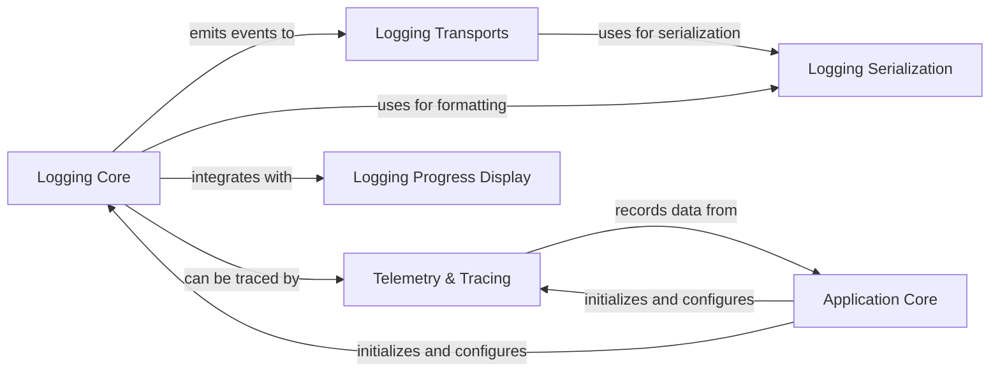

## Component Details

The Logging and Observability component provides comprehensive capabilities for monitoring the application's behavior. It encompasses structured event logging to various outputs like console, files, and HTTP endpoints, and integrates with OpenTelemetry for distributed tracing and usage tracking. This component ensures that application events, execution flows, and performance metrics are captured, processed, and made available for debugging, analysis, and operational insights.

### Logging Core
Manages the central logging mechanism, including event emission, listener management, and overall logging configuration. It provides the main interface for logging events at various levels (debug, info, warning, error, progress) and manages how these events are processed by different listeners.

**Related Classes/Methods**:

- <a href="https://github.com/lastmile-ai/mcp-agent/blob/master/src/mcp_agent/logging/logger.py#L34-L37" target="_blank" rel="noopener noreferrer">`mcp_agent.logging.logger.Logger:__init__` (34:37)</a>
- <a href="https://github.com/lastmile-ai/mcp-agent/blob/master/src/mcp_agent/logging/logger.py#L49-L75" target="_blank" rel="noopener noreferrer">`mcp_agent.logging.logger.Logger:_emit_event` (49:75)</a>
- <a href="https://github.com/lastmile-ai/mcp-agent/blob/master/src/mcp_agent/logging/logger.py#L77-L103" target="_blank" rel="noopener noreferrer">`mcp_agent.logging.logger.Logger:event` (77:103)</a>
- <a href="https://github.com/lastmile-ai/mcp-agent/blob/master/src/mcp_agent/logging/logger.py#L105-L113" target="_blank" rel="noopener noreferrer">`mcp_agent.logging.logger.Logger:debug` (105:113)</a>
- <a href="https://github.com/lastmile-ai/mcp-agent/blob/master/src/mcp_agent/logging/logger.py#L115-L123" target="_blank" rel="noopener noreferrer">`mcp_agent.logging.logger.Logger:info` (115:123)</a>
- <a href="https://github.com/lastmile-ai/mcp-agent/blob/master/src/mcp_agent/logging/logger.py#L125-L133" target="_blank" rel="noopener noreferrer">`mcp_agent.logging.logger.Logger:warning` (125:133)</a>
- <a href="https://github.com/lastmile-ai/mcp-agent/blob/master/src/mcp_agent/logging/logger.py#L135-L143" target="_blank" rel="noopener noreferrer">`mcp_agent.logging.logger.Logger:error` (135:143)</a>
- <a href="https://github.com/lastmile-ai/mcp-agent/blob/master/src/mcp_agent/logging/logger.py#L145-L155" target="_blank" rel="noopener noreferrer">`mcp_agent.logging.logger.Logger:progress` (145:155)</a>
- <a href="https://github.com/lastmile-ai/mcp-agent/blob/master/src/mcp_agent/logging/logger.py#L218-L260" target="_blank" rel="noopener noreferrer">`mcp_agent.logging.logger.LoggingConfig:configure` (218:260)</a>
- <a href="https://github.com/lastmile-ai/mcp-agent/blob/master/src/mcp_agent/logging/logger.py#L263-L269" target="_blank" rel="noopener noreferrer">`mcp_agent.logging.logger.LoggingConfig:shutdown` (263:269)</a>
- <a href="https://github.com/lastmile-ai/mcp-agent/blob/master/src/mcp_agent/logging/logger.py#L273-L279" target="_blank" rel="noopener noreferrer">`mcp_agent.logging.logger.LoggingConfig:managed` (273:279)</a>
- <a href="https://github.com/lastmile-ai/mcp-agent/blob/master/src/mcp_agent/logging/logger.py#L286-L303" target="_blank" rel="noopener noreferrer">`mcp_agent.logging.logger:get_logger` (286:303)</a>
- <a href="https://github.com/lastmile-ai/mcp-agent/blob/master/src/mcp_agent/logging/listeners.py#L53-L55" target="_blank" rel="noopener noreferrer">`mcp_agent.logging.listeners.FilteredListener:handle_event` (53:55)</a>
- <a href="https://github.com/lastmile-ai/mcp-agent/blob/master/src/mcp_agent/logging/listeners.py#L67-L78" target="_blank" rel="noopener noreferrer">`mcp_agent.logging.listeners.LoggingListener:__init__` (67:78)</a>
- <a href="https://github.com/lastmile-ai/mcp-agent/blob/master/src/mcp_agent/logging/listeners.py#L125-L127" target="_blank" rel="noopener noreferrer">`mcp_agent.logging.listeners.ProgressListener:start` (125:127)</a>
- <a href="https://github.com/lastmile-ai/mcp-agent/blob/master/src/mcp_agent/logging/listeners.py#L129-L131" target="_blank" rel="noopener noreferrer">`mcp_agent.logging.listeners.ProgressListener:stop` (129:131)</a>
- <a href="https://github.com/lastmile-ai/mcp-agent/blob/master/src/mcp_agent/logging/listeners.py#L133-L139" target="_blank" rel="noopener noreferrer">`mcp_agent.logging.listeners.ProgressListener:handle_event` (133:139)</a>
- <a href="https://github.com/lastmile-ai/mcp-agent/blob/master/src/mcp_agent/logging/listeners.py#L148-L166" target="_blank" rel="noopener noreferrer">`mcp_agent.logging.listeners.BatchingListener:__init__` (148:166)</a>
- <a href="https://github.com/lastmile-ai/mcp-agent/blob/master/src/mcp_agent/logging/listeners.py#L168-L171" target="_blank" rel="noopener noreferrer">`mcp_agent.logging.listeners.BatchingListener:start` (168:171)</a>
- <a href="https://github.com/lastmile-ai/mcp-agent/blob/master/src/mcp_agent/logging/listeners.py#L173-L185" target="_blank" rel="noopener noreferrer">`mcp_agent.logging.listeners.BatchingListener:stop` (173:185)</a>
- <a href="https://github.com/lastmile-ai/mcp-agent/blob/master/src/mcp_agent/logging/listeners.py#L187-L199" target="_blank" rel="noopener noreferrer">`mcp_agent.logging.listeners.BatchingListener:_periodic_flush` (187:199)</a>
- <a href="https://github.com/lastmile-ai/mcp-agent/blob/master/src/mcp_agent/logging/listeners.py#L201-L204" target="_blank" rel="noopener noreferrer">`mcp_agent.logging.listeners.BatchingListener:handle_matched_event` (201:204)</a>
- <a href="https://github.com/lastmile-ai/mcp-agent/blob/master/src/mcp_agent/logging/listeners.py#L206-L213" target="_blank" rel="noopener noreferrer">`mcp_agent.logging.listeners.BatchingListener:flush` (206:213)</a>
- <a href="https://github.com/lastmile-ai/mcp-agent/blob/master/src/mcp_agent/logging/events.py#L120-L123" target="_blank" rel="noopener noreferrer">`mcp_agent.logging.events.SamplingFilter:matches` (120:123)</a>

### Logging Transports
Handles the delivery of log events to various destinations such as console, files, and HTTP endpoints, supporting both synchronous and asynchronous operations. It abstracts the mechanism of sending processed log events to their final output.

**Related Classes/Methods**:

- <a href="https://github.com/lastmile-ai/mcp-agent/blob/master/src/mcp_agent/logging/transport.py#L52-L54" target="_blank" rel="noopener noreferrer">`mcp_agent.logging.transport.FilteredEventTransport:send_event` (52:54)</a>
- <a href="https://github.com/lastmile-ai/mcp-agent/blob/master/src/mcp_agent/logging/transport.py#L72-L81" target="_blank" rel="noopener noreferrer">`mcp_agent.logging.transport.ConsoleTransport:__init__` (72:81)</a>
- <a href="https://github.com/lastmile-ai/mcp-agent/blob/master/src/mcp_agent/logging/transport.py#L83-L107" target="_blank" rel="noopener noreferrer">`mcp_agent.logging.transport.ConsoleTransport:send_matched_event` (83:107)</a>
- <a href="https://github.com/lastmile-ai/mcp-agent/blob/master/src/mcp_agent/logging/transport.py#L113-L135" target="_blank" rel="noopener noreferrer">`mcp_agent.logging.transport.FileTransport:__init__` (113:135)</a>
- <a href="https://github.com/lastmile-ai/mcp-agent/blob/master/src/mcp_agent/logging/transport.py#L137-L166" target="_blank" rel="noopener noreferrer">`mcp_agent.logging.transport.FileTransport:send_matched_event` (137:166)</a>
- <a href="https://github.com/lastmile-ai/mcp-agent/blob/master/src/mcp_agent/logging/transport.py#L184-L201" target="_blank" rel="noopener noreferrer">`mcp_agent.logging.transport.HTTPTransport:__init__` (184:201)</a>
- <a href="https://github.com/lastmile-ai/mcp-agent/blob/master/src/mcp_agent/logging/transport.py#L210-L216" target="_blank" rel="noopener noreferrer">`mcp_agent.logging.transport.HTTPTransport:stop` (210:216)</a>
- <a href="https://github.com/lastmile-ai/mcp-agent/blob/master/src/mcp_agent/logging/transport.py#L218-L223" target="_blank" rel="noopener noreferrer">`mcp_agent.logging.transport.HTTPTransport:send_matched_event` (218:223)</a>
- <a href="https://github.com/lastmile-ai/mcp-agent/blob/master/src/mcp_agent/logging/transport.py#L225-L260" target="_blank" rel="noopener noreferrer">`mcp_agent.logging.transport.HTTPTransport:_flush` (225:260)</a>
- <a href="https://github.com/lastmile-ai/mcp-agent/blob/master/src/mcp_agent/logging/transport.py#L271-L275" target="_blank" rel="noopener noreferrer">`mcp_agent.logging.transport.AsyncEventBus:__init__` (271:275)</a>
- <a href="https://github.com/lastmile-ai/mcp-agent/blob/master/src/mcp_agent/logging/transport.py#L290-L297" target="_blank" rel="noopener noreferrer">`mcp_agent.logging.transport.AsyncEventBus:get` (290:297)</a>
- <a href="https://github.com/lastmile-ai/mcp-agent/blob/master/src/mcp_agent/logging/transport.py#L314-L327" target="_blank" rel="noopener noreferrer">`mcp_agent.logging.transport.AsyncEventBus:start` (314:327)</a>
- <a href="https://github.com/lastmile-ai/mcp-agent/blob/master/src/mcp_agent/logging/transport.py#L377-L393" target="_blank" rel="noopener noreferrer">`mcp_agent.logging.transport.AsyncEventBus:emit` (377:393)</a>
- <a href="https://github.com/lastmile-ai/mcp-agent/blob/master/src/mcp_agent/logging/transport.py#L476-L500" target="_blank" rel="noopener noreferrer">`mcp_agent.logging.transport.MultiTransport:send_event` (476:500)</a>
- <a href="https://github.com/lastmile-ai/mcp-agent/blob/master/src/mcp_agent/logging/transport.py#L536-L587" target="_blank" rel="noopener noreferrer">`mcp_agent.logging.transport:create_transport` (536:587)</a>

### Logging Serialization
Provides functionality for converting log events into a structured format, primarily JSON, for consistent output across different transports.

**Related Classes/Methods**:

- <a href="https://github.com/lastmile-ai/mcp-agent/blob/master/src/mcp_agent/logging/json_serializer.py#L53-L57" target="_blank" rel="noopener noreferrer">`mcp_agent.logging.json_serializer.JSONSerializer:serialize` (53:57)</a>
- <a href="https://github.com/lastmile-ai/mcp-agent/blob/master/src/mcp_agent/logging/json_serializer.py#L64-L159" target="_blank" rel="noopener noreferrer">`mcp_agent.logging.json_serializer.JSONSerializer:_serialize_object` (64:159)</a>
- <a href="https://github.com/lastmile-ai/mcp-agent/blob/master/src/mcp_agent/logging/json_serializer.py#L161-L163" target="_blank" rel="noopener noreferrer">`mcp_agent.logging.json_serializer.JSONSerializer:__call__` (161:163)</a>

### Logging Progress Display
Manages the visual representation of ongoing operations and progress updates within the application's console output, enhancing user feedback during long-running tasks.

**Related Classes/Methods**:

- <a href="https://github.com/lastmile-ai/mcp-agent/blob/master/src/mcp_agent/logging/rich_progress.py#L58-L64" target="_blank" rel="noopener noreferrer">`mcp_agent.logging.rich_progress.RichProgressDisplay:paused` (58:64)</a>
- <a href="https://github.com/lastmile-ai/mcp-agent/blob/master/src/mcp_agent/logging/rich_progress.py#L84-L136" target="_blank" rel="noopener noreferrer">`mcp_agent.logging.rich_progress.RichProgressDisplay:update` (84:136)</a>
- <a href="https://github.com/lastmile-ai/mcp-agent/blob/master/src/mcp_agent/logging/event_progress.py#L47-L97" target="_blank" rel="noopener noreferrer">`mcp_agent.logging.event_progress:convert_log_event` (47:97)</a>

### Telemetry & Tracing
Provides comprehensive distributed tracing capabilities using OpenTelemetry, including span management, attribute recording, and integration with various application components for observability. It also includes usage tracking for analytical purposes.

**Related Classes/Methods**:

- <a href="https://github.com/lastmile-ai/mcp-agent/blob/master/src/mcp_agent/tracing/telemetry.py#L27-L28" target="_blank" rel="noopener noreferrer">`mcp_agent.tracing.telemetry.TelemetryManager:__init__` (27:28)</a>
- <a href="https://github.com/lastmile-ai/mcp-agent/blob/master/src/mcp_agent/tracing/telemetry.py#L30-L83" target="_blank" rel="noopener noreferrer">`mcp_agent.tracing.telemetry.TelemetryManager:traced` (30:83)</a>
- <a href="https://github.com/lastmile-ai/mcp-agent/blob/master/src/mcp_agent/tracing/telemetry.py#L85-L90" target="_blank" rel="noopener noreferrer">`mcp_agent.tracing.telemetry.TelemetryManager:_record_args` (85:90)</a>
- <a href="https://github.com/lastmile-ai/mcp-agent/blob/master/src/mcp_agent/tracing/telemetry.py#L93-L113" target="_blank" rel="noopener noreferrer">`mcp_agent.tracing.telemetry:serialize_attribute` (93:113)</a>
- <a href="https://github.com/lastmile-ai/mcp-agent/blob/master/src/mcp_agent/tracing/telemetry.py#L116-L127" target="_blank" rel="noopener noreferrer">`mcp_agent.tracing.telemetry:serialize_attributes` (116:127)</a>
- <a href="https://github.com/lastmile-ai/mcp-agent/blob/master/src/mcp_agent/tracing/telemetry.py#L130-L137" target="_blank" rel="noopener noreferrer">`mcp_agent.tracing.telemetry:record_attribute` (130:137)</a>
- <a href="https://github.com/lastmile-ai/mcp-agent/blob/master/src/mcp_agent/tracing/telemetry.py#L140-L144" target="_blank" rel="noopener noreferrer">`mcp_agent.tracing.telemetry:record_attributes` (140:144)</a>
- <a href="https://github.com/lastmile-ai/mcp-agent/blob/master/src/mcp_agent/tracing/file_span_exporter.py#L19-L35" target="_blank" rel="noopener noreferrer">`mcp_agent.tracing.file_span_exporter.FileSpanExporter:__init__` (19:35)</a>
- <a href="https://github.com/lastmile-ai/mcp-agent/blob/master/src/mcp_agent/tracing/file_span_exporter.py#L55-L65" target="_blank" rel="noopener noreferrer">`mcp_agent.tracing.file_span_exporter.FileSpanExporter:export` (55:65)</a>
- <a href="https://github.com/lastmile-ai/mcp-agent/blob/master/src/mcp_agent/telemetry/usage_tracking.py#L7-L11" target="_blank" rel="noopener noreferrer">`mcp_agent.telemetry.usage_tracking:send_usage_data` (7:11)</a>

### Application Core
Represents the main application entry point and its core context, responsible for initializing and configuring the logging and observability components at startup.

**Related Classes/Methods**:

- <a href="https://github.com/lastmile-ai/mcp-agent/blob/master/src/mcp_agent/app.py#L164-L168" target="_blank" rel="noopener noreferrer">`mcp_agent.app.MCPApp:logger` (164:168)</a>
- <a href="https://github.com/lastmile-ai/mcp-agent/blob/master/src/mcp_agent/core/context.py#L92-L107" target="_blank" rel="noopener noreferrer">`mcp_agent.core.context:configure_logger` (92:107)</a>

### [FAQ](https://github.com/CodeBoarding/GeneratedOnBoardings/tree/main?tab=readme-ov-file#faq)