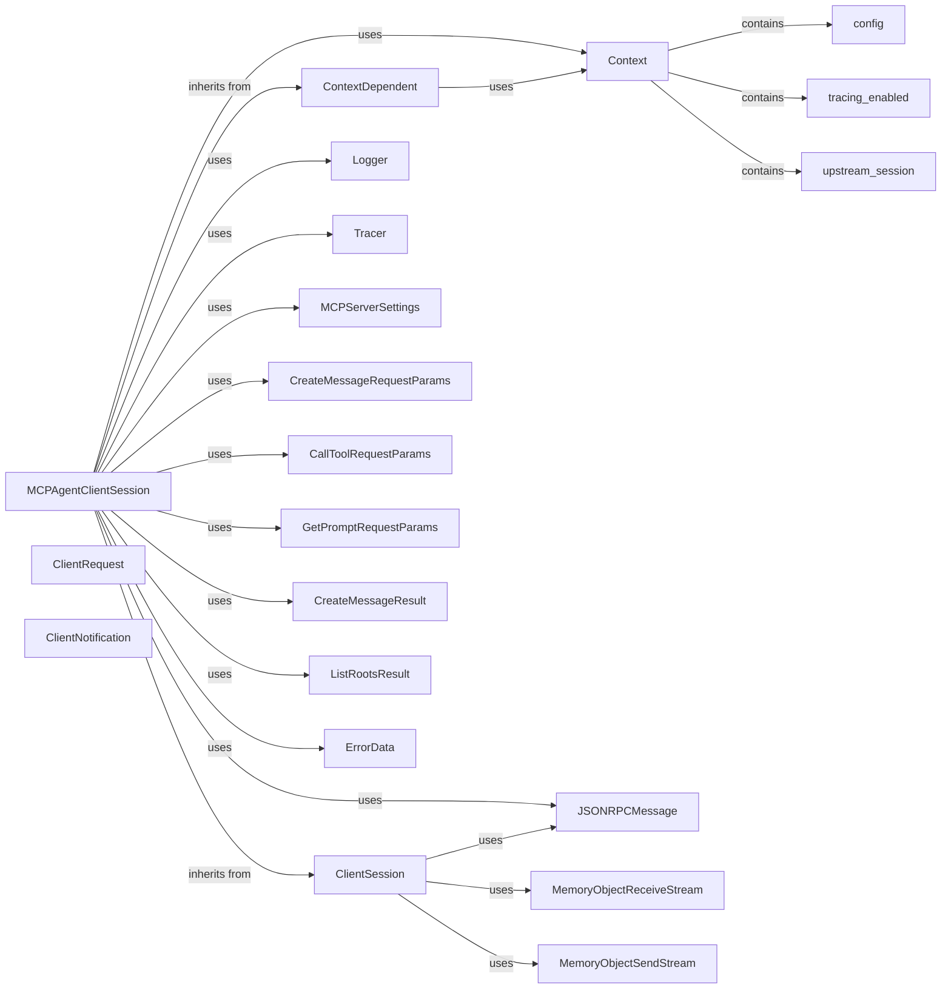

## Component Details

The `MCPAgentClientSession` is a crucial component within the `mcp-agent` project, acting as a client-side session for communication with a single MCP (Multi-Agent Communication Protocol) server. It extends core functionalities for handling requests, notifications, and managing server configurations.

### MCPAgentClientSession
The primary component, responsible for managing a client session with an MCP server. It handles sending requests (`send_request`), notifications (`send_notification`, `send_progress_notification`), and processing incoming messages. It also manages session-specific configurations and integrates with tracing for observability.

**Related Classes/Methods**:

- `MCPAgentClientSession` (0:0)
- `MCPAgentClientSession:send_request` (0:0)
- `MCPAgentClientSession:send_notification` (0:0)
- `MCPAgentClientSession:send_progress_notification` (0:0)

### ClientSession
A generic client session base class that provides the fundamental mechanisms for sending and receiving JSON-RPC messages over streams. MCPAgentClientSession extends this to add MCP-specific functionalities.

**Related Classes/Methods**:

- `ClientSession` (0:0)
- `ClientSession:send_request` (0:0)
- `ClientSession:send_notification` (0:0)
- `ClientSession:_send_response` (0:0)
- `ClientSession:_received_notification` (0:0)

### ContextDependent
A base class that provides a mechanism for components to access a shared `Context` object. This `Context` typically holds application-wide configurations, services, and state.

**Related Classes/Methods**:

- <a href="https://github.com/lastmile-ai/mcp-agent/blob/master/src/mcp_agent/core/context_dependent.py#L8-L47" target="_blank" rel="noopener noreferrer">`ContextDependent` (8:47)</a>

### Context
A central object that provides access to various application-wide resources and configurations, such as logging, tracing, and upstream server sessions. It acts as a dependency injection container for components like `MCPAgentClientSession`.

**Related Classes/Methods**:

- <a href="https://github.com/lastmile-ai/mcp-agent/blob/master/src/mcp_agent/core/context.py#L0-L0" target="_blank" rel="noopener noreferrer">`Context` (0:0)</a>
- <a href="https://github.com/lastmile-ai/mcp-agent/blob/master/src/mcp_agent/core/context.py#L0-L0" target="_blank" rel="noopener noreferrer">`Context:config` (0:0)</a>
- <a href="https://github.com/lastmile-ai/mcp-agent/blob/master/src/mcp_agent/core/context.py#L0-L0" target="_blank" rel="noopener noreferrer">`Context:tracing_enabled` (0:0)</a>
- <a href="https://github.com/lastmile-ai/mcp-agent/blob/master/src/mcp_agent/core/context.py#L0-L0" target="_blank" rel="noopener noreferrer">`Context:upstream_session` (0:0)</a>

### Logger
Provides logging capabilities for the `MCPAgentClientSession`, enabling debugging and operational insights into the session's activities, such as sending/receiving requests and notifications.

**Related Classes/Methods**:

- <a href="https://github.com/lastmile-ai/mcp-agent/blob/master/src/mcp_agent/logging/logger.py#L0-L0" target="_blank" rel="noopener noreferrer">`Logger` (0:0)</a>

### Tracer
An OpenTelemetry-compliant tracer used for distributed tracing. It allows `MCPAgentClientSession` to create spans for requests and notifications, capturing attributes like session ID, method names, and arguments, which are crucial for monitoring and debugging distributed interactions.

**Related Classes/Methods**:

- <a href="https://github.com/lastmile-ai/mcp-agent/blob/master/src/mcp_agent/tracing/tracer.py#L0-L0" target="_blank" rel="noopener noreferrer">`Tracer` (0:0)</a>
- `trace.SpanKind.CLIENT` (0:0)
- `inject` (0:0)

### MCPServerSettings
A data structure that holds the configuration for MCP servers, including their roots (URIs and names). `MCPAgentClientSession` uses this to respond to `list_roots` requests.

**Related Classes/Methods**:

- `MCPServerSettings` (0:0)

### JSONRPCMessage
These are data models (likely Pydantic models) that define the structure of messages, requests, notifications, and responses exchanged within the MCP framework. They ensure type safety and proper serialization/deserialization of communication payloads.

**Related Classes/Methods**:

- `JSONRPCMessage` (0:0)

### ClientRequest
These are data models (likely Pydantic models) that define the structure of messages, requests, notifications, and responses exchanged within the MCP framework. They ensure type safety and proper serialization/deserialization of communication payloads.

**Related Classes/Methods**:

- `ClientRequest` (0:0)

### ClientNotification
These are data models (likely Pydantic models) that define the structure of messages, requests, notifications, and responses exchanged within the MCP framework. They ensure type safety and proper serialization/deserialization of communication payloads.

**Related Classes/Methods**:

- `ClientNotification` (0:0)

### CreateMessageRequestParams
These are data models (likely Pydantic models) that define the structure of messages, requests, notifications, and responses exchanged within the MCP framework. They ensure type safety and proper serialization/deserialization of communication payloads.

**Related Classes/Methods**:

- `CreateMessageRequestParams` (0:0)

### CallToolRequestParams
These are data models (likely Pydantic models) that define the structure of messages, requests, notifications, and responses exchanged within the MCP framework. They ensure type safety and proper serialization/deserialization of communication payloads.

**Related Classes/Methods**:

- `CallToolRequestParams` (0:0)

### GetPromptRequestParams
These are data models (likely Pydantic models) that define the structure of messages, requests, notifications, and responses exchanged within the MCP framework. They ensure type safety and proper serialization/deserialization of communication payloads.

**Related Classes/Methods**:

- `GetPromptRequestParams` (0:0)

### CreateMessageResult
These are data models (likely Pydantic models) that define the structure of messages, requests, notifications, and responses exchanged within the MCP framework. They ensure type safety and proper serialization/deserialization of communication payloads.

**Related Classes/Methods**:

- `CreateMessageResult` (0:0)

### ListRootsResult
These are data models (likely Pydantic models) that define the structure of messages, requests, notifications, and responses exchanged within the MCP framework. They ensure type safety and proper serialization/deserialization of communication payloads.

**Related Classes/Methods**:

- `ListRootsResult` (0:0)

### ErrorData
These are data models (likely Pydantic models) that define the structure of messages, requests, notifications, and responses exchanged within the MCP framework. They ensure type safety and proper serialization/deserialization of communication payloads.

**Related Classes/Methods**:

- `ErrorData` (0:0)

### MemoryObjectReceiveStream
Underlying message transport for ClientSession.

**Related Classes/Methods**:

- `MemoryObjectReceiveStream` (0:0)

### MemoryObjectSendStream
Underlying message transport for ClientSession.

**Related Classes/Methods**:

- `MemoryObjectSendStream` (0:0)

### [FAQ](https://github.com/CodeBoarding/GeneratedOnBoardings/tree/main?tab=readme-ov-file#faq)