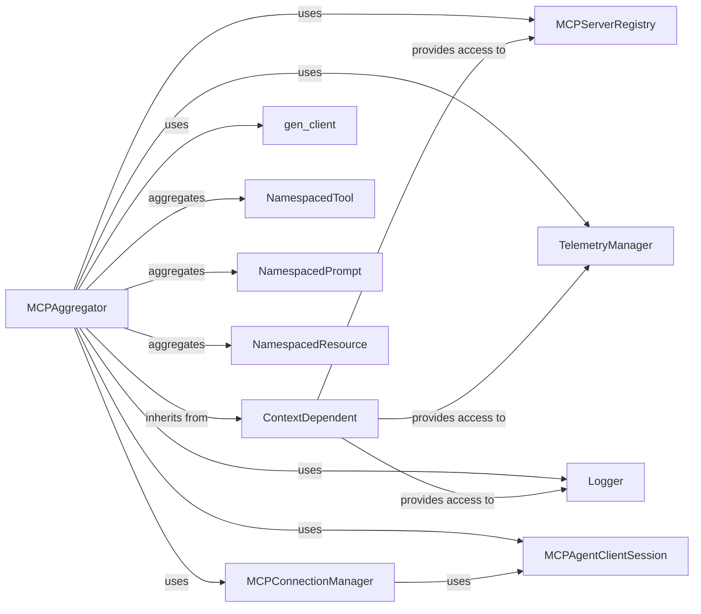

## Component Details

The MCPAggregator component is central to unifying capabilities from various MCP servers, acting as a single access point for the mcp-agent.

### MCPAggregator
The core component responsible for collecting and unifying capabilities (tools, prompts, resources) from various connected MCP servers. It manages the lifecycle of server connections and provides a unified interface for accessing a diverse set of functionalities.

**Related Classes/Methods**:

- `MCPAggregator` (1:1)

### ContextDependent
A foundational base class that provides a shared execution context to components. MCPAggregator inherits from this class to access essential services like the MCPServerRegistry and TelemetryManager, enabling context-aware behavior and data sharing.

**Related Classes/Methods**:

- <a href="https://github.com/lastmile-ai/mcp-agent/blob/master/src/mcp_agent/core/context_dependent.py#L8-L47" target="_blank" rel="noopener noreferrer">`ContextDependent` (8:47)</a>

### MCPConnectionManager
Manages persistent connections to MCP servers. It handles the establishment, maintenance, and retrieval of active server sessions, ensuring efficient and reliable communication with remote capabilities. MCPAggregator relies on this to get and manage connections.

**Related Classes/Methods**:

- `MCPConnectionManager` (1:1)

### MCPAgentClientSession
Represents a client session for direct interaction with a single MCP server. It encapsulates the communication logic for fetching server capabilities (tools, prompts, resources) and executing remote operations. MCPAggregator uses this to interact with individual servers.

**Related Classes/Methods**:

- `MCPAgentClientSession` (1:1)

### MCPServerRegistry
A registry that maps logical server names to their actual connection details or factories. It is crucial for MCPAggregator to discover and initiate connections to the correct MCP servers based on their names.

**Related Classes/Methods**:

- `MCPServerRegistry` (1:1)

### gen_client
A utility function that facilitates the creation of temporary client sessions to MCP servers. This is used when MCPAggregator does not need to maintain a persistent connection for a particular operation, offering flexibility.

**Related Classes/Methods**:

- <a href="https://github.com/lastmile-ai/mcp-agent/blob/master/src/mcp_agent/mcp/gen_client.py#L15-L40" target="_blank" rel="noopener noreferrer">`gen_client` (15:40)</a>

### TelemetryManager
Provides a framework for distributed tracing and telemetry collection. It enables MCPAggregator to record detailed operational events, performance metrics, and the flow of execution, which is vital for monitoring, debugging, and understanding the agent's behavior.

**Related Classes/Methods**:

- `TelemetryManager` (1:1)

### Logger
A standard logging utility that allows MCPAggregator to output informational messages, debug details, warnings, and errors to various destinations.

**Related Classes/Methods**:

- <a href="https://github.com/lastmile-ai/mcp-agent/blob/master/src/mcp_agent/logging/logger.py#L1-L1" target="_blank" rel="noopener noreferrer">`Logger` (1:1)</a>

### NamespacedTool
These represent the internal, unified data structures for capabilities (tools, prompts, and resources) after they have been fetched and processed by the MCPAggregator. They likely include metadata about their origin (e.g., server name) to prevent naming conflicts.

**Related Classes/Methods**:

- `NamespacedTool` (1:1)

### NamespacedPrompt
These represent the internal, unified data structures for capabilities (tools, prompts, and resources) after they have been fetched and processed by the MCPAggregator. They likely include metadata about their origin (e.g., server name) to prevent naming conflicts.

**Related Classes/Methods**:

- `NamespacedPrompt` (1:1)

### NamespacedResource
These represent the internal, unified data structures for capabilities (tools, prompts, and resources) after they have been fetched and processed by the MCPAggregator. They likely include metadata about their origin (e.g., server name) to prevent naming conflicts.

**Related Classes/Methods**:

- `NamespacedResource` (1:1)

### [FAQ](https://github.com/CodeBoarding/GeneratedOnBoardings/tree/main?tab=readme-ov-file#faq)