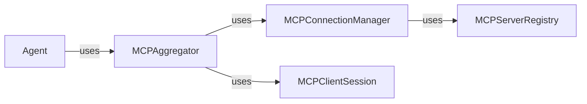

## Details

One paragraph explaining the functionality which is represented by this graph. What the main flow is and what is its purpose.

### MCPAggregator
Discovers, connects to, and aggregates capabilities from multiple MCP servers into a single, unified endpoint. It provides a simplified interface for agents to access a wide range of functionalities exposed by different MCP servers. This aligns with the Facade pattern.

**Related Classes/Methods**:

- <a href="https://github.com/lastmile-ai/mcp-agent/blob/main/src/mcp_agent/mcp/mcp_aggregator.py" target="_blank" rel="noopener noreferrer">`mcp_agent.mcp.mcp_aggregator`</a>

### MCPConnectionManager
Manages the lifecycle of connections to individual MCP servers. It handles connection establishment, maintenance (e.g., heartbeats, reconnection), and termination. It also deals with authentication and authorization aspects of connecting to MCP servers.

**Related Classes/Methods**:

- <a href="https://github.com/lastmile-ai/mcp-agent/blob/main/src/mcp_agent/mcp/mcp_connection_manager.py" target="_blank" rel="noopener noreferrer">`mcp_agent.mcp.mcp_connection_manager`</a>

### MCPServerRegistry
Maintains a registry of available MCP servers, their addresses, capabilities, and connection status. It provides a lookup mechanism for the `MCPConnectionManager` to find and connect to servers.

**Related Classes/Methods**:

- <a href="https://github.com/lastmile-ai/mcp-agent/blob/main/src/mcp_agent/mcp/mcp_server_registry.py" target="_blank" rel="noopener noreferrer">`mcp_agent.mcp.mcp_server_registry`</a>

### MCPClientSession
Represents a single client session with an MCP server. It handles the communication protocol with the server, including request serialization, response deserialization, and error handling.

**Related Classes/Methods**:

- <a href="https://github.com/lastmile-ai/mcp-agent/blob/main/src/mcp_agent/mcp/mcp_agent_client_session.py" target="_blank" rel="noopener noreferrer">`mcp_agent.mcp.mcp_agent_client_session`</a>

### Agent [[Expand]](./Agent.md)
The core agent class that utilizes the MCP Aggregator to access capabilities. It represents the intelligent entity that orchestrates tasks and interacts with the environment.

**Related Classes/Methods**:

- <a href="https://github.com/lastmile-ai/mcp-agent/blob/main/src/mcp_agent/agents/agent.py" target="_blank" rel="noopener noreferrer">`mcp_agent.agents.agent`</a>

### [FAQ](https://github.com/CodeBoarding/GeneratedOnBoardings/tree/main?tab=readme-ov-file#faq)