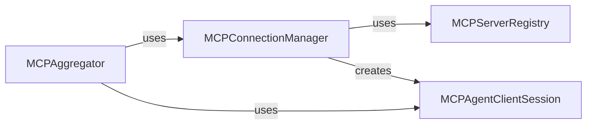

## Component Details

The `MCP Communication` component facilitates interaction with external MCP servers, aggregating their capabilities for the `mcp-agent`.

### MCPAggregator
This component is responsible for collecting and unifying capabilities (tools, prompts, resources) from various connected MCP servers. It acts as a central point for the `mcp-agent` to access a diverse set of functionalities without needing to interact with individual servers directly.

**Related Classes/Methods**: _None_

### MCPConnectionManager
Manages the lifecycle of connections to external MCP servers. It handles establishing, maintaining, and terminating connections, ensuring reliable communication channels are available for the `MCPAggregator` and other components.

**Related Classes/Methods**: _None_

### MCPServerRegistry
Maintains a registry of known MCP servers, including their addresses and status. It provides a lookup mechanism for the `MCPConnectionManager` to identify and connect to available servers.

**Related Classes/Methods**: _None_

### MCPAgentClientSession
Represents a client-side session for interacting with a single MCP server. It encapsulates the communication logic for sending requests and receiving responses from a specific server.

**Related Classes/Methods**: _None_

### [FAQ](https://github.com/CodeBoarding/GeneratedOnBoardings/tree/main?tab=readme-ov-file#faq)