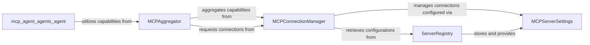

## Component Details

Analysis of fundamental components and their relationships for the MCP Server Integration, which extends the agent's capabilities by connecting to external Multi-Capability Platform (MCP) servers.

### MCPAggregator
This component is responsible for aggregating capabilities (tools, prompts, resources) from multiple connected MCP servers. It presents a unified interface to the agent, allowing it to discover and interact with these external services seamlessly. It acts as the central point for capability exposure.

**Related Classes/Methods**:

- <a href="https://github.com/lastmile-ai/mcp-agent/blob/master/src/mcp_agent/mcp/mcp_aggregator.py#L77-L1357" target="_blank" rel="noopener noreferrer">`mcp_agent.mcp.mcp_aggregator.MCPAggregator` (77:1357)</a>

### MCPConnectionManager
Manages the lifecycle of connections to individual MCP servers. This includes establishing, maintaining, and terminating connections. It ensures that the MCPAggregator has access to active and valid server connections.

**Related Classes/Methods**:

- <a href="https://github.com/lastmile-ai/mcp-agent/blob/master/src/mcp_agent/mcp/mcp_connection_manager.py#L1-L1" target="_blank" rel="noopener noreferrer">`mcp_agent.mcp.mcp_connection_manager.MCPConnectionManager` (1:1)</a>

### ServerRegistry
Stores and provides configuration details for known MCP servers. This component acts as a directory for MCP servers, allowing the MCPConnectionManager to retrieve necessary information (e.g., addresses, authentication details) to establish connections.

**Related Classes/Methods**:

- <a href="https://github.com/lastmile-ai/mcp-agent/blob/master/src/mcp_agent/mcp/mcp_server_registry.py#L1-L1" target="_blank" rel="noopener noreferrer">`mcp_agent.mcp.mcp_server_registry.ServerRegistry` (1:1)</a>

### MCPServerSettings
This class defines the structure and properties for configuring individual MCP servers. It's used by the ServerRegistry to store server-specific details and by the MCPConnectionManager to interpret these settings for connection establishment.

**Related Classes/Methods**:

- <a href="https://github.com/lastmile-ai/mcp-agent/blob/master/src/mcp_agent/config.py#L1-L1" target="_blank" rel="noopener noreferrer">`mcp_agent.config.MCPServerSettings` (1:1)</a>

### [FAQ](https://github.com/CodeBoarding/GeneratedOnBoardings/tree/main?tab=readme-ov-file#faq)