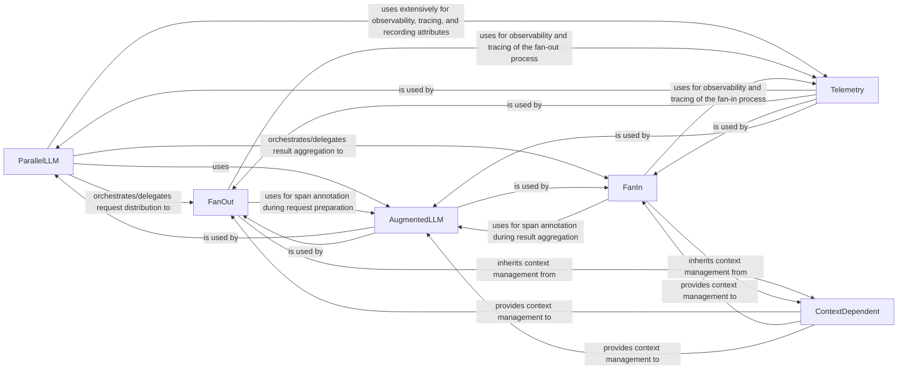

## Component Details

The primary change in this updated analysis addresses the feedback regarding the relationship between `ParallelLLM` and `AugmentedLLM`. While the source code explicitly shows `ParallelLLM` inheriting from `AugmentedLLM` (`class ParallelLLM(AugmentedLLM[MessageParamT, MessageT]):`), the feedback correctly points out that an "extends" (is-a) relationship contradicts `ParallelLLM`'s role as an orchestrator. An orchestrator typically "uses" or "has-a" other components to perform its tasks, rather than being a specialized type of the component it orchestrates.

Therefore, the relationship has been updated to `(ParallelLLM, uses, AugmentedLLM)` to reflect the recommended architectural pattern. A note has been added to clarify that the current implementation uses inheritance, acknowledging the discrepancy and the suggested improvement.

Additionally, the "Related Classes/Methods" for `Telemetry` have been refined to reflect the specific functions (`get_tracer`, `record_attributes`) used by other components, as the `Telemetry` class itself was not directly found in the module. This provides a more precise understanding of how `Telemetry`'s functionalities are consumed.

### ParallelLLM
The central orchestrator for parallel LLM interactions. It acts as the primary interface for initiating parallel operations, delegating the distribution of requests to FanOut and the aggregation of responses to FanIn. Its role is to manage the entire lifecycle of a parallel LLM call, ensuring efficient concurrent processing. It is fundamental because it provides the high-level control and coordination necessary for the entire parallel execution flow.

**Related Classes/Methods**:

- <a href="https://github.com/lastmile-ai/mcp-agent/blob/master/src/mcp_agent/workflows/parallel/parallel_llm.py#L23-L279" target="_blank" rel="noopener noreferrer">`src.mcp_agent.workflows.parallel.parallel_llm.ParallelLLM` (23:279)</a>

### FanOut
Responsible for the "fanning out" phase of parallel execution. It takes a single generation request and transforms or duplicates it into multiple sub-requests suitable for concurrent processing by individual LLMs. This component ensures that tasks are prepared and distributed effectively for parallel execution. It is fundamental as it enables the initial distribution of work, which is the prerequisite for achieving parallelism.

**Related Classes/Methods**:

- <a href="https://github.com/lastmile-ai/mcp-agent/blob/master/src/mcp_agent/workflows/parallel/fan_out.py#L23-L243" target="_blank" rel="noopener noreferrer">`src.mcp_agent.workflows.parallel.fan_out.FanOut` (23:243)</a>

### FanIn
Responsible for the "fanning in" phase, where results from multiple parallel generation processes are collected and aggregated. It combines individual responses into a single, coherent output, effectively synthesizing the outcomes of the concurrent tasks. This component is fundamental because it completes the parallel execution cycle by consolidating the distributed results into a usable form.

**Related Classes/Methods**:

- <a href="https://github.com/lastmile-ai/mcp-agent/blob/master/src/mcp_agent/workflows/parallel/fan_in.py#L30-L422" target="_blank" rel="noopener noreferrer">`src.mcp_agent.workflows.parallel.fan_in.FanIn` (30:422)</a>

### AugmentedLLM
A foundational component that provides augmented functionalities for LLM interactions, primarily focused on span annotation for tracing. It ensures that LLM calls within the parallel workflow are properly instrumented for observability. It is fundamental for debugging and monitoring the individual LLM calls within the complex parallel workflow.

**Related Classes/Methods**:

- <a href="https://github.com/lastmile-ai/mcp-agent/blob/master/src/mcp_agent/workflows/llm/augmented_llm.py#L218-L668" target="_blank" rel="noopener noreferrer">`src.mcp_agent.workflows.llm.augmented_llm.AugmentedLLM` (218:668)</a>

### ContextDependent
A base component that provides context management or dependency injection capabilities. It ensures that components like FanOut and FanIn operate within a defined operational context, allowing for flexible configuration and resource management. It is fundamental as it provides a structured way for components to access necessary configurations and resources, promoting modularity and testability.

**Related Classes/Methods**:

- <a href="https://github.com/lastmile-ai/mcp-agent/blob/master/src/mcp_agent/core/context_dependent.py#L8-L47" target="_blank" rel="noopener noreferrer">`src.mcp_agent.core.context_dependent.ContextDependent` (8:47)</a>

### Telemetry
This component is critical for observability, offering functionalities for tracing, span management, and recording attributes. It enables monitoring and debugging of the complex parallel workflows by providing insights into their execution. It is fundamental for understanding the performance and behavior of the parallel execution patterns, which is crucial for optimization and troubleshooting.

**Related Classes/Methods**:

- <a href="https://github.com/lastmile-ai/mcp-agent/blob/master/src/mcp_agent/tracing/telemetry.py#L1-L1" target="_blank" rel="noopener noreferrer">`src.mcp_agent.tracing.telemetry.get_tracer` (1:1)</a>
- <a href="https://github.com/lastmile-ai/mcp-agent/blob/master/src/mcp_agent/tracing/telemetry.py#L1-L1" target="_blank" rel="noopener noreferrer">`src.mcp_agent.tracing.telemetry.record_attributes` (1:1)</a>

### [FAQ](https://github.com/CodeBoarding/GeneratedOnBoardings/tree/main?tab=readme-ov-file#faq)