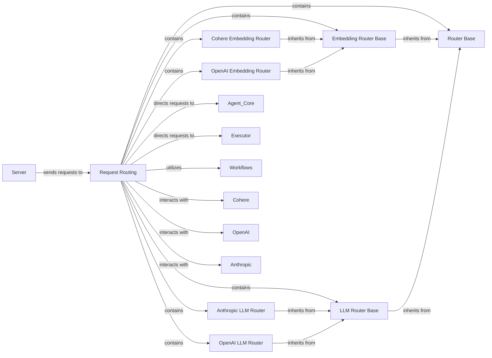

## Component Details

This component is responsible for intelligently directing incoming requests or tasks to the most appropriate LLM, agent, or workflow. It employs various routing strategies, including those based on semantic similarity derived from embeddings (with specific implementations for Cohere and OpenAI) and direct LLM-based decision-making (with specific implementations for Anthropic and OpenAI), ensuring efficient task distribution.

### Request Routing
This component is responsible for intelligently directing incoming requests or tasks to the most appropriate LLM, agent, or workflow. It employs various routing strategies, including those based on semantic similarity derived from embeddings (with specific implementations for Cohere and OpenAI) and direct LLM-based decision-making (with specific implementations for Anthropic and OpenAI), ensuring efficient task distribution.

**Related Classes/Methods**:

- <a href="https://github.com/lastmile-ai/mcp-agent/blob/master/src/mcp_agent/workflows/router/router_base.py#L1-L10000" target="_blank" rel="noopener noreferrer">`src/mcp_agent/workflows/router/router_base.py` (1:10000)</a>
- <a href="https://github.com/lastmile-ai/mcp-agent/blob/master/src/mcp_agent/workflows/router/router_embedding.py#L1-L10000" target="_blank" rel="noopener noreferrer">`src/mcp_agent/workflows/router/router_embedding.py` (1:10000)</a>
- <a href="https://github.com/lastmile-ai/mcp-agent/blob/master/src/mcp_agent/workflows/router/router_embedding_cohere.py#L1-L10000" target="_blank" rel="noopener noreferrer">`src/mcp_agent/workflows/router/router_embedding_cohere.py` (1:10000)</a>
- <a href="https://github.com/lastmile-ai/mcp-agent/blob/master/src/mcp_agent/workflows/router/router_embedding_openai.py#L1-L10000" target="_blank" rel="noopener noreferrer">`src/mcp_agent/workflows/router/router_embedding_openai.py` (1:10000)</a>
- <a href="https://github.com/lastmile-ai/mcp-agent/blob/master/src/mcp_agent/workflows/router/router_llm.py#L1-L10000" target="_blank" rel="noopener noreferrer">`src/mcp_agent/workflows/router/router_llm.py` (1:10000)</a>
- <a href="https://github.com/lastmile-ai/mcp-agent/blob/master/src/mcp_agent/workflows/router/router_llm_anthropic.py#L1-L10000" target="_blank" rel="noopener noreferrer">`src/mcp_agent/workflows/router/router_llm_anthropic.py` (1:10000)</a>
- <a href="https://github.com/lastmile-ai/mcp-agent/blob/master/src/mcp_agent/workflows/router/router_llm_openai.py#L1-L10000" target="_blank" rel="noopener noreferrer">`src/mcp_agent/workflows/router/router_llm_openai.py` (1:10000)</a>

### Router Base
Defines the abstract base class or interface for all routing strategies. It establishes the common contract and methods that all specific routers must implement, ensuring a consistent routing mechanism across the system.

**Related Classes/Methods**:

- <a href="https://github.com/lastmile-ai/mcp-agent/blob/master/src/mcp_agent/workflows/router/router_base.py#L1-L10000" target="_blank" rel="noopener noreferrer">`src/mcp_agent/workflows/router/router_base.py` (1:10000)</a>

### Embedding Router Base
Provides the abstract logic for routing decisions based on semantic similarity derived from embeddings. It outlines how embeddings are utilized for comparison and selection, serving as a base for specific embedding provider implementations.

**Related Classes/Methods**:

- <a href="https://github.com/lastmile-ai/mcp-agent/blob/master/src/mcp_agent/workflows/router/router_embedding.py#L1-L10000" target="_blank" rel="noopener noreferrer">`src/mcp_agent/workflows/router/router_embedding.py` (1:10000)</a>

### LLM Router Base
Defines the abstract logic for routing decisions made directly by a Large Language Model (LLM). It specifies how LLMs are prompted and how their responses are interpreted to determine the optimal route.

**Related Classes/Methods**:

- <a href="https://github.com/lastmile-ai/mcp-agent/blob/master/src/mcp_agent/workflows/router/router_llm.py#L1-L10000" target="_blank" rel="noopener noreferrer">`src/mcp_agent/workflows/router/router_llm.py` (1:10000)</a>

### Cohere Embedding Router
A concrete implementation of the embedding-based routing strategy, specifically tailored to utilize Cohere's embedding models for semantic similarity calculations.

**Related Classes/Methods**:

- <a href="https://github.com/lastmile-ai/mcp-agent/blob/master/src/mcp_agent/workflows/router/router_embedding_cohere.py#L1-L10000" target="_blank" rel="noopener noreferrer">`src/mcp_agent/workflows/router/router_embedding_cohere.py` (1:10000)</a>

### OpenAI Embedding Router
A concrete implementation of the embedding-based routing strategy, specifically designed to leverage OpenAI's embedding models for semantic similarity.

**Related Classes/Methods**:

- <a href="https://github.com/lastmile-ai/mcp-agent/blob/master/src/mcp_agent/workflows/router/router_embedding_openai.py#L1-L10000" target="_blank" rel="noopener noreferrer">`src/mcp_agent/workflows/router/router_embedding_openai.py` (1:10000)</a>

### Anthropic LLM Router
A concrete implementation of the LLM-based routing strategy, specifically integrating with Anthropic's LLMs to make routing decisions.

**Related Classes/Methods**:

- <a href="https://github.com/lastmile-ai/mcp-agent/blob/master/src/mcp_agent/workflows/router/router_llm_anthropic.py#L1-L10000" target="_blank" rel="noopener noreferrer">`src/mcp_agent/workflows/router/router_llm_anthropic.py` (1:10000)</a>

### OpenAI LLM Router
A concrete implementation of the LLM-based routing strategy, specifically integrating with OpenAI's LLMs to determine the appropriate route for requests.

**Related Classes/Methods**:

- <a href="https://github.com/lastmile-ai/mcp-agent/blob/master/src/mcp_agent/workflows/router/router_llm_openai.py#L1-L10000" target="_blank" rel="noopener noreferrer">`src/mcp_agent/workflows/router/router_llm_openai.py` (1:10000)</a>

### [FAQ](https://github.com/CodeBoarding/GeneratedOnBoardings/tree/main?tab=readme-ov-file#faq)