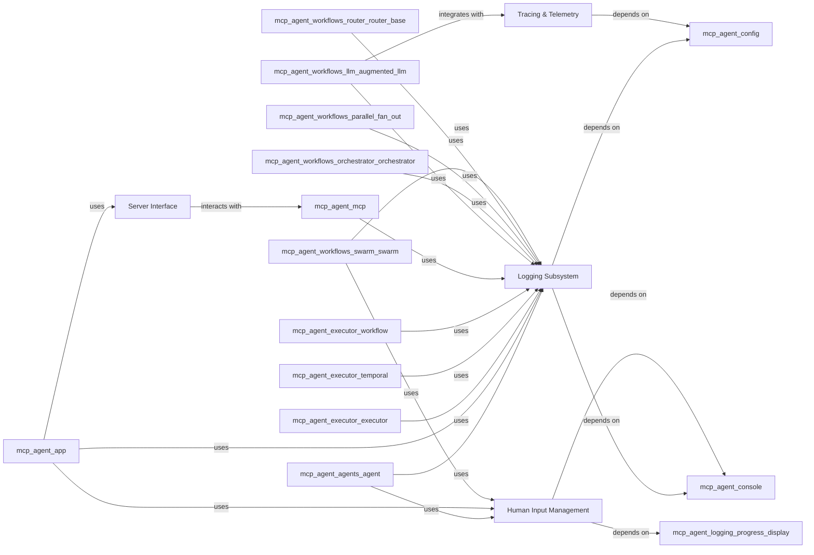

## Component Details

This component encompasses all functionalities related to centralized logging, application tracing, and usage data collection, which are vital for monitoring and debugging. It also handles exposing the application's capabilities as an external server and managing interactive human input for workflows requiring user intervention. These four components are fundamental to the `System Observability & Interface` because they collectively cover all aspects of how the `mcp-agent` communicates with its environment and how its internal state is monitored. Together, these components ensure that the `mcp-agent` is observable (through logging and tracing) and interactive (through the server and human input), making it a robust and manageable system.

### Logging Subsystem
This component provides a centralized logging mechanism for the `mcp-agent` project. It handles the generation, filtering, listening, and transportation of log events, which are crucial for monitoring, debugging, and auditing the application's behavior.

**Related Classes/Methods**:

- <a href="https://github.com/lastmile-ai/mcp-agent/blob/master/src/mcp_agent/logging/logger.py#L1-L1" target="_blank" rel="noopener noreferrer">`mcp_agent/logging/logger.py` (1:1)</a>
- <a href="https://github.com/lastmile-ai/mcp-agent/blob/master/src/mcp_agent/logging/events.py#L1-L1" target="_blank" rel="noopener noreferrer">`mcp_agent/logging/events.py` (1:1)</a>
- <a href="https://github.com/lastmile-ai/mcp-agent/blob/master/src/mcp_agent/logging/listeners.py#L1-L1" target="_blank" rel="noopener noreferrer">`mcp_agent/logging/listeners.py` (1:1)</a>
- <a href="https://github.com/lastmile-ai/mcp-agent/blob/master/src/mcp_agent/logging/transport.py#L1-L1" target="_blank" rel="noopener noreferrer">`mcp_agent/logging/transport.py` (1:1)</a>
- <a href="https://github.com/lastmile-ai/mcp-agent/blob/master/src/mcp_agent/logging/progress_display.py#L1-L1" target="_blank" rel="noopener noreferrer">`mcp_agent/logging/progress_display.py` (1:1)</a>
- <a href="https://github.com/lastmile-ai/mcp-agent/blob/master/src/mcp_agent/logging/event_progress.py#L1-L1" target="_blank" rel="noopener noreferrer">`mcp_agent/logging/event_progress.py` (1:1)</a>
- <a href="https://github.com/lastmile-ai/mcp-agent/blob/master/src/mcp_agent/logging/json_serializer.py#L1-L1" target="_blank" rel="noopener noreferrer">`mcp_agent/logging/json_serializer.py` (1:1)</a>
- <a href="https://github.com/lastmile-ai/mcp-agent/blob/master/src/mcp_agent/logging/rich_progress.py#L1-L1" target="_blank" rel="noopener noreferrer">`mcp_agent/logging/rich_progress.py` (1:1)</a>
- <a href="https://github.com/lastmile-ai/mcp-agent/blob/master/src/mcp_agent/logging/logger.py#L1-L1" target="_blank" rel="noopener noreferrer">`mcp_agent.logging.logger.Logger` (1:1)</a>
- <a href="https://github.com/lastmile-ai/mcp-agent/blob/master/src/mcp_agent/logging/events.py#L1-L1" target="_blank" rel="noopener noreferrer">`mcp_agent.logging.events.EventFilter` (1:1)</a>
- <a href="https://github.com/lastmile-ai/mcp-agent/blob/master/src/mcp_agent/logging/listeners.py#L1-L1" target="_blank" rel="noopener noreferrer">`mcp_agent.logging.listeners.EventListener` (1:1)</a>
- <a href="https://github.com/lastmile-ai/mcp-agent/blob/master/src/mcp_agent/logging/transport.py#L1-L1" target="_blank" rel="noopener noreferrer">`mcp_agent.logging.transport.EventTransport` (1:1)</a>
- <a href="https://github.com/lastmile-ai/mcp-agent/blob/master/src/mcp_agent/logging/json_serializer.py#L15-L162" target="_blank" rel="noopener noreferrer">`mcp_agent.logging.json_serializer.JSONSerializer` (15:162)</a>
- <a href="https://github.com/lastmile-ai/mcp-agent/blob/master/src/mcp_agent/logging/rich_progress.py#L11-L135" target="_blank" rel="noopener noreferrer">`mcp_agent.logging.rich_progress.RichProgressDisplay` (11:135)</a>

### Tracing & Telemetry
This component provides cross-cutting concerns for application tracing and usage data collection. It instruments LLM interactions and captures valuable debugging and performance data, contributing to overall system observability. This is crucial for understanding the flow of execution, especially in complex LLM-driven workflows, and for collecting anonymous usage statistics.

**Related Classes/Methods**:

- <a href="https://github.com/lastmile-ai/mcp-agent/blob/master/src/mcp_agent/tracing/telemetry.py#L1-L1" target="_blank" rel="noopener noreferrer">`mcp_agent/tracing/telemetry.py` (1:1)</a>
- <a href="https://github.com/lastmile-ai/mcp-agent/blob/master/src/mcp_agent/tracing/tracer.py#L1-L1" target="_blank" rel="noopener noreferrer">`mcp_agent/tracing/tracer.py` (1:1)</a>
- <a href="https://github.com/lastmile-ai/mcp-agent/blob/master/src/mcp_agent/telemetry/usage_tracking.py#L1-L1" target="_blank" rel="noopener noreferrer">`mcp_agent/telemetry/usage_tracking.py` (1:1)</a>
- <a href="https://github.com/lastmile-ai/mcp-agent/blob/master/src/mcp_agent/tracing/file_span_exporter.py#L1-L1" target="_blank" rel="noopener noreferrer">`mcp_agent/tracing/file_span_exporter.py` (1:1)</a>
- <a href="https://github.com/lastmile-ai/mcp-agent/blob/master/src/mcp_agent/tracing/semconv.py#L1-L1" target="_blank" rel="noopener noreferrer">`mcp_agent/tracing/semconv.py` (1:1)</a>
- <a href="https://github.com/lastmile-ai/mcp-agent/blob/master/src/mcp_agent/tracing/tracer.py#L1-L1" target="_blank" rel="noopener noreferrer">`mcp_agent.tracing.tracer.Tracer` (1:1)</a>
- <a href="https://github.com/lastmile-ai/mcp-agent/blob/master/src/mcp_agent/tracing/telemetry.py#L1-L1" target="_blank" rel="noopener noreferrer">`mcp_agent.tracing.telemetry.Telemetry` (1:1)</a>
- <a href="https://github.com/lastmile-ai/mcp-agent/blob/master/src/mcp_agent/telemetry/usage_tracking.py#L1-L1" target="_blank" rel="noopener noreferrer">`mcp_agent.telemetry.usage_tracking.UsageTracker` (1:1)</a>
- <a href="https://github.com/lastmile-ai/mcp-agent/blob/master/src/mcp_agent/tracing/file_span_exporter.py#L15-L67" target="_blank" rel="noopener noreferrer">`mcp_agent.tracing.file_span_exporter.FileSpanExporter` (15:67)</a>

### Server Interface
This component is responsible for exposing the `mcp-agent`'s capabilities as an external server. It handles the server application logic, defines the necessary data types for communication, and allows external systems to interact with the agent. This is fundamental for enabling the agent to be used as a service.

**Related Classes/Methods**:

- <a href="https://github.com/lastmile-ai/mcp-agent/blob/master/src/mcp_agent/server/app_server.py#L1-L1" target="_blank" rel="noopener noreferrer">`mcp_agent/server/app_server.py` (1:1)</a>
- <a href="https://github.com/lastmile-ai/mcp-agent/blob/master/src/mcp_agent/server/app_server_types.py#L1-L1" target="_blank" rel="noopener noreferrer">`mcp_agent/server/app_server_types.py` (1:1)</a>
- <a href="https://github.com/lastmile-ai/mcp-agent/blob/master/src/mcp_agent/server/app_server.py#L1-L1" target="_blank" rel="noopener noreferrer">`mcp_agent.server.app_server.AppServer` (1:1)</a>
- <a href="https://github.com/lastmile-ai/mcp-agent/blob/master/src/mcp_agent/server/app_server_types.py#L1-L1" target="_blank" rel="noopener noreferrer">`mcp_agent.server.app_server_types.AppServerTypes` (1:1)</a>

### Human Input Management
This component manages interactive human input for workflows that require user intervention. It provides mechanisms for handling input requests from the console and displaying relevant progress to the user, enabling human-in-the-loop processes.

**Related Classes/Methods**:

- <a href="https://github.com/lastmile-ai/mcp-agent/blob/master/src/mcp_agent/human_input/handler.py#L1-L1" target="_blank" rel="noopener noreferrer">`mcp_agent/human_input/handler.py` (1:1)</a>
- <a href="https://github.com/lastmile-ai/mcp-agent/blob/master/src/mcp_agent/human_input/types.py#L1-L1" target="_blank" rel="noopener noreferrer">`mcp_agent/human_input/types.py` (1:1)</a>
- <a href="https://github.com/lastmile-ai/mcp-agent/blob/master/src/mcp_agent/human_input/handler.py#L1-L1" target="_blank" rel="noopener noreferrer">`mcp_agent.human_input.handler.Handler` (1:1)</a>
- <a href="https://github.com/lastmile-ai/mcp-agent/blob/master/src/mcp_agent/human_input/types.py#L1-L1" target="_blank" rel="noopener noreferrer">`mcp_agent.human_input.types.types` (1:1)</a>

### [FAQ](https://github.com/CodeBoarding/GeneratedOnBoardings/tree/main?tab=readme-ov-file#faq)