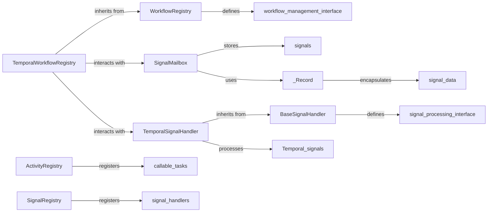

## Component Details

The Task & Signal Registry subsystem is crucial for the mcp-agent's executor, providing the backbone for dynamic task execution and responsive signal handling within workflows. It centralizes the management of executable activities and external signals, ensuring discoverability, proper routing, and efficient processing.

### ActivityRegistry
This component acts as a central repository for registering and looking up executable tasks (activities) within the `mcp-agent`'s executor. It stores references to callable functions and their associated metadata, making tasks discoverable and enabling dynamic orchestration by the workflow engine.

**Related Classes/Methods**: _None_

### SignalRegistry
This component provides a centralized mechanism for registering and retrieving signal handlers. It manages callable functions designed to process incoming external signals, along with any associated state. This ensures the system can properly route and react to external events that influence workflow execution.

**Related Classes/Methods**: _None_

### BaseSignalHandler
This is an abstract base class that defines the common interface and expected behavior for all signal handlers within the system. It ensures consistency in how signals are processed, regardless of the specific executor or workflow type. Concrete signal handlers, like `TemporalSignalHandler`, inherit from this class.

**Related Classes/Methods**: _None_

### SignalMailbox
This component serves as a dedicated mailbox for signals within the context of a Temporal workflow. It facilitates the pushing of new signals, retrieval of the current mailbox state, and access to the signal's value. It internally utilizes the `_Record` class to manage signal data efficiently.

**Related Classes/Methods**: _None_

### _Record
An internal helper class primarily used by `SignalMailbox`. Its purpose is to encapsulate and manage the actual signal data, including its version and value, providing a structured way to store and retrieve signal information.

**Related Classes/Methods**: _None_

### TemporalSignalHandler
This handler is specifically designed for processing and validating incoming signals within Temporal workflows. It extends `BaseSignalHandler`, adhering to a common interface for signal handling while providing Temporal-specific logic for signal processing and validation.

**Related Classes/Methods**: _None_

### WorkflowRegistry
This is an abstract base class that defines the common interface for managing the lifecycle of workflows. It provides a consistent approach for registering, retrieving, and tracking the status of workflows across different executor types. Concrete workflow registries, such as `TemporalWorkflowRegistry`, extend this class.

**Related Classes/Methods**: _None_

### TemporalWorkflowRegistry
This component is responsible for managing the lifecycle of Temporal workflows, including their registration, retrieval, and status tracking. It offers functionalities to resume, cancel, and list the statuses of active workflows. It extends `WorkflowRegistry`, ensuring a consistent approach to workflow management within the Temporal context.

**Related Classes/Methods**: _None_

### [FAQ](https://github.com/CodeBoarding/GeneratedOnBoardings/tree/main?tab=readme-ov-file#faq)