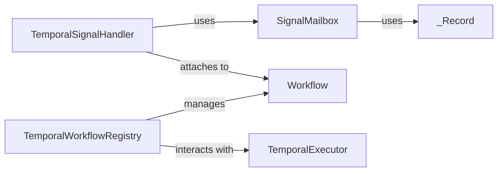

## Component Details

The `Temporal Integration` subsystem provides robust integration with the Temporal workflow engine, enabling durable execution, fault tolerance, and the management of long-running, stateful workflows. This is achieved by bridging internal workflow definitions with Temporal's powerful capabilities.

### TemporalWorkflowRegistry
This component is the central point for managing the lifecycle of Temporal workflow instances. It handles the registration, unregistration, retrieval, and status tracking of workflows. It directly interacts with the Temporal client to perform operations such as resuming, canceling, and querying workflow statuses, effectively bridging the internal workflow representation with Temporal's external management capabilities.

**Related Classes/Methods**:

- <a href="https://github.com/lastmile-ai/mcp-agent/blob/master/src/mcp_agent/executor/temporal/workflow_registry.py#L20-L248" target="_blank" rel="noopener noreferrer">`mcp_agent.executor.temporal.workflow_registry.TemporalWorkflowRegistry` (20:248)</a>
- <a href="https://github.com/lastmile-ai/mcp-agent/blob/master/src/mcp_agent/executor/workflow.py#L61-L510" target="_blank" rel="noopener noreferrer">`mcp_agent.executor.workflow.Workflow` (61:510)</a>
- `mcp_agent.executor.temporal.TemporalExecutor` (1:1)

### SignalMailbox
This component acts as an in-memory mailbox specifically designed for managing signals within a Temporal workflow. It provides a deterministic mechanism to push new signals, retrieve the current state of the mailbox, and access the signal's value. It internally uses the `_Record` class to encapsulate signal data, ensuring proper versioning and state management for broadcast semantics.

**Related Classes/Methods**:

- <a href="https://github.com/lastmile-ai/mcp-agent/blob/master/src/mcp_agent/executor/temporal/workflow_signal.py#L25-L70" target="_blank" rel="noopener noreferrer">`mcp_agent.executor.temporal.workflow_signal.SignalMailbox` (25:70)</a>
- <a href="https://github.com/lastmile-ai/mcp-agent/blob/master/src/mcp_agent/executor/temporal/workflow_signal.py#L18-L22" target="_blank" rel="noopener noreferrer">`mcp_agent.executor.temporal.workflow_signal._Record` (18:22)</a>

### _Record
This is an internal helper dataclass specifically designed to be used by `SignalMailbox`. Its primary purpose is to encapsulate and manage the actual signal data, including its value and a monotonic version counter. This abstraction is crucial for maintaining the integrity and versioning of signals within the mailbox, supporting the broadcast semantics of `SignalMailbox`.

**Related Classes/Methods**:

- <a href="https://github.com/lastmile-ai/mcp-agent/blob/master/src/mcp_agent/executor/temporal/workflow_signal.py#L18-L22" target="_blank" rel="noopener noreferrer">`mcp_agent.executor.temporal.workflow_signal._Record` (18:22)</a>
- <a href="https://github.com/lastmile-ai/mcp-agent/blob/master/src/mcp_agent/executor/temporal/workflow_signal.py#L25-L70" target="_blank" rel="noopener noreferrer">`mcp_agent.executor.temporal.workflow_signal.SignalMailbox` (25:70)</a>

### TemporalSignalHandler
This component is responsible for processing and validating incoming signals specifically for Temporal workflows. By extending `BaseSignalHandler`, it adheres to a common interface for signal handling, promoting consistency across different executor types. Its role is critical in ensuring that signals are correctly interpreted and acted upon within the Temporal workflow context, leveraging `SignalMailbox` for signal management.

**Related Classes/Methods**:

- <a href="https://github.com/lastmile-ai/mcp-agent/blob/master/src/mcp_agent/executor/temporal/workflow_signal.py#L73-L233" target="_blank" rel="noopener noreferrer">`mcp_agent.executor.temporal.workflow_signal.TemporalSignalHandler` (73:233)</a>
- <a href="https://github.com/lastmile-ai/mcp-agent/blob/master/src/mcp_agent/executor/temporal/workflow_signal.py#L25-L70" target="_blank" rel="noopener noreferrer">`mcp_agent.executor.temporal.workflow_signal.SignalMailbox` (25:70)</a>
- <a href="https://github.com/lastmile-ai/mcp-agent/blob/master/src/mcp_agent/executor/workflow.py#L61-L510" target="_blank" rel="noopener noreferrer">`mcp_agent.executor.workflow.Workflow` (61:510)</a>

### [FAQ](https://github.com/CodeBoarding/GeneratedOnBoardings/tree/main?tab=readme-ov-file#faq)