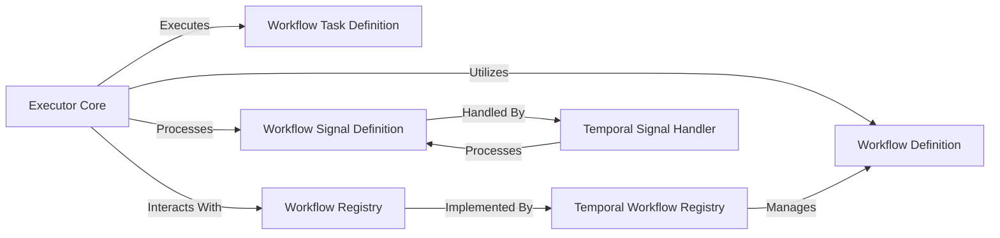

## Component Details

Overview of the fundamental components within the mcp_agent.executor subsystem, focusing on Workflow Definition & Management.

### Workflow Definition
This component defines the fundamental structure and properties of a workflow. It serves as the blueprint that dictates the sequence of tasks, their dependencies, and the overall state transitions within a workflow. It's the core model that the Executor Core interprets and executes.

**Related Classes/Methods**:

- <a href="https://github.com/lastmile-ai/mcp-agent/blob/master/src/mcp_agent/executor/workflow.py#L1-L1" target="_blank" rel="noopener noreferrer">`mcp_agent.executor.workflow` (1:1)</a>

### Workflow Task Definition
This component is responsible for defining the individual units of work within a workflow, known as tasks. It specifies the properties, state, and execution parameters for each task, enabling the workflow to be broken down into manageable and executable steps.

**Related Classes/Methods**:

- <a href="https://github.com/lastmile-ai/mcp-agent/blob/master/src/mcp_agent/executor/workflow_task.py#L1-L1" target="_blank" rel="noopener noreferrer">`mcp_agent.executor.workflow_task` (1:1)</a>

### Workflow Signal Definition
This component defines the structure and purpose of signals within the workflow system. Signals are external or internal messages that can alter the state or progression of a workflow, enabling dynamic interaction and event-driven behavior.

**Related Classes/Methods**:

- <a href="https://github.com/lastmile-ai/mcp-agent/blob/master/src/mcp_agent/executor/workflow_signal.py#L1-L1" target="_blank" rel="noopener noreferrer">`mcp_agent.executor.workflow_signal` (1:1)</a>

### Workflow Registry
This component acts as a central repository for registering, retrieving, and managing the lifecycle of workflows. It provides mechanisms for storing workflow definitions, tracking their status (e.g., active, completed, canceled), and enabling operations like resuming or listing workflows.

**Related Classes/Methods**:

- <a href="https://github.com/lastmile-ai/mcp-agent/blob/master/src/mcp_agent/executor/workflow_registry.py#L1-L1" target="_blank" rel="noopener noreferrer">`mcp_agent.executor.workflow_registry` (1:1)</a>

### Temporal Workflow Registry
This is a concrete implementation of the Workflow Registry specifically tailored for workflows managed by the Temporal platform. It handles the specifics of registering and interacting with Temporal workflows, bridging the abstract workflow management with a concrete execution environment.

**Related Classes/Methods**:

- <a href="https://github.com/lastmile-ai/mcp-agent/blob/master/src/mcp_agent/executor/temporal/workflow_registry.py#L1-L1" target="_blank" rel="noopener noreferrer">`mcp_agent.executor.temporal.workflow_registry` (1:1)</a>

### Temporal Signal Handler
This component is a concrete implementation for handling signals within Temporal-based workflows. It manages the reception, storage (e.g., in a mailbox), and processing of signals, ensuring that incoming events are correctly routed and acted upon within the Temporal workflow context.

**Related Classes/Methods**:

- <a href="https://github.com/lastmile-ai/mcp-agent/blob/master/src/mcp_agent/executor/temporal/workflow_signal.py#L1-L1" target="_blank" rel="noopener noreferrer">`mcp_agent.executor.temporal.workflow_signal` (1:1)</a>

### Executor Core
This component is the central execution engine responsible for orchestrating and running workflows. It interprets the workflow definitions, manages task execution, handles state transitions, and interacts with the various registries and signal handlers to ensure the smooth progression of workflows.

**Related Classes/Methods**:

- <a href="https://github.com/lastmile-ai/mcp-agent/blob/master/src/mcp_agent/executor/executor.py#L1-L1" target="_blank" rel="noopener noreferrer">`mcp_agent.executor.executor` (1:1)</a>

### [FAQ](https://github.com/CodeBoarding/GeneratedOnBoardings/tree/main?tab=readme-ov-file#faq)