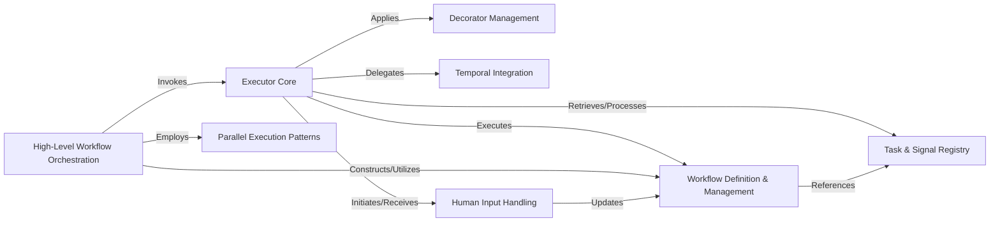

## Component Details

The Workflow & Execution Engine component provides the foundational infrastructure for executing tasks and managing complex, multi-step workflows. It supports various execution environments and handles task registration, signal processing, and workflow state management, orchestrating sequential or parallel execution, including points requiring human input.

### Executor Core
The central orchestrator responsible for initiating, managing, and executing tasks and workflows. It dispatches tasks to appropriate handlers and oversees their lifecycle, including completion or failure.

**Related Classes/Methods**:

- <a href="https://github.com/lastmile-ai/mcp-agent/blob/master/src/mcp_agent/executor/executor.py#L1-L1" target="_blank" rel="noopener noreferrer">`mcp_agent.executor.executor` (1:1)</a>

### Workflow Definition & Management
Defines the structure, state, and progression of workflows. It provides the blueprint for the Executor Core to follow, including task sequences, dependencies, and current workflow progress. This component also manages the general registry for workflows, tasks, and signals.

**Related Classes/Methods**:

- <a href="https://github.com/lastmile-ai/mcp-agent/blob/master/src/mcp_agent/executor/workflow.py#L1-L1" target="_blank" rel="noopener noreferrer">`mcp_agent.executor.workflow` (1:1)</a>
- <a href="https://github.com/lastmile-ai/mcp-agent/blob/master/src/mcp_agent/executor/workflow_registry.py#L1-L1" target="_blank" rel="noopener noreferrer">`mcp_agent.executor.workflow_registry` (1:1)</a>
- <a href="https://github.com/lastmile-ai/mcp-agent/blob/master/src/mcp_agent/executor/workflow_task.py#L1-L1" target="_blank" rel="noopener noreferrer">`mcp_agent.executor.workflow_task` (1:1)</a>
- <a href="https://github.com/lastmile-ai/mcp-agent/blob/master/src/mcp_agent/executor/workflow_signal.py#L1-L1" target="_blank" rel="noopener noreferrer">`mcp_agent.executor.workflow_signal` (1:1)</a>

### Task & Signal Registry
Manages the registration and lookup of executable tasks and handles the processing of external signals that can influence workflow execution. It ensures that tasks and signals are discoverable and properly routed.

**Related Classes/Methods**:

- <a href="https://github.com/lastmile-ai/mcp-agent/blob/master/src/mcp_agent/executor/task_registry.py#L1-L1" target="_blank" rel="noopener noreferrer">`mcp_agent.executor.task_registry` (1:1)</a>
- <a href="https://github.com/lastmile-ai/mcp-agent/blob/master/src/mcp_agent/executor/signal_registry.py#L1-L1" target="_blank" rel="noopener noreferrer">`mcp_agent.executor.signal_registry` (1:1)</a>

### Decorator Management
Manages decorators that can be applied to tasks or workflows. These decorators enable the injection of cross-cutting concerns such as logging, retry logic, or authentication without altering the core business logic of tasks or workflows.

**Related Classes/Methods**:

- <a href="https://github.com/lastmile-ai/mcp-agent/blob/master/src/mcp_agent/executor/decorator_registry.py#L1-L1" target="_blank" rel="noopener noreferrer">`mcp_agent.executor.decorator_registry` (1:1)</a>

### Temporal Integration
Provides specific integration with the Temporal workflow engine. This component enables durable execution, fault tolerance, and the management of long-running, stateful workflows by bridging internal workflow definitions with Temporal's capabilities.

**Related Classes/Methods**:

- <a href="https://github.com/lastmile-ai/mcp-agent/blob/master/src/mcp_agent/executor/temporal/workflow_registry.py#L1-L1" target="_blank" rel="noopener noreferrer">`mcp_agent.executor.temporal.workflow_registry` (1:1)</a>
- <a href="https://github.com/lastmile-ai/mcp-agent/blob/master/src/mcp_agent/executor/temporal/workflow_signal.py#L1-L1" target="_blank" rel="noopener noreferrer">`mcp_agent.executor.temporal.workflow_signal` (1:1)</a>

### High-Level Workflow Orchestration
Implements higher-level orchestration logic for complex workflows. This includes decision-making, branching, and the coordination of various sub-workflows to achieve a larger, overarching goal.

**Related Classes/Methods**:

- <a href="https://github.com/lastmile-ai/mcp-agent/blob/master/src/mcp_agent/workflows/orchestrator/orchestrator.py#L1-L1" target="_blank" rel="noopener noreferrer">`mcp_agent.workflows.orchestrator.orchestrator` (1:1)</a>

### Parallel Execution Patterns
Implements specific patterns for parallelizing tasks (e.g., fan_out) and then aggregating their results (fan_in). This is crucial for optimizing performance in scenarios where multiple independent tasks can run concurrently.

**Related Classes/Methods**:

- <a href="https://github.com/lastmile-ai/mcp-agent/blob/master/src/mcp_agent/workflows/parallel/fan_out.py#L1-L1" target="_blank" rel="noopener noreferrer">`mcp_agent.workflows.parallel.fan_out` (1:1)</a>
- <a href="https://github.com/lastmile-ai/mcp-agent/blob/master/src/mcp_agent/workflows/parallel/fan_in.py#L1-L1" target="_blank" rel="noopener noreferrer">`mcp_agent.workflows.parallel.fan_in` (1:1)</a>
- <a href="https://github.com/lastmile-ai/mcp-agent/blob/master/src/mcp_agent/workflows/parallel/parallel_llm.py#L1-L1" target="_blank" rel="noopener noreferrer">`mcp_agent.workflows.parallel.parallel_llm` (1:1)</a>

### Human Input Handling
Manages the interaction points where human input is required within a workflow. It handles prompting the user, receiving input, and integrating it back into the workflow's execution flow, enabling human-in-the-loop processes.

**Related Classes/Methods**:

- <a href="https://github.com/lastmile-ai/mcp-agent/blob/master/src/mcp_agent/human_input/handler.py#L1-L1" target="_blank" rel="noopener noreferrer">`mcp_agent.human_input.handler` (1:1)</a>
- <a href="https://github.com/lastmile-ai/mcp-agent/blob/master/src/mcp_agent/human_input/types.py#L1-L1" target="_blank" rel="noopener noreferrer">`mcp_agent.human_input.types` (1:1)</a>

### [FAQ](https://github.com/CodeBoarding/GeneratedOnBoardings/tree/main?tab=readme-ov-file#faq)