```mermaid
graph LR
    Agent_Core_Lifecycle["Agent Core & Lifecycle"]
    Workflow_Execution_Engine["Workflow & Execution Engine"]
    AI_LLM_Intelligence["AI & LLM Intelligence"]
    MCP_Communication["MCP Communication"]
    Server_Interface["Server Interface"]
    Agent_Core_Lifecycle -- "initializes and configures" --> Workflow_Execution_Engine
    Agent_Core_Lifecycle -- "provides core interface to" --> Server_Interface
    Workflow_Execution_Engine -- "executes tasks and workflows defined by" --> Agent_Core_Lifecycle
    Workflow_Execution_Engine -- "utilizes" --> AI_LLM_Intelligence
    AI_LLM_Intelligence -- "provides LLM capabilities to" --> Workflow_Execution_Engine
    AI_LLM_Intelligence -- "receives LLM capabilities from" --> MCP_Communication
    MCP_Communication -- "provides external capabilities to" --> Agent_Core_Lifecycle
    MCP_Communication -- "supplies LLM capabilities to" --> AI_LLM_Intelligence
    Server_Interface -- "exposes capabilities of" --> Agent_Core_Lifecycle
    Server_Interface -- "registers workflows/tools with" --> Workflow_Execution_Engine
    click Workflow_Execution_Engine href "https://github.com/CodeBoarding/GeneratedOnBoardings/blob/main//mcp-agent/Workflow_Execution_Engine.md" "Details"
    click AI_LLM_Intelligence href "https://github.com/CodeBoarding/GeneratedOnBoardings/blob/main//mcp-agent/AI_LLM_Intelligence.md" "Details"
    click MCP_Communication href "https://github.com/CodeBoarding/GeneratedOnBoardings/blob/main//mcp-agent/MCP_Communication.md" "Details"
```

## Component Details

The `mcp-agent` architecture is designed around a modular and intelligent agent system, primarily focused on orchestrating tasks, interacting with Large Language Models (LLMs), and communicating within a multi-agent environment. The analysis consolidates the initial components into five fundamental, high-level architectural components, chosen for their distinct responsibilities and critical roles in the agent's operation.

### Agent Core & Lifecycle
This is the central orchestrator of the `mcp-agent`. It manages the entire application lifecycle, including startup, shutdown, and global context initialization. It also defines the fundamental interface and capabilities of the MCP agent, such as listing available tools, resources, prompts, and executing core agent functions. It serves as the primary interaction point for other internal components and external systems.

**Related Classes/Methods**:

- <a href="https://github.com/lastmile-ai/mcp-agent/blob/master/src/mcp_agent/app.py#L0-L0" target="_blank" rel="noopener noreferrer">`src/mcp_agent/app.py` (0:0)</a>
- <a href="https://github.com/lastmile-ai/mcp-agent/blob/master/src/mcp_agent/config.py#L0-L0" target="_blank" rel="noopener noreferrer">`src/mcp_agent/config.py` (0:0)</a>
- <a href="https://github.com/lastmile-ai/mcp-agent/blob/master/src/mcp_agent/core/context.py#L0-L0" target="_blank" rel="noopener noreferrer">`src/mcp_agent/core/context.py` (0:0)</a>
- <a href="https://github.com/lastmile-ai/mcp-agent/blob/master/src/mcp_agent/agents/agent.py#L0-L0" target="_blank" rel="noopener noreferrer">`src/mcp_agent/agents/agent.py` (0:0)</a>
- <a href="https://github.com/lastmile-ai/mcp-agent/blob/master/src/mcp_agent/utils/pydantic_type_serializer.py#L0-L0" target="_blank" rel="noopener noreferrer">`src/mcp_agent/utils/pydantic_type_serializer.py` (0:0)</a>
- <a href="https://github.com/lastmile-ai/mcp-agent/blob/master/src/mcp_agent/utils/prompt_message_multipart.py#L0-L0" target="_blank" rel="noopener noreferrer">`src/mcp_agent/utils/prompt_message_multipart.py` (0:0)</a>
- <a href="https://github.com/lastmile-ai/mcp-agent/blob/master/src/mcp_agent/utils/resource_utils.py#L0-L0" target="_blank" rel="noopener noreferrer">`src/mcp_agent/utils/resource_utils.py` (0:0)</a>
- <a href="https://github.com/lastmile-ai/mcp-agent/blob/master/src/mcp_agent/utils/mime_utils.py#L0-L0" target="_blank" rel="noopener noreferrer">`src/mcp_agent/utils/mime_utils.py` (0:0)</a>
- <a href="https://github.com/lastmile-ai/mcp-agent/blob/master/src/mcp_agent/utils/content_utils.py#L0-L0" target="_blank" rel="noopener noreferrer">`src/mcp_agent/utils/content_utils.py` (0:0)</a>
- <a href="https://github.com/lastmile-ai/mcp-agent/blob/master/src/mcp_agent/utils/common.py#L0-L0" target="_blank" rel="noopener noreferrer">`src/mcp_agent/utils/common.py` (0:0)</a>

### Workflow & Execution Engine
This component provides the foundational infrastructure for executing tasks and managing complex, multi-step workflows. It supports various execution environments (e.g., Asyncio, Temporal) and handles task registration, signal processing, and workflow state management. It orchestrates the sequential or parallel execution of steps, including points that require human input.

**Related Classes/Methods**:

- <a href="https://github.com/lastmile-ai/mcp-agent/blob/master/src/mcp_agent/executor/executor.py#L0-L0" target="_blank" rel="noopener noreferrer">`src/mcp_agent/executor/executor.py` (0:0)</a>
- <a href="https://github.com/lastmile-ai/mcp-agent/blob/master/src/mcp_agent/executor/workflow.py#L0-L0" target="_blank" rel="noopener noreferrer">`src/mcp_agent/executor/workflow.py` (0:0)</a>
- <a href="https://github.com/lastmile-ai/mcp-agent/blob/master/src/mcp_agent/executor/task_registry.py#L0-L0" target="_blank" rel="noopener noreferrer">`src/mcp_agent/executor/task_registry.py` (0:0)</a>
- <a href="https://github.com/lastmile-ai/mcp-agent/blob/master/src/mcp_agent/executor/signal_registry.py#L0-L0" target="_blank" rel="noopener noreferrer">`src/mcp_agent/executor/signal_registry.py` (0:0)</a>
- <a href="https://github.com/lastmile-ai/mcp-agent/blob/master/src/mcp_agent/executor/decorator_registry.py#L0-L0" target="_blank" rel="noopener noreferrer">`src/mcp_agent/executor/decorator_registry.py` (0:0)</a>
- `src/mcp_agent/executor/temporal/` (0:0)
- <a href="https://github.com/lastmile-ai/mcp-agent/blob/master/src/mcp_agent/workflows/orchestrator/orchestrator.py#L0-L0" target="_blank" rel="noopener noreferrer">`src/mcp_agent/workflows/orchestrator/orchestrator.py` (0:0)</a>
- <a href="https://github.com/lastmile-ai/mcp-agent/blob/master/src/mcp_agent/workflows/parallel/fan_out.py#L0-L0" target="_blank" rel="noopener noreferrer">`src/mcp_agent/workflows/parallel/fan_out.py` (0:0)</a>
- <a href="https://github.com/lastmile-ai/mcp-agent/blob/master/src/mcp_agent/workflows/parallel/fan_in.py#L0-L0" target="_blank" rel="noopener noreferrer">`src/mcp_agent/workflows/parallel/fan_in.py` (0:0)</a>
- <a href="https://github.com/lastmile-ai/mcp-agent/blob/master/src/mcp_agent/workflows/parallel/parallel_llm.py#L0-L0" target="_blank" rel="noopener noreferrer">`src/mcp_agent/workflows/parallel/parallel_llm.py` (0:0)</a>
- <a href="https://github.com/lastmile-ai/mcp-agent/blob/master/src/mcp_agent/human_input/handler.py#L0-L0" target="_blank" rel="noopener noreferrer">`src/mcp_agent/human_input/handler.py` (0:0)</a>
- <a href="https://github.com/lastmile-ai/mcp-agent/blob/master/src/mcp_agent/human_input/types.py#L0-L0" target="_blank" rel="noopener noreferrer">`src/mcp_agent/human_input/types.py` (0:0)</a>

### AI & LLM Intelligence
This component serves as the brain of the agent, offering a standardized and augmented interface for interacting with various Large Language Models (LLMs) from different providers. It includes functionalities for intelligent model selection, handling request parameters, and converting content formats. Furthermore, it provides intelligent mechanisms for routing incoming requests, classifying user intentions using both embedding-based and LLM-based analysis, and evaluating/optimizing LLM-generated responses.

**Related Classes/Methods**:

- <a href="https://github.com/lastmile-ai/mcp-agent/blob/master/src/mcp_agent/workflows/llm/augmented_llm.py#L0-L0" target="_blank" rel="noopener noreferrer">`src/mcp_agent/workflows/llm/augmented_llm.py` (0:0)</a>
- <a href="https://github.com/lastmile-ai/mcp-agent/blob/master/src/mcp_agent/workflows/llm/llm_selector.py#L0-L0" target="_blank" rel="noopener noreferrer">`src/mcp_agent/workflows/llm/llm_selector.py` (0:0)</a>
- `src/mcp_agent/workflows/llm/augmented_llm_*.py` (0:0)
- `src/mcp_agent/workflows/llm/multipart_converter_*.py` (0:0)
- <a href="https://github.com/lastmile-ai/mcp-agent/blob/master/src/mcp_agent/workflows/router/router_base.py#L0-L0" target="_blank" rel="noopener noreferrer">`src/mcp_agent/workflows/router/router_base.py` (0:0)</a>
- <a href="https://github.com/lastmile-ai/mcp-agent/blob/master/src/mcp_agent/workflows/router/router_embedding.py#L0-L0" target="_blank" rel="noopener noreferrer">`src/mcp_agent/workflows/router/router_embedding.py` (0:0)</a>
- <a href="https://github.com/lastmile-ai/mcp-agent/blob/master/src/mcp_agent/workflows/router/router_llm.py#L0-L0" target="_blank" rel="noopener noreferrer">`src/mcp_agent/workflows/router/router_llm.py` (0:0)</a>
- <a href="https://github.com/lastmile-ai/mcp-agent/blob/master/src/mcp_agent/workflows/intent_classifier/intent_classifier_base.py#L0-L0" target="_blank" rel="noopener noreferrer">`src/mcp_agent/workflows/intent_classifier/intent_classifier_base.py` (0:0)</a>
- <a href="https://github.com/lastmile-ai/mcp-agent/blob/master/src/mcp_agent/workflows/intent_classifier/intent_classifier_embedding.py#L0-L0" target="_blank" rel="noopener noreferrer">`src/mcp_agent/workflows/intent_classifier/intent_classifier_embedding.py` (0:0)</a>
- <a href="https://github.com/lastmile-ai/mcp-agent/blob/master/src/mcp_agent/workflows/intent_classifier/intent_classifier_llm.py#L0-L0" target="_blank" rel="noopener noreferrer">`src/mcp_agent/workflows/intent_classifier/intent_classifier_llm.py` (0:0)</a>
- <a href="https://github.com/lastmile-ai/mcp-agent/blob/master/src/mcp_agent/workflows/embedding/embedding_base.py#L0-L0" target="_blank" rel="noopener noreferrer">`src/mcp_agent/workflows/embedding/embedding_base.py` (0:0)</a>
- <a href="https://github.com/lastmile-ai/mcp-agent/blob/master/src/mcp_agent/workflows/embedding/embedding_openai.py#L0-L0" target="_blank" rel="noopener noreferrer">`src/mcp_agent/workflows/embedding/embedding_openai.py` (0:0)</a>
- <a href="https://github.com/lastmile-ai/mcp-agent/blob/master/src/mcp_agent/workflows/embedding/embedding_cohere.py#L0-L0" target="_blank" rel="noopener noreferrer">`src/mcp_agent/workflows/embedding/embedding_cohere.py` (0:0)</a>
- <a href="https://github.com/lastmile-ai/mcp-agent/blob/master/src/mcp_agent/workflows/evaluator_optimizer/evaluator_optimizer.py#L0-L0" target="_blank" rel="noopener noreferrer">`src/mcp_agent/workflows/evaluator_optimizer/evaluator_optimizer.py` (0:0)</a>

### MCP Communication
This component is responsible for facilitating communication with and aggregating capabilities (tools, prompts, resources) from multiple external MCP (Multi-Agent Communication Protocol) servers. It manages server connections and provides a unified interface to these diverse capabilities, enabling the `mcp-agent` to interact seamlessly within a broader multi-agent ecosystem.

**Related Classes/Methods**:

- <a href="https://github.com/lastmile-ai/mcp-agent/blob/master/src/mcp_agent/mcp/mcp_aggregator.py#L0-L0" target="_blank" rel="noopener noreferrer">`src/mcp_agent/mcp/mcp_aggregator.py` (0:0)</a>
- <a href="https://github.com/lastmile-ai/mcp-agent/blob/master/src/mcp_agent/mcp/mcp_connection_manager.py#L0-L0" target="_blank" rel="noopener noreferrer">`src/mcp_agent/mcp/mcp_connection_manager.py` (0:0)</a>
- <a href="https://github.com/lastmile-ai/mcp-agent/blob/master/src/mcp_agent/mcp/mcp_server_registry.py#L0-L0" target="_blank" rel="noopener noreferrer">`src/mcp_agent/mcp/mcp_server_registry.py` (0:0)</a>

### Server Interface
This component defines the server-side context and mechanisms for exposing the `mcp-agent`'s capabilities as an MCP server. It handles the registration of workflows and tools, allowing other agents or external systems to discover and interact with the `mcp-agent` via the Multi-Agent Communication Protocol.

**Related Classes/Methods**:

- <a href="https://github.com/lastmile-ai/mcp-agent/blob/master/src/mcp_agent/server/app_server.py#L0-L0" target="_blank" rel="noopener noreferrer">`src/mcp_agent/server/app_server.py` (0:0)</a>

### [FAQ](https://github.com/CodeBoarding/GeneratedOnBoardings/tree/main?tab=readme-ov-file#faq)