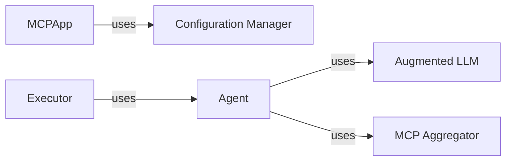

## Details

The mcp-agent is an AI agent framework designed for modularity and extensibility. It begins by loading configurations using the Configuration Manager. The MCP Aggregator discovers and connects to various MCP servers, aggregating their capabilities. Agents, built upon a base class, leverage an Augmented LLM interface to interact with different LLM providers. The Executor then manages and executes workflows involving these agents, orchestrating tasks to achieve specific goals.

### Configuration Manager [[Expand]](./Configuration_Manager.md)
Loads and manages application settings, secrets, and provider-specific configurations from YAML files.

**Related Classes/Methods**:

- <a href="https://github.com/lastmile-ai/mcp-agent/blob/main/src/mcp_agent/config.py" target="_blank" rel="noopener noreferrer">`mcp_agent.config`</a>

### MCP Aggregator [[Expand]](./MCP_Aggregator.md)
Discovers, connects to, and aggregates capabilities from multiple MCP servers. Manages server connections and registries.

**Related Classes/Methods**:

- <a href="https://github.com/lastmile-ai/mcp-agent/blob/main/src/mcp_agent/mcp/mcp_aggregator.py" target="_blank" rel="noopener noreferrer">`mcp_agent.mcp.mcp_aggregator`</a>
- <a href="https://github.com/lastmile-ai/mcp-agent/blob/main/src/mcp_agent/mcp/mcp_server_registry.py" target="_blank" rel="noopener noreferrer">`mcp_agent.mcp.mcp_server_registry`</a>
- <a href="https://github.com/lastmile-ai/mcp-agent/blob/main/src/mcp_agent/mcp/mcp_connection_manager.py" target="_blank" rel="noopener noreferrer">`mcp_agent.mcp.mcp_connection_manager`</a>

### Agent [[Expand]](./Agent.md)
The base class for all agents. Manages tools, resources, prompts, and interacts with the Augmented LLM.

**Related Classes/Methods**:

- <a href="https://github.com/lastmile-ai/mcp-agent/blob/main/src/mcp_agent/agents/agent.py" target="_blank" rel="noopener noreferrer">`mcp_agent.agents.agent`</a>

### Augmented LLM [[Expand]](./Augmented_LLM.md)
Abstract interface for interacting with different LLM providers (OpenAI, Anthropic, Azure, Google, Bedrock, Ollama). Handles prompt formatting, model selection, and tool execution.

**Related Classes/Methods**:

- <a href="https://github.com/lastmile-ai/mcp-agent/blob/main/src/mcp_agent/workflows/llm/augmented_llm.py" target="_blank" rel="noopener noreferrer">`mcp_agent.workflows.llm.augmented_llm`</a>
- <a href="https://github.com/lastmile-ai/mcp-agent/blob/main/src/mcp_agent/workflows/llm/augmented_llm_openai.py" target="_blank" rel="noopener noreferrer">`mcp_agent.workflows.llm.augmented_llm_openai`</a>
- <a href="https://github.com/lastmile-ai/mcp-agent/blob/main/src/mcp_agent/workflows/llm/augmented_llm_anthropic.py" target="_blank" rel="noopener noreferrer">`mcp_agent.workflows.llm.augmented_llm_anthropic`</a>

### Executor [[Expand]](./Executor.md)
Executes workflows, manages tasks, and handles signals.

**Related Classes/Methods**:

- <a href="https://github.com/lastmile-ai/mcp-agent/blob/main/src/mcp_agent/executor/executor.py" target="_blank" rel="noopener noreferrer">`mcp_agent.executor.executor`</a>
- `mcp_agent.executor.temporal.TemporalExecutor`
- <a href="https://github.com/lastmile-ai/mcp-agent/blob/main/src/mcp_agent/executor/workflow.py" target="_blank" rel="noopener noreferrer">`mcp_agent.executor.workflow`</a>

### [FAQ](https://github.com/CodeBoarding/GeneratedOnBoardings/tree/main?tab=readme-ov-file#faq)