```mermaid
graph LR
    Application_Core_Configuration["Application Core & Configuration"]
    Execution_Workflow_Engine["Execution & Workflow Engine"]
    AI_Model_Services["AI Model Services"]
    Agentic_Workflow_Engine["Agentic Workflow Engine"]
    MCP_Server_Integration["MCP Server Integration"]
    Intelligent_Routing_Intent["Intelligent Routing & Intent"]
    System_Observability_Interface["System Observability & Interface"]
    Application_Core_Configuration -- "Initializes" --> Execution_Workflow_Engine
    Application_Core_Configuration -- "Initializes" --> MCP_Server_Integration
    Application_Core_Configuration -- "Configures" --> AI_Model_Services
    Application_Core_Configuration -- "Configures" --> Execution_Workflow_Engine
    Application_Core_Configuration -- "Configures" --> MCP_Server_Integration
    Application_Core_Configuration -- "Logs to" --> System_Observability_Interface
    Execution_Workflow_Engine -- "Initialized by" --> Application_Core_Configuration
    Execution_Workflow_Engine -- "Used by" --> Agentic_Workflow_Engine
    Execution_Workflow_Engine -- "Logs to" --> System_Observability_Interface
    Execution_Workflow_Engine -- "Interacts with" --> System_Observability_Interface
    AI_Model_Services -- "Configured by" --> Application_Core_Configuration
    AI_Model_Services -- "Used by" --> Agentic_Workflow_Engine
    AI_Model_Services -- "Used by" --> Intelligent_Routing_Intent
    AI_Model_Services -- "Logs to" --> System_Observability_Interface
    Agentic_Workflow_Engine -- "Uses" --> AI_Model_Services
    Agentic_Workflow_Engine -- "Uses" --> Execution_Workflow_Engine
    Agentic_Workflow_Engine -- "Uses" --> MCP_Server_Integration
    Agentic_Workflow_Engine -- "Logs to" --> System_Observability_Interface
    Agentic_Workflow_Engine -- "Interacts with" --> System_Observability_Interface
    MCP_Server_Integration -- "Initialized by" --> Application_Core_Configuration
    MCP_Server_Integration -- "Configured by" --> Application_Core_Configuration
    MCP_Server_Integration -- "Used by" --> Agentic_Workflow_Engine
    MCP_Server_Integration -- "Used by" --> Intelligent_Routing_Intent
    MCP_Server_Integration -- "Logs to" --> System_Observability_Interface
    Intelligent_Routing_Intent -- "Uses" --> AI_Model_Services
    Intelligent_Routing_Intent -- "Uses" --> MCP_Server_Integration
    Intelligent_Routing_Intent -- "Logs to" --> System_Observability_Interface
    System_Observability_Interface -- "Provides services to" --> Application_Core_Configuration
    System_Observability_Interface -- "Provides services to" --> Execution_Workflow_Engine
    System_Observability_Interface -- "Provides services to" --> AI_Model_Services
    System_Observability_Interface -- "Provides services to" --> Agentic_Workflow_Engine
    System_Observability_Interface -- "Provides services to" --> MCP_Server_Integration
    System_Observability_Interface -- "Provides services to" --> Intelligent_Routing_Intent
    click Application_Core_Configuration href "https://github.com/CodeBoarding/GeneratedOnBoardings/blob/main//mcp-agent/Application_Core_Configuration.md" "Details"
    click Execution_Workflow_Engine href "https://github.com/CodeBoarding/GeneratedOnBoardings/blob/main//mcp-agent/Execution_Workflow_Engine.md" "Details"
    click AI_Model_Services href "https://github.com/CodeBoarding/GeneratedOnBoardings/blob/main//mcp-agent/AI_Model_Services.md" "Details"
    click Agentic_Workflow_Engine href "https://github.com/CodeBoarding/GeneratedOnBoardings/blob/main//mcp-agent/Agentic_Workflow_Engine.md" "Details"
    click MCP_Server_Integration href "https://github.com/CodeBoarding/GeneratedOnBoardings/blob/main//mcp-agent/MCP_Server_Integration.md" "Details"
    click Intelligent_Routing_Intent href "https://github.com/CodeBoarding/GeneratedOnBoardings/blob/main//mcp-agent/Intelligent_Routing_Intent.md" "Details"
    click System_Observability_Interface href "https://github.com/CodeBoarding/GeneratedOnBoardings/blob/main//mcp-agent/System_Observability_Interface.md" "Details"
```

## Component Details

The `mcp-agent` architecture is designed around a modular, AI-driven system capable of orchestrating complex workflows, interacting with various Large Language Models (LLMs), and integrating with external Multi-Capability Platform (MCP) servers. The analysis consolidates the system into seven fundamental components, each with distinct responsibilities and clear interaction patterns. These seven components were chosen because they represent a logical and cohesive decomposition of the `mcp-agent` system into distinct, manageable functional areas. They are fundamental to the application's operation for the following reasons:

*   **Clear Separation of Concerns**: Each component addresses a specific set of responsibilities, minimizing inter-component dependencies and enhancing maintainability. For instance, `AI Model Services` strictly handles LLM interactions, while `Agentic Workflow Engine` focuses on the agent's reasoning and orchestration.
*   **Scalability and Extensibility**: By abstracting core functionalities (e.g., `Execution & Workflow Engine` for different backends, `AI Model Services` for various LLM providers), the architecture allows for easier scaling and the integration of new technologies or services without major refactoring.
*   **Operational Visibility**: The dedicated `System Observability & Interface` component ensures that the application's health, performance, and usage can be effectively monitored and managed, which is crucial for production environments.
*   **Core Business Logic Encapsulation**: Components like `Agentic Workflow Engine` and `Intelligent Routing & Intent` directly embody the unique intelligent capabilities of the `mcp-agent`, making them central to its value proposition.
*   **External Integration**: `MCP Server Integration` is a cornerstone, enabling the agent to extend its capabilities beyond its internal functions by leveraging external tools and services, which is a key design goal of the `mcp-agent`.

This architectural breakdown provides a high-level, yet comprehensive, understanding of the `mcp-agent`'s structure, highlighting its critical interaction pathways and the roles of its central modules.

### Application Core & Configuration
This component serves as the foundational layer, responsible for the application's startup, context initialization, and the comprehensive management of global configurations and sensitive secrets. It orchestrates the initial setup and configuration of other core components, ensuring the application operates with the correct settings.

**Related Classes/Methods**:

- <a href="https://github.com/lastmile-ai/mcp-agent/blob/master/src/mcp_agent/app.py#L0-L0" target="_blank" rel="noopener noreferrer">`mcp_agent.app` (0:0)</a>
- <a href="https://github.com/lastmile-ai/mcp-agent/blob/master/src/mcp_agent/config.py#L0-L0" target="_blank" rel="noopener noreferrer">`mcp_agent.config` (0:0)</a>

### Execution & Workflow Engine
This component provides the core capabilities for executing tasks and managing complex, potentially durable workflows. It abstracts different execution backends (e.g., asyncio for local execution, Temporal for fault-tolerant distributed workflows) and handles the registration and invocation of activities and signals, forming the operational backbone for agentic behaviors.

**Related Classes/Methods**:

- `mcp_agent.executor` (0:0)

### AI Model Services
This component offers a unified, provider-agnostic interface for interacting with various Large Language Models (LLMs) and generating numerical text embeddings. It includes functionalities for intelligent model selection, message format conversion, and facilitating parallel LLM invocations (fan-out/fan-in patterns), centralizing all AI model interactions.

**Related Classes/Methods**:

- `mcp_agent.workflows.llm` (0:0)
- `mcp_agent.workflows.embedding` (0:0)
- `mcp_agent.workflows.parallel` (0:0)

### Agentic Workflow Engine
This component encapsulates the intelligent agent's core behavior, including its ability to interact with LLMs, call tools (both internal and external), manage resources, and engage in collaborative multi-agent workflows (swarm). It is responsible for high-level planning and orchestration of complex, goal-oriented tasks.

**Related Classes/Methods**:

- `mcp_agent.agents` (0:0)
- `mcp_agent.workflows.orchestrator` (0:0)
- `mcp_agent.workflows.swarm` (0:0)

### MCP Server Integration
This component manages connections to multiple external Multi-Capability Platform (MCP) servers. It aggregates their exposed capabilities (tools, prompts, resources) and provides a unified interface for the agent to discover and interact with these external services, significantly extending the agent's operational reach.

**Related Classes/Methods**:

- `mcp_agent.mcp` (0:0)

### Intelligent Routing & Intent
This component provides intelligent mechanisms for directing incoming requests to the most appropriate destination (e.g., specific MCP servers, agents, or functions) and for classifying the user's underlying intent. It employs both embedding-based similarity and LLM-based reasoning for these crucial decision-making processes.

**Related Classes/Methods**:

- `mcp_agent.workflows.router` (0:0)
- `mcp_agent.workflows.intent_classifier` (0:0)

### System Observability & Interface
This component encompasses all functionalities related to centralized logging, application tracing, and usage data collection, which are vital for monitoring and debugging. It also handles exposing the application's capabilities as an external server and managing interactive human input for workflows requiring user intervention.

**Related Classes/Methods**:

- `mcp_agent.logging` (0:0)
- `mcp_agent.tracing` (0:0)
- `mcp_agent.server` (0:0)
- `mcp_agent.human_input` (0:0)

### [FAQ](https://github.com/CodeBoarding/GeneratedOnBoardings/tree/main?tab=readme-ov-file#faq)