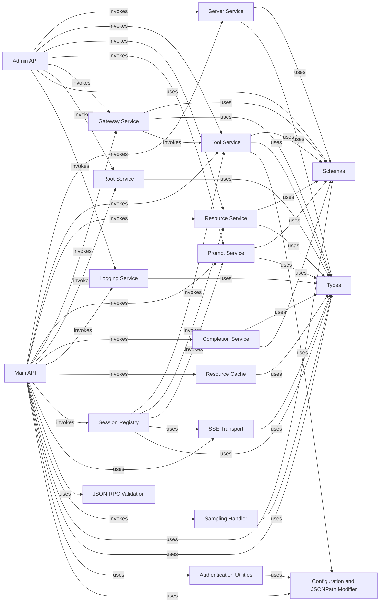

## Component Details

The API Gateway Core is the central component handling all incoming API requests (REST, RPC, SSE, WebSocket), routing them to appropriate services, and managing the application's lifecycle. It acts as the primary interface for clients and orchestrates interactions between various internal services. It also exposes administrative endpoints and health checks.

### Admin API
The Admin API component provides administrative endpoints for managing various entities within the MCP Gateway, including servers, resources, prompts, gateways, and tools. It handles operations like listing, adding, editing, toggling status, and deleting these entities. It also provides endpoints for retrieving and resetting metrics.

**Related Classes/Methods**:

- `mcpgateway.admin` (full file reference)

### Main API
The Main API component exposes the primary functionalities of the MCP Gateway, including lifecycle management, SSE and WebSocket endpoints for real-time communication, and core CRUD operations for servers, tools, resources, prompts, and roots. It also handles RPC requests and provides utility functions for logging and metrics.

**Related Classes/Methods**:

- `mcpgateway.main` (full file reference)

### Server Service
The Server Service component is responsible for managing MCP Servers within the catalog. It provides functionalities for registering, listing, retrieving, updating, toggling the status, and deleting server records. It also handles event notifications for server changes and aggregates metrics related to server invocations.

**Related Classes/Methods**:

- `mcpgateway.services.server_service` (full file reference)

### Tool Service
The Tool Service component manages and invokes tools according to the MCP specification. It handles tool registration, validation, invocation with schema validation, and federation across gateways. It also provides event notifications for tool changes, manages active/inactive tool statuses, and aggregates tool usage metrics.

**Related Classes/Methods**:

- `mcpgateway.services.tool_service` (full file reference)

### Resource Service
The Resource Service component is responsible for managing resources within the MCP Gateway. It handles resource registration, retrieval, and updates, including support for resource templates and URI handling. It also manages resource subscriptions for real-time updates, detects content types, and maintains active/inactive resource statuses. Additionally, it aggregates resource usage metrics.

**Related Classes/Methods**:

- `mcpgateway.services.resource_service` (full file reference)

### Prompt Service
The Prompt Service component manages prompt templates according to the MCP specification. It handles prompt template registration and retrieval, validates prompt arguments, and renders templates with provided arguments. It also supports resource embedding in prompts, manages active/inactive prompt statuses, and aggregates prompt usage metrics.

**Related Classes/Methods**:

- `mcpgateway.services.prompt_service` (full file reference)

### Gateway Service
The Gateway Service component manages federated gateways within the MCP system. It handles gateway discovery, registration, and health monitoring. It is responsible for forwarding requests to other gateways, aggregating their capabilities, and managing federation events. It also controls the active/inactive status of gateways.

**Related Classes/Methods**:

- `mcpgateway.services.gateway_service` (full file reference)

### Root Service
The Root Service component manages root directories and files exposed to MCP clients. It handles the registration and validation of roots, provides change notifications for root modifications, and manages root permissions and access control.

**Related Classes/Methods**:

- `mcpgateway.services.root_service` (full file reference)

### Completion Service
The Completion Service component provides argument completion suggestions for prompt arguments and resource URIs according to the MCP specification. It handles completion requests, retrieves relevant data from the database, and can incorporate custom completion sources.

**Related Classes/Methods**:

- `mcpgateway.services.completion_service` (full file reference)

### Logging Service
The Logging Service component implements structured logging for the MCP Gateway, adhering to RFC 5424 severity levels. It provides functionalities for managing log levels, sending log notifications to subscribers, and tracking logger names.

**Related Classes/Methods**:

- `mcpgateway.services.logging_service` (full file reference)

### Resource Cache
The Resource Cache component provides an in-memory cache with TTL expiration for resource content. It supports maximum size limits with LRU eviction and ensures thread-safe operations for efficient resource retrieval.

**Related Classes/Methods**:

- `mcpgateway.cache.resource_cache` (full file reference)

### Session Registry
The Session Registry component manages SSE sessions, with optional support for distributed state using Redis or SQLAlchemy. It tracks session existence, handles session addition and removal, and facilitates broadcasting messages to specific sessions. It also includes logic for handling initialization and generating responses for SSE messages.

**Related Classes/Methods**:

- `mcpgateway.cache.session_registry` (full file reference)

### SSE Transport
The SSE Transport component implements Server-Sent Events (SSE) for the MCP Gateway, enabling server-to-client streaming with session management. It handles connecting, disconnecting, sending messages, and creating SSE responses, ensuring proper event formatting and retry mechanisms.

**Related Classes/Methods**:

- `mcpgateway.transports.sse_transport` (full file reference)

### JSON-RPC Validation
The JSON-RPC Validation component provides functions for validating JSON-RPC 2.0 requests and responses according to the specification. It includes checks for JSON-RPC version, method presence, ID types, and parameter types, and defines standard error codes and formatting for error messages.

**Related Classes/Methods**:

- `mcpgateway.validation.jsonrpc` (full file reference)

### Sampling Handler
The Sampling Handler component implements the sampling functionality for MCP LLM interactions. It is responsible for model selection based on preferences, handling message sampling requests, managing context inclusion, and validating message formats. It also provides a mock sampling response for testing purposes.

**Related Classes/Methods**:

- `mcpgateway.handlers.sampling` (full file reference)

### Schemas
The Schemas component defines the data models (Pydantic schemas) used throughout the MCP Gateway for various entities like servers, tools, resources, prompts, and gateways. It includes schemas for creation, update, and read operations, as well as utility schemas for status toggling and listing filters. It also handles data validation and transformation, such as splitting comma-separated strings into lists.

**Related Classes/Methods**:

- `mcpgateway.schemas` (full file reference)

### Types
The Types component defines core MCP protocol types, including message content types (text, image, resource), tool definitions, resource types and templates, prompt structures, protocol initialization types, sampling message types, and capability definitions. It provides the foundational data structures for communication and data representation within the MCP Gateway.

**Related Classes/Methods**:

- `mcpgateway.types` (full file reference)

### Authentication Utilities
The Authentication Utilities component provides functions for verifying credentials using JWT tokens and basic authentication. It handles token decoding, validation, and extraction from headers or cookies, ensuring secure access to the MCP Gateway's functionalities.

**Related Classes/Methods**:

- <a href="https://github.com/IBM/mcp-context-forge/blob/master/mcpgateway/utils/verify_credentials.py#L64-L77" target="_blank" rel="noopener noreferrer">`mcpgateway.utils.verify_credentials` (64:77)</a>

### Configuration and JSONPath Modifier
The Configuration and JSONPath Modifier component manages the MCP Gateway's configuration settings, loading them from environment variables with sensible defaults. It also provides utilities for extracting and transforming JSON data using JSONPath expressions and mappings, allowing dynamic data manipulation based on user requirements.

**Related Classes/Methods**:

- `mcpgateway.config` (full file reference)
- `mcpgateway.schemas.JsonPathModifier` (full file reference)

### [FAQ](https://github.com/CodeBoarding/GeneratedOnBoardings/tree/main?tab=readme-ov-file#faq)