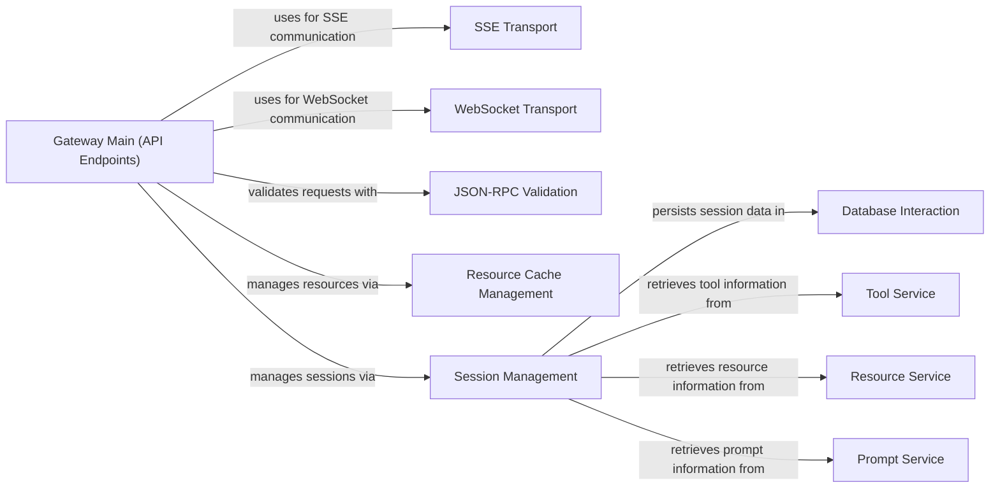

## Component Details

This graph illustrates the core components of the `Communication & Infrastructure` subsystem within the `mcp-context-forge` project. It details how network communication protocols like SSE and WebSocket are managed, how JSON-RPC requests are validated, and how resource caching and user session management are handled to support real-time interactions and efficient data access.

### SSE Transport
This component manages Server-Sent Events (SSE) connections, including establishing connections and creating SSE responses for clients.

**Related Classes/Methods**:

- <a href="https://github.com/IBM/mcp-context-forge/blob/master/mcpgateway/transports/sse_transport.py#L28-L230" target="_blank" rel="noopener noreferrer">`mcp-context-forge.mcpgateway.transports.sse_transport.SSETransport` (28:230)</a>
- <a href="https://github.com/IBM/mcp-context-forge/blob/master/mcpgateway/transports/sse_transport.py#L45-L48" target="_blank" rel="noopener noreferrer">`mcpgateway.transports.sse_transport.SSETransport.connect` (45:48)</a>
- <a href="https://github.com/IBM/mcp-context-forge/blob/master/mcpgateway/transports/sse_transport.py#L125-L206" target="_blank" rel="noopener noreferrer">`mcpgateway.transports.sse_transport.SSETransport.create_sse_response` (125:206)</a>
- `mcpgateway.transports.sse_transport.SSETransport.create_sse_response.event_generator` (full file reference)

### WebSocket Transport
This component handles WebSocket connections, including connecting, receiving messages, and managing ping-pong loops for connection liveness.

**Related Classes/Methods**:

- <a href="https://github.com/IBM/mcp-context-forge/blob/master/mcpgateway/transports/websocket_transport.py#L24-L139" target="_blank" rel="noopener noreferrer">`mcp-context-forge.mcpgateway.transports.websocket_transport.WebSocketTransport` (24:139)</a>
- <a href="https://github.com/IBM/mcp-context-forge/blob/master/mcpgateway/transports/websocket_transport.py#L37-L46" target="_blank" rel="noopener noreferrer">`mcpgateway.transports.websocket_transport.WebSocketTransport:connect` (37:46)</a>
- <a href="https://github.com/IBM/mcp-context-forge/blob/master/mcpgateway/transports/websocket_transport.py#L81-L105" target="_blank" rel="noopener noreferrer">`mcpgateway.transports.websocket_transport.WebSocketTransport:receive_message` (81:105)</a>
- <a href="https://github.com/IBM/mcp-context-forge/blob/master/mcpgateway/transports/websocket_transport.py#L115-L134" target="_blank" rel="noopener noreferrer">`mcpgateway.transports.websocket_transport.WebSocketTransport:_ping_loop` (115:134)</a>
- <a href="https://github.com/IBM/mcp-context-forge/blob/master/mcpgateway/transports/websocket_transport.py#L48-L60" target="_blank" rel="noopener noreferrer">`mcpgateway.transports.websocket_transport.WebSocketTransport.disconnect` (48:60)</a>

### JSON-RPC Validation
This component is responsible for validating JSON-RPC requests and responses, ensuring they conform to the expected format and handling errors by raising appropriate JSON-RPC error types.

**Related Classes/Methods**:

- `mcp-context-forge.mcpgateway.validation.jsonrpc` (full file reference)
- <a href="https://github.com/IBM/mcp-context-forge/blob/master/mcpgateway/validation/jsonrpc.py#L68-L96" target="_blank" rel="noopener noreferrer">`mcpgateway.validation.jsonrpc.validate_request` (68:96)</a>
- <a href="https://github.com/IBM/mcp-context-forge/blob/master/mcpgateway/validation/jsonrpc.py#L21-L55" target="_blank" rel="noopener noreferrer">`mcpgateway.validation.jsonrpc.JSONRPCError` (21:55)</a>
- <a href="https://github.com/IBM/mcp-context-forge/blob/master/mcpgateway/validation/jsonrpc.py#L45-L55" target="_blank" rel="noopener noreferrer">`mcpgateway.validation.jsonrpc.JSONRPCError.to_dict` (45:55)</a>
- <a href="https://github.com/IBM/mcp-context-forge/blob/master/mcpgateway/validation/jsonrpc.py#L99-L142" target="_blank" rel="noopener noreferrer">`mcpgateway.validation.jsonrpc.validate_response` (99:142)</a>

### Resource Cache Management
This component is responsible for caching and managing resources. It provides functionalities for initializing, shutting down, deleting, clearing, getting, and setting resources in a cache.

**Related Classes/Methods**:

- <a href="https://github.com/IBM/mcp-context-forge/blob/master/mcpgateway/cache/resource_cache.py#L55-L59" target="_blank" rel="noopener noreferrer">`mcpgateway.cache.resource_cache.ResourceCache.initialize` (55:59)</a>
- <a href="https://github.com/IBM/mcp-context-forge/blob/master/mcpgateway/cache/resource_cache.py#L61-L64" target="_blank" rel="noopener noreferrer">`mcpgateway.cache.resource_cache.ResourceCache.shutdown` (61:64)</a>
- <a href="https://github.com/IBM/mcp-context-forge/blob/master/mcpgateway/cache/resource_cache.py#L108-L114" target="_blank" rel="noopener noreferrer">`mcpgateway.cache.resource_cache.ResourceCache.delete` (108:114)</a>
- <a href="https://github.com/IBM/mcp-context-forge/blob/master/mcpgateway/cache/resource_cache.py#L116-L118" target="_blank" rel="noopener noreferrer">`mcpgateway.cache.resource_cache.ResourceCache.clear` (116:118)</a>
- <a href="https://github.com/IBM/mcp-context-forge/blob/master/mcpgateway/cache/resource_cache.py#L66-L88" target="_blank" rel="noopener noreferrer">`mcpgateway.cache.resource_cache.ResourceCache.get` (66:88)</a>
- <a href="https://github.com/IBM/mcp-context-forge/blob/master/mcpgateway/cache/resource_cache.py#L90-L106" target="_blank" rel="noopener noreferrer">`mcpgateway.cache.resource_cache.ResourceCache.set` (90:106)</a>
- <a href="https://github.com/IBM/mcp-context-forge/blob/master/mcpgateway/cache/resource_cache.py#L120-L136" target="_blank" rel="noopener noreferrer">`mcpgateway.cache.resource_cache.ResourceCache._cleanup_loop` (120:136)</a>
- <a href="https://github.com/IBM/mcp-context-forge/blob/master/mcpgateway/cache/resource_cache.py#L25-L30" target="_blank" rel="noopener noreferrer">`mcpgateway.cache.resource_cache.CacheEntry` (25:30)</a>

### Session Management
This component handles the lifecycle of user sessions, including adding, retrieving, removing, and broadcasting messages to sessions. It also manages session initialization logic and cleanup tasks, and generates responses based on session state and available services.

**Related Classes/Methods**:

- <a href="https://github.com/IBM/mcp-context-forge/blob/master/mcpgateway/cache/session_registry.py#L628-L671" target="_blank" rel="noopener noreferrer">`mcpgateway.cache.session_registry.SessionRegistry.handle_initialize_logic` (628:671)</a>
- <a href="https://github.com/IBM/mcp-context-forge/blob/master/mcpgateway/cache/session_registry.py#L182-L225" target="_blank" rel="noopener noreferrer">`mcpgateway.cache.session_registry.SessionRegistry.add_session` (182:225)</a>
- <a href="https://github.com/IBM/mcp-context-forge/blob/master/mcpgateway/cache/session_registry.py#L402-L506" target="_blank" rel="noopener noreferrer">`mcpgateway.cache.session_registry.SessionRegistry.respond` (402:506)</a>
- <a href="https://github.com/IBM/mcp-context-forge/blob/master/mcpgateway/cache/session_registry.py#L332-L382" target="_blank" rel="noopener noreferrer">`mcpgateway.cache.session_registry.SessionRegistry.broadcast` (332:382)</a>
- <a href="https://github.com/IBM/mcp-context-forge/blob/master/mcpgateway/cache/session_registry.py#L116-L136" target="_blank" rel="noopener noreferrer">`mcpgateway.cache.session_registry.SessionRegistry.__init__` (116:136)</a>
- <a href="https://github.com/IBM/mcp-context-forge/blob/master/mcpgateway/cache/session_registry.py#L51-L101" target="_blank" rel="noopener noreferrer">`mcpgateway.cache.session_registry.SessionBackend.__init__` (51:101)</a>
- <a href="https://github.com/IBM/mcp-context-forge/blob/master/mcpgateway/cache/session_registry.py#L138-L157" target="_blank" rel="noopener noreferrer">`mcpgateway.cache.session_registry.SessionRegistry.initialize` (138:157)</a>
- <a href="https://github.com/IBM/mcp-context-forge/blob/master/mcpgateway/cache/session_registry.py#L227-L278" target="_blank" rel="noopener noreferrer">`mcpgateway.cache.session_registry.SessionRegistry.get_session` (227:278)</a>
- <a href="https://github.com/IBM/mcp-context-forge/blob/master/mcpgateway/cache/session_registry.py#L280-L330" target="_blank" rel="noopener noreferrer">`mcpgateway.cache.session_registry.SessionRegistry.remove_session` (280:330)</a>
- <a href="https://github.com/IBM/mcp-context-forge/blob/master/mcpgateway/cache/session_registry.py#L508-L528" target="_blank" rel="noopener noreferrer">`mcpgateway.cache.session_registry.SessionRegistry._refresh_redis_sessions` (508:528)</a>
- <a href="https://github.com/IBM/mcp-context-forge/blob/master/mcpgateway/cache/session_registry.py#L530-L598" target="_blank" rel="noopener noreferrer">`mcpgateway.cache.session_registry.SessionRegistry._db_cleanup_task` (530:598)</a>
- <a href="https://github.com/IBM/mcp-context-forge/blob/master/mcpgateway/cache/session_registry.py#L600-L625" target="_blank" rel="noopener noreferrer">`mcpgateway.cache.session_registry.SessionRegistry._memory_cleanup_task` (600:625)</a>
- <a href="https://github.com/IBM/mcp-context-forge/blob/master/mcpgateway/cache/session_registry.py#L673-L761" target="_blank" rel="noopener noreferrer">`mcpgateway.cache.session_registry.SessionRegistry.generate_response` (673:761)</a>
- <a href="https://github.com/IBM/mcp-context-forge/blob/master/mcpgateway/cache/session_registry.py#L384-L400" target="_blank" rel="noopener noreferrer">`mcpgateway.cache.session_registry.SessionRegistry.get_session_sync` (384:400)</a>
- `mcpgateway.cache.session_registry.SessionRegistry.respond.message_check_loop` (full file reference)
- <a href="https://github.com/IBM/mcp-context-forge/blob/master/mcpgateway/types.py#L271-L294" target="_blank" rel="noopener noreferrer">`mcpgateway.types.InitializeResult` (271:294)</a>
- <a href="https://github.com/IBM/mcp-context-forge/blob/master/mcpgateway/types.py#L224-L239" target="_blank" rel="noopener noreferrer">`mcpgateway.types.ServerCapabilities` (224:239)</a>
- <a href="https://github.com/IBM/mcp-context-forge/blob/master/mcpgateway/types.py#L170-L179" target="_blank" rel="noopener noreferrer">`mcpgateway.types.Implementation` (170:179)</a>

### Gateway Main (API Endpoints)
This component represents the main entry point for the mcp-context-forge gateway, handling various API endpoints like SSE, message, resource listing, reading, updating, and deleting. It orchestrates interactions with caching, session management, and validation.

**Related Classes/Methods**:

- `mcpgateway.main:lifespan` (full file reference)
- `mcpgateway.main:invalidate_resource_cache` (full file reference)
- `mcpgateway.main:initialize` (full file reference)
- `mcpgateway.main:sse_endpoint` (full file reference)
- `mcpgateway.main:message_endpoint` (full file reference)
- `mcpgateway.main:list_resources` (full file reference)
- `mcpgateway.main:read_resource` (full file reference)
- `mcpgateway.main:update_resource` (full file reference)
- `mcpgateway.main:delete_resource` (full file reference)
- `mcpgateway.main:handle_rpc` (full file reference)
- `mcpgateway.main:websocket_endpoint` (full file reference)
- `mcpgateway.main:utility_sse_endpoint` (full file reference)
- `mcpgateway.main:utility_message_endpoint` (full file reference)

### Database Interaction
This component provides an interface for interacting with the underlying database, primarily for session and message persistence, allowing for retrieval and storage of session-related records.

**Related Classes/Methods**:

- `mcpgateway.db.get_db` (full file reference)
- <a href="https://github.com/IBM/mcp-context-forge/blob/master/mcpgateway/db.py#L965-L973" target="_blank" rel="noopener noreferrer">`mcpgateway.db.SessionRecord` (965:973)</a>
- <a href="https://github.com/IBM/mcp-context-forge/blob/master/mcpgateway/db.py#L976-L985" target="_blank" rel="noopener noreferrer">`mcpgateway.db.SessionMessageRecord` (976:985)</a>

### Tool Service
This component provides functionalities related to listing server tools and general tools, acting as a service layer for tool discovery.

**Related Classes/Methods**:

- <a href="https://github.com/IBM/mcp-context-forge/blob/master/mcpgateway/services/tool_service.py#L252-L273" target="_blank" rel="noopener noreferrer">`mcpgateway.services.tool_service.ToolService.list_server_tools` (252:273)</a>
- <a href="https://github.com/IBM/mcp-context-forge/blob/master/mcpgateway/services/tool_service.py#L230-L250" target="_blank" rel="noopener noreferrer">`mcpgateway.services.tool_service.ToolService.list_tools` (230:250)</a>

### Resource Service
This component provides functionalities related to listing server resources and general resources, acting as a service layer for resource discovery.

**Related Classes/Methods**:

- <a href="https://github.com/IBM/mcp-context-forge/blob/master/mcpgateway/services/resource_service.py#L236-L259" target="_blank" rel="noopener noreferrer">`mcpgateway.services.resource_service.ResourceService.list_server_resources` (236:259)</a>
- <a href="https://github.com/IBM/mcp-context-forge/blob/master/mcpgateway/services/resource_service.py#L212-L234" target="_blank" rel="noopener noreferrer">`mcpgateway.services.resource_service.ResourceService.list_resources` (212:234)</a>

### Prompt Service
This component provides functionalities related to listing server prompts and general prompts, acting as a service layer for prompt discovery.

**Related Classes/Methods**:

- <a href="https://github.com/IBM/mcp-context-forge/blob/master/mcpgateway/services/prompt_service.py#L250-L276" target="_blank" rel="noopener noreferrer">`mcpgateway.services.prompt_service.PromptService.list_server_prompts` (250:276)</a>
- <a href="https://github.com/IBM/mcp-context-forge/blob/master/mcpgateway/services/prompt_service.py#L223-L248" target="_blank" rel="noopener noreferrer">`mcpgateway.services.prompt_service.PromptService.list_prompts` (223:248)</a>

### [FAQ](https://github.com/CodeBoarding/GeneratedOnBoardings/tree/main?tab=readme-ov-file#faq)