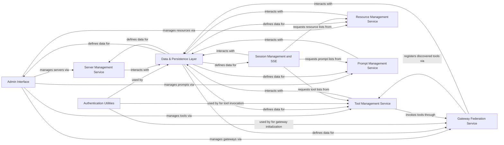

## Component Details

This graph illustrates the architecture of the MCP Gateway, focusing on its core components and their interactions. The system is designed to manage various entities like servers, tools, resources, prompts, and gateways, providing administrative interfaces, robust data persistence, and real-time session management. The main flow involves administrative operations, service-level business logic, and data storage and retrieval, with authentication ensuring secure access and operations.

### Admin Interface
This component provides the administrative API endpoints for managing various entities within the MCP Gateway, such as servers, tools, gateways, resources, and prompts. It handles form submissions for creation, editing, and deletion, and interacts with the respective service layers to perform these operations. It also exposes metrics for monitoring.

**Related Classes/Methods**:

- `mcpgateway.admin` (full file reference)
- `mcpgateway.admin:admin_add_server` (full file reference)
- `mcpgateway.admin:admin_edit_server` (full file reference)
- `mcpgateway.admin:admin_add_tool` (full file reference)
- `mcpgateway.admin:admin_edit_tool` (full file reference)
- `mcpgateway.admin:admin_add_gateway` (full file reference)
- `mcpgateway.admin:admin_edit_gateway` (full file reference)
- `mcpgateway.admin:admin_add_resource` (full file reference)
- `mcpgateway.admin:admin_edit_resource` (full file reference)
- `mcpgateway.admin:admin_add_prompt` (full file reference)
- `mcpgateway.admin:admin_edit_prompt` (full file reference)
- `mcpgateway.admin:admin_get_metrics` (full file reference)
- `mcpgateway.admin:admin_reset_metrics` (full file reference)

### Data & Persistence Layer
Defines the data structures (schemas) for all entities and messages within the system and provides an abstraction layer for persistent storage, handling database operations for various application entities.

**Related Classes/Methods**:

- `mcpgateway.schemas` (full file reference)
- `mcpgateway.types` (full file reference)
- `mcpgateway.db` (full file reference)

### Authentication Utilities
This component provides helper functions for encoding and decoding authentication credentials, primarily using AESGCM encryption and base64 URL-safe encoding. It ensures secure handling of sensitive authentication data.

**Related Classes/Methods**:

- `mcpgateway.utils.services_auth` (full file reference)
- <a href="https://github.com/IBM/mcp-context-forge/blob/master/mcpgateway/utils/services_auth.py#L36-L55" target="_blank" rel="noopener noreferrer">`mcpgateway.utils.services_auth.encode_auth` (36:55)</a>
- <a href="https://github.com/IBM/mcp-context-forge/blob/master/mcpgateway/utils/services_auth.py#L58-L78" target="_blank" rel="noopener noreferrer">`mcpgateway.utils.services_auth.decode_auth` (58:78)</a>

### Server Management Service
This service handles the business logic for managing MCP servers. It provides functionalities for registering, updating, listing, retrieving, toggling status, and deleting server records. It also aggregates server-related metrics and publishes events for server changes.

**Related Classes/Methods**:

- `mcpgateway.services.server_service` (full file reference)
- <a href="https://github.com/IBM/mcp-context-forge/blob/master/mcpgateway/services/server_service.py#L57-L624" target="_blank" rel="noopener noreferrer">`mcpgateway.services.server_service.ServerService` (57:624)</a>
- <a href="https://github.com/IBM/mcp-context-forge/blob/master/mcpgateway/services/server_service.py#L138-L238" target="_blank" rel="noopener noreferrer">`mcpgateway.services.server_service.ServerService:register_server` (138:238)</a>
- <a href="https://github.com/IBM/mcp-context-forge/blob/master/mcpgateway/services/server_service.py#L287-L376" target="_blank" rel="noopener noreferrer">`mcpgateway.services.server_service.ServerService:update_server` (287:376)</a>
- <a href="https://github.com/IBM/mcp-context-forge/blob/master/mcpgateway/services/server_service.py#L581-L614" target="_blank" rel="noopener noreferrer">`mcpgateway.services.server_service.ServerService:aggregate_metrics` (581:614)</a>
- <a href="https://github.com/IBM/mcp-context-forge/blob/master/mcpgateway/services/server_service.py#L44-L54" target="_blank" rel="noopener noreferrer">`mcpgateway.services.server_service.ServerNameConflictError` (44:54)</a>
- <a href="https://github.com/IBM/mcp-context-forge/blob/master/mcpgateway/services/server_service.py#L36-L37" target="_blank" rel="noopener noreferrer">`mcpgateway.services.server_service.ServerError` (36:37)</a>

### Tool Management Service
This service manages the lifecycle of MCP tools, including their registration, updates, deletion, and invocation. It handles validation of tool schemas, records invocation metrics, and supports federation by interacting with gateways.

**Related Classes/Methods**:

- `mcpgateway.services.tool_service` (full file reference)
- <a href="https://github.com/IBM/mcp-context-forge/blob/master/mcpgateway/services/tool_service.py#L84-L841" target="_blank" rel="noopener noreferrer">`mcpgateway.services.tool_service.ToolService` (84:841)</a>
- <a href="https://github.com/IBM/mcp-context-forge/blob/master/mcpgateway/services/tool_service.py#L174-L228" target="_blank" rel="noopener noreferrer">`mcpgateway.services.tool_service.ToolService:register_tool` (174:228)</a>
- <a href="https://github.com/IBM/mcp-context-forge/blob/master/mcpgateway/services/tool_service.py#L555-L617" target="_blank" rel="noopener noreferrer">`mcpgateway.services.tool_service.ToolService:update_tool` (555:617)</a>
- <a href="https://github.com/IBM/mcp-context-forge/blob/master/mcpgateway/services/tool_service.py#L459-L553" target="_blank" rel="noopener noreferrer">`mcpgateway.services.tool_service.ToolService:invoke_tool` (459:553)</a>
- <a href="https://github.com/IBM/mcp-context-forge/blob/master/mcpgateway/services/tool_service.py#L148-L172" target="_blank" rel="noopener noreferrer">`mcpgateway.services.tool_service.ToolService:_record_tool_metric` (148:172)</a>
- <a href="https://github.com/IBM/mcp-context-forge/blob/master/mcpgateway/services/tool_service.py#L56-L73" target="_blank" rel="noopener noreferrer">`mcpgateway.services.tool_service.ToolNameConflictError` (56:73)</a>
- <a href="https://github.com/IBM/mcp-context-forge/blob/master/mcpgateway/services/tool_service.py#L80-L81" target="_blank" rel="noopener noreferrer">`mcpgateway.services.tool_service.ToolInvocationError` (80:81)</a>
- <a href="https://github.com/IBM/mcp-context-forge/blob/master/mcpgateway/services/tool_service.py#L48-L49" target="_blank" rel="noopener noreferrer">`mcpgateway.services.tool_service.ToolError` (48:49)</a>

### Gateway Federation Service
This service is responsible for managing federated MCP gateways. It handles gateway registration, health checks, and the aggregation of capabilities from connected gateways. It also facilitates the registration of tools discovered from federated gateways.

**Related Classes/Methods**:

- `mcpgateway.services.gateway_service` (full file reference)
- <a href="https://github.com/IBM/mcp-context-forge/blob/master/mcpgateway/services/gateway_service.py#L72-L705" target="_blank" rel="noopener noreferrer">`mcpgateway.services.gateway_service.GatewayService` (72:705)</a>
- <a href="https://github.com/IBM/mcp-context-forge/blob/master/mcpgateway/services/gateway_service.py#L113-L176" target="_blank" rel="noopener noreferrer">`mcpgateway.services.gateway_service.GatewayService:register_gateway` (113:176)</a>
- <a href="https://github.com/IBM/mcp-context-forge/blob/master/mcpgateway/services/gateway_service.py#L196-L272" target="_blank" rel="noopener noreferrer">`mcpgateway.services.gateway_service.GatewayService:update_gateway` (196:272)</a>
- <a href="https://github.com/IBM/mcp-context-forge/blob/master/mcpgateway/services/gateway_service.py#L528-L579" target="_blank" rel="noopener noreferrer">`mcpgateway.services.gateway_service.GatewayService:_initialize_gateway` (528:579)</a>
- <a href="https://github.com/IBM/mcp-context-forge/blob/master/mcpgateway/services/gateway_service.py#L48-L65" target="_blank" rel="noopener noreferrer">`mcpgateway.services.gateway_service.GatewayNameConflictError` (48:65)</a>
- <a href="https://github.com/IBM/mcp-context-forge/blob/master/mcpgateway/services/gateway_service.py#L40-L41" target="_blank" rel="noopener noreferrer">`mcpgateway.services.gateway_service.GatewayError` (40:41)</a>

### Resource Management Service
This service manages MCP resources, including their registration, reading content, updating, and handling subscriptions. It also deals with resource templates, URI validation, and MIME type detection.

**Related Classes/Methods**:

- `mcpgateway.services.resource_service` (full file reference)
- <a href="https://github.com/IBM/mcp-context-forge/blob/master/mcpgateway/services/resource_service.py#L78-L871" target="_blank" rel="noopener noreferrer">`mcpgateway.services.resource_service.ResourceService` (78:871)</a>
- <a href="https://github.com/IBM/mcp-context-forge/blob/master/mcpgateway/services/resource_service.py#L144-L210" target="_blank" rel="noopener noreferrer">`mcpgateway.services.resource_service.ResourceService:register_resource` (144:210)</a>
- <a href="https://github.com/IBM/mcp-context-forge/blob/master/mcpgateway/services/resource_service.py#L393-L457" target="_blank" rel="noopener noreferrer">`mcpgateway.services.resource_service.ResourceService:update_resource` (393:457)</a>
- <a href="https://github.com/IBM/mcp-context-forge/blob/master/mcpgateway/services/resource_service.py#L334-L367" target="_blank" rel="noopener noreferrer">`mcpgateway.services.resource_service.ResourceService:subscribe_resource` (334:367)</a>
- <a href="https://github.com/IBM/mcp-context-forge/blob/master/mcpgateway/services/resource_service.py#L642-L655" target="_blank" rel="noopener noreferrer">`mcpgateway.services.resource_service.ResourceService:_is_valid_uri` (642:655)</a>
- <a href="https://github.com/IBM/mcp-context-forge/blob/master/mcpgateway/services/resource_service.py#L657-L676" target="_blank" rel="noopener noreferrer">`mcpgateway.services.resource_service.ResourceService:_detect_mime_type` (657:676)</a>
- <a href="https://github.com/IBM/mcp-context-forge/blob/master/mcpgateway/services/resource_service.py#L678-L715" target="_blank" rel="noopener noreferrer">`mcpgateway.services.resource_service.ResourceService:_read_template_resource` (678:715)</a>
- <a href="https://github.com/IBM/mcp-context-forge/blob/master/mcpgateway/services/resource_service.py#L54-L71" target="_blank" rel="noopener noreferrer">`mcpgateway.services.resource_service.ResourceURIConflictError` (54:71)</a>
- <a href="https://github.com/IBM/mcp-context-forge/blob/master/mcpgateway/services/resource_service.py#L74-L75" target="_blank" rel="noopener noreferrer">`mcpgateway.services.resource_service.ResourceValidationError` (74:75)</a>
- <a href="https://github.com/IBM/mcp-context-forge/blob/master/mcpgateway/services/resource_service.py#L46-L47" target="_blank" rel="noopener noreferrer">`mcpgateway.services.resource_service.ResourceError` (46:47)</a>
- <a href="https://github.com/IBM/mcp-context-forge/blob/master/mcpgateway/services/resource_service.py#L828-L861" target="_blank" rel="noopener noreferrer">`mcpgateway.services.resource_service.ResourceService:aggregate_metrics` (828:861)</a>

### Prompt Management Service
This service is responsible for managing prompt templates. It handles the registration, updating, retrieval, and rendering of prompts, including validation of template syntax and argument extraction.

**Related Classes/Methods**:

- `mcpgateway.services.prompt_service` (full file reference)
- <a href="https://github.com/IBM/mcp-context-forge/blob/master/mcpgateway/services/prompt_service.py#L68-L740" target="_blank" rel="noopener noreferrer">`mcpgateway.services.prompt_service.PromptService` (68:740)</a>
- <a href="https://github.com/IBM/mcp-context-forge/blob/master/mcpgateway/services/prompt_service.py#L153-L221" target="_blank" rel="noopener noreferrer">`mcpgateway.services.prompt_service.PromptService:register_prompt` (153:221)</a>
- <a href="https://github.com/IBM/mcp-context-forge/blob/master/mcpgateway/services/prompt_service.py#L322-L386" target="_blank" rel="noopener noreferrer">`mcpgateway.services.prompt_service.PromptService:update_prompt` (322:386)</a>
- <a href="https://github.com/IBM/mcp-context-forge/blob/master/mcpgateway/services/prompt_service.py#L278-L320" target="_blank" rel="noopener noreferrer">`mcpgateway.services.prompt_service.PromptService:get_prompt` (278:320)</a>
- <a href="https://github.com/IBM/mcp-context-forge/blob/master/mcpgateway/services/prompt_service.py#L492-L504" target="_blank" rel="noopener noreferrer">`mcpgateway.services.prompt_service.PromptService:_validate_template` (492:504)</a>
- <a href="https://github.com/IBM/mcp-context-forge/blob/master/mcpgateway/services/prompt_service.py#L506-L519" target="_blank" rel="noopener noreferrer">`mcpgateway.services.prompt_service.PromptService:_get_required_arguments` (506:519)</a>
- <a href="https://github.com/IBM/mcp-context-forge/blob/master/mcpgateway/services/prompt_service.py#L521-L541" target="_blank" rel="noopener noreferrer">`mcpgateway.services.prompt_service.PromptService:_render_template` (521:541)</a>
- <a href="https://github.com/IBM/mcp-context-forge/blob/master/mcpgateway/services/prompt_service.py#L543-L585" target="_blank" rel="noopener noreferrer">`mcpgateway.services.prompt_service.PromptService:_parse_messages` (543:585)</a>
- <a href="https://github.com/IBM/mcp-context-forge/blob/master/mcpgateway/services/prompt_service.py#L44-L61" target="_blank" rel="noopener noreferrer">`mcpgateway.services.prompt_service.PromptNameConflictError` (44:61)</a>
- <a href="https://github.com/IBM/mcp-context-forge/blob/master/mcpgateway/services/prompt_service.py#L36-L37" target="_blank" rel="noopener noreferrer">`mcpgateway.services.prompt_service.PromptError` (36:37)</a>
- <a href="https://github.com/IBM/mcp-context-forge/blob/master/mcpgateway/services/prompt_service.py#L692-L729" target="_blank" rel="noopener noreferrer">`mcpgateway.services.prompt_service.PromptService:aggregate_metrics` (692:729)</a>

### Session Management and SSE
This component manages Server-Sent Events (SSE) sessions, providing mechanisms for adding, retrieving, and removing sessions. It handles broadcasting messages to sessions and processes incoming client requests, delegating to other services for data retrieval (e.g., listing tools, resources, prompts). It supports different backends for session state.

**Related Classes/Methods**:

- `mcpgateway.cache.session_registry` (full file reference)
- <a href="https://github.com/IBM/mcp-context-forge/blob/master/mcpgateway/cache/session_registry.py#L104-L761" target="_blank" rel="noopener noreferrer">`mcpgateway.cache.session_registry.SessionRegistry` (104:761)</a>
- <a href="https://github.com/IBM/mcp-context-forge/blob/master/mcpgateway/cache/session_registry.py#L182-L225" target="_blank" rel="noopener noreferrer">`mcpgateway.cache.session_registry.SessionRegistry:add_session` (182:225)</a>
- <a href="https://github.com/IBM/mcp-context-forge/blob/master/mcpgateway/cache/session_registry.py#L227-L278" target="_blank" rel="noopener noreferrer">`mcpgateway.cache.session_registry.SessionRegistry:get_session` (227:278)</a>
- <a href="https://github.com/IBM/mcp-context-forge/blob/master/mcpgateway/cache/session_registry.py#L280-L330" target="_blank" rel="noopener noreferrer">`mcpgateway.cache.session_registry.SessionRegistry:remove_session` (280:330)</a>
- <a href="https://github.com/IBM/mcp-context-forge/blob/master/mcpgateway/cache/session_registry.py#L332-L382" target="_blank" rel="noopener noreferrer">`mcpgateway.cache.session_registry.SessionRegistry:broadcast` (332:382)</a>
- <a href="https://github.com/IBM/mcp-context-forge/blob/master/mcpgateway/cache/session_registry.py#L402-L506" target="_blank" rel="noopener noreferrer">`mcpgateway.cache.session_registry.SessionRegistry:respond` (402:506)</a>
- <a href="https://github.com/IBM/mcp-context-forge/blob/master/mcpgateway/cache/session_registry.py#L628-L671" target="_blank" rel="noopener noreferrer">`mcpgateway.cache.session_registry.SessionRegistry:handle_initialize_logic` (628:671)</a>
- <a href="https://github.com/IBM/mcp-context-forge/blob/master/mcpgateway/cache/session_registry.py#L673-L761" target="_blank" rel="noopener noreferrer">`mcpgateway.cache.session_registry.SessionRegistry:generate_response` (673:761)</a>
- <a href="https://github.com/IBM/mcp-context-forge/blob/master/mcpgateway/cache/session_registry.py#L530-L598" target="_blank" rel="noopener noreferrer">`mcpgateway.cache.session_registry.SessionRegistry:_db_cleanup_task` (530:598)</a>

### [FAQ](https://github.com/CodeBoarding/GeneratedOnBoardings/tree/main?tab=readme-ov-file#faq)