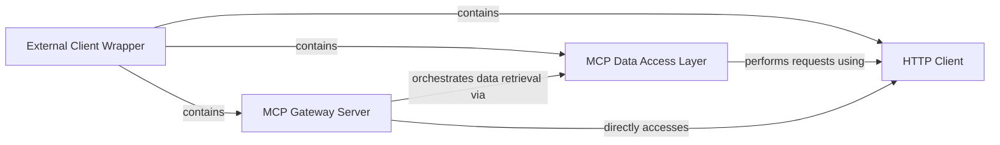

## Component Details

This architecture describes the `External Client Wrapper` subsystem, which acts as a client-side interface for interacting with an MCP Gateway server. Its primary purpose is to facilitate the fetching of metadata related to tools, prompts, and resources, and to enable the invocation of tools. The main flow involves the `External Client Wrapper` encapsulating the `MCP Gateway Server`, which orchestrates data retrieval through the `MCP Data Access Layer` and performs HTTP communications via the `HTTP Client`.

### External Client Wrapper
The top-level component that encapsulates the entire functionality of interacting with the MCP Gateway server. It acts as a bridge between an MCP client and the MCP gateway, providing a unified interface for various operations like tool listing, tool invocation, resource management, and prompt retrieval.

**Related Classes/Methods**:

- <a href="https://github.com/IBM/mcp-context-forge/blob/master/mcpgateway-wrapper/src/mcpgateway_wrapper/server.py#L1-L345" target="_blank" rel="noopener noreferrer">`mcpgateway_wrapper.server` (1:345)</a>

### MCP Gateway Server
This is the core server component within the wrapper that exposes various functionalities to the MCP client. It handles incoming requests for listing and calling tools, managing resources, and retrieving prompts, orchestrating the overall flow by delegating to data access and HTTP components.

**Related Classes/Methods**:

- <a href="https://github.com/IBM/mcp-context-forge/blob/master/mcpgateway-wrapper/src/mcpgateway_wrapper/server.py#L163-L163" target="_blank" rel="noopener noreferrer">`mcpgateway_wrapper.server:server` (163:163)</a>
- <a href="https://github.com/IBM/mcp-context-forge/blob/master/mcpgateway-wrapper/src/mcpgateway_wrapper/server.py#L198-L221" target="_blank" rel="noopener noreferrer">`mcpgateway_wrapper.server:handle_list_tools` (198:221)</a>
- <a href="https://github.com/IBM/mcp-context-forge/blob/master/mcpgateway-wrapper/src/mcpgateway_wrapper/server.py#L225-L266" target="_blank" rel="noopener noreferrer">`mcpgateway_wrapper.server:handle_call_tool` (225:266)</a>
- <a href="https://github.com/IBM/mcp-context-forge/blob/master/mcpgateway-wrapper/src/mcpgateway_wrapper/server.py#L270-L294" target="_blank" rel="noopener noreferrer">`mcpgateway_wrapper.server:handle_list_resources` (270:294)</a>
- <a href="https://github.com/IBM/mcp-context-forge/blob/master/mcpgateway-wrapper/src/mcpgateway_wrapper/server.py#L298-L310" target="_blank" rel="noopener noreferrer">`mcpgateway_wrapper.server:handle_read_resource` (298:310)</a>
- <a href="https://github.com/IBM/mcp-context-forge/blob/master/mcpgateway-wrapper/src/mcpgateway_wrapper/server.py#L314-L338" target="_blank" rel="noopener noreferrer">`mcpgateway_wrapper.server:handle_list_prompts` (314:338)</a>
- <a href="https://github.com/IBM/mcp-context-forge/blob/master/mcpgateway-wrapper/src/mcpgateway_wrapper/server.py#L342-L372" target="_blank" rel="noopener noreferrer">`mcpgateway_wrapper.server:handle_get_prompt` (342:372)</a>
- <a href="https://github.com/IBM/mcp-context-forge/blob/master/mcpgateway-wrapper/src/mcpgateway_wrapper/server.py#L27-L42" target="_blank" rel="noopener noreferrer">`mcpgateway_wrapper.server:extract_base_url` (27:42)</a>
- <a href="https://github.com/IBM/mcp-context-forge/blob/master/mcpgateway-wrapper/src/mcpgateway_wrapper/server.py#L375-L389" target="_blank" rel="noopener noreferrer">`mcpgateway_wrapper.server:main` (375:389)</a>

### MCP Data Access Layer
This component is responsible for abstracting interactions with the MCP server's various metadata endpoints. It fetches and processes raw responses into structured data for tools, prompts, and resources, acting as a dedicated layer for data retrieval from the MCP server.

**Related Classes/Methods**:

- <a href="https://github.com/IBM/mcp-context-forge/blob/master/mcpgateway-wrapper/src/mcpgateway_wrapper/server.py#L70-L87" target="_blank" rel="noopener noreferrer">`mcpgateway_wrapper.server:get_tools_from_mcp_server` (70:87)</a>
- <a href="https://github.com/IBM/mcp-context-forge/blob/master/mcpgateway-wrapper/src/mcpgateway_wrapper/server.py#L90-L109" target="_blank" rel="noopener noreferrer">`mcpgateway_wrapper.server:tools_metadata` (90:109)</a>
- <a href="https://github.com/IBM/mcp-context-forge/blob/master/mcpgateway-wrapper/src/mcpgateway_wrapper/server.py#L112-L128" target="_blank" rel="noopener noreferrer">`mcpgateway_wrapper.server:get_prompts_from_mcp_server` (112:128)</a>
- <a href="https://github.com/IBM/mcp-context-forge/blob/master/mcpgateway-wrapper/src/mcpgateway_wrapper/server.py#L131-L150" target="_blank" rel="noopener noreferrer">`mcpgateway_wrapper.server:prompts_metadata` (131:150)</a>
- <a href="https://github.com/IBM/mcp-context-forge/blob/master/mcpgateway-wrapper/src/mcpgateway_wrapper/server.py#L153-L169" target="_blank" rel="noopener noreferrer">`mcpgateway_wrapper.server:get_resources_from_mcp_server` (153:169)</a>
- <a href="https://github.com/IBM/mcp-context-forge/blob/master/mcpgateway-wrapper/src/mcpgateway_wrapper/server.py#L172-L191" target="_blank" rel="noopener noreferrer">`mcpgateway_wrapper.server:resources_metadata` (172:191)</a>

### HTTP Client
This component provides the fundamental asynchronous HTTP communication capabilities. It handles the actual network requests (GET and POST) to external URLs, encapsulating the logic for setting headers and managing timeouts.

**Related Classes/Methods**:

- <a href="https://github.com/IBM/mcp-context-forge/blob/master/mcpgateway-wrapper/src/mcpgateway_wrapper/server.py#L55-L67" target="_blank" rel="noopener noreferrer">`mcpgateway_wrapper.server:fetch_url` (55:67)</a>

### [FAQ](https://github.com/CodeBoarding/GeneratedOnBoardings/tree/main?tab=readme-ov-file#faq)