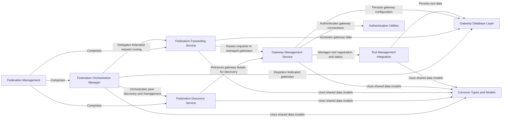

## Component Details

The Federation Management component facilitates inter-gateway communication, including peer discovery, health monitoring, and intelligent request forwarding across a distributed network of gateways. This component acts as the overarching container for federation-related services.

### Federation Management
Facilitates inter-gateway communication, including peer discovery, health monitoring, and intelligent request forwarding across a distributed network of gateways. This component acts as the overarching container for federation-related services.

**Related Classes/Methods**:

- <a href="https://github.com/IBM/mcp-context-forge/blob/master/mcpgateway/federation/manager.py#L53-L459" target="_blank" rel="noopener noreferrer">`mcpgateway.federation.manager.FederationManager` (53:459)</a>
- <a href="https://github.com/IBM/mcp-context-forge/blob/master/mcpgateway/federation/discovery.py#L91-L390" target="_blank" rel="noopener noreferrer">`mcpgateway.federation.discovery.DiscoveryService` (91:390)</a>
- <a href="https://github.com/IBM/mcp-context-forge/blob/master/mcpgateway/federation/forward.py#L37-L337" target="_blank" rel="noopener noreferrer">`mcpgateway.federation.forward.ForwardingService` (37:337)</a>

### Federation Orchestration Manager
Coordinates the overall federation activities, including starting and stopping discovery, managing gateway registration and unregistration within the federation, and performing health checks and synchronization of federated gateways.

**Related Classes/Methods**:

- <a href="https://github.com/IBM/mcp-context-forge/blob/master/mcpgateway/federation/manager.py#L53-L459" target="_blank" rel="noopener noreferrer">`mcpgateway.federation.manager.FederationManager` (53:459)</a>
- <a href="https://github.com/IBM/mcp-context-forge/blob/master/mcpgateway/federation/manager.py#L49-L50" target="_blank" rel="noopener noreferrer">`mcpgateway.federation.manager.FederationError` (49:50)</a>

### Federation Discovery Service
Responsible for discovering and maintaining a list of peer gateways within the federation. It handles peer addition, refreshing, and removal, and facilitates the exchange of peer information.

**Related Classes/Methods**:

- <a href="https://github.com/IBM/mcp-context-forge/blob/master/mcpgateway/federation/discovery.py#L91-L390" target="_blank" rel="noopener noreferrer">`mcpgateway.federation.discovery.DiscoveryService` (91:390)</a>
- <a href="https://github.com/IBM/mcp-context-forge/blob/master/mcpgateway/federation/discovery.py#L50-L88" target="_blank" rel="noopener noreferrer">`mcpgateway.federation.discovery.LocalDiscoveryService` (50:88)</a>
- <a href="https://github.com/IBM/mcp-context-forge/blob/master/mcpgateway/federation/discovery.py#L38-L47" target="_blank" rel="noopener noreferrer">`mcpgateway.federation.discovery.DiscoveredPeer` (38:47)</a>

### Federation Forwarding Service
Handles the routing and forwarding of various types of requests (general, tool, resource) to the appropriate gateways within the federated network. It also incorporates rate limiting and authentication.

**Related Classes/Methods**:

- <a href="https://github.com/IBM/mcp-context-forge/blob/master/mcpgateway/federation/forward.py#L37-L337" target="_blank" rel="noopener noreferrer">`mcpgateway.federation.forward.ForwardingService` (37:337)</a>
- <a href="https://github.com/IBM/mcp-context-forge/blob/master/mcpgateway/federation/forward.py#L33-L34" target="_blank" rel="noopener noreferrer">`mcpgateway.federation.forward.ForwardingError` (33:34)</a>

### Gateway Management Service
Manages the lifecycle of individual gateways, including registration, updates, status changes, and health monitoring. It also handles forwarding requests to these gateways and publishes related events.

**Related Classes/Methods**:

- <a href="https://github.com/IBM/mcp-context-forge/blob/master/mcpgateway/services/gateway_service.py#L72-L705" target="_blank" rel="noopener noreferrer">`mcpgateway.services.gateway_service.GatewayService` (72:705)</a>
- <a href="https://github.com/IBM/mcp-context-forge/blob/master/mcpgateway/services/gateway_service.py#L48-L65" target="_blank" rel="noopener noreferrer">`mcpgateway.services.gateway_service.GatewayNameConflictError` (48:65)</a>
- <a href="https://github.com/IBM/mcp-context-forge/blob/master/mcpgateway/services/gateway_service.py#L44-L45" target="_blank" rel="noopener noreferrer">`mcpgateway.services.gateway_service.GatewayNotFoundError` (44:45)</a>
- <a href="https://github.com/IBM/mcp-context-forge/blob/master/mcpgateway/services/gateway_service.py#L68-L69" target="_blank" rel="noopener noreferrer">`mcpgateway.services.gateway_service.GatewayConnectionError` (68:69)</a>
- <a href="https://github.com/IBM/mcp-context-forge/blob/master/mcpgateway/services/gateway_service.py#L40-L41" target="_blank" rel="noopener noreferrer">`mcpgateway.services.gateway_service.GatewayError` (40:41)</a>

### Tool Management Integration
Represents the external service responsible for managing tools, which interacts with the Gateway Management Service for tool registration and status updates.

**Related Classes/Methods**:

- <a href="https://github.com/IBM/mcp-context-forge/blob/master/mcpgateway/services/tool_service.py#L84-L841" target="_blank" rel="noopener noreferrer">`mcpgateway.services.tool_service.ToolService` (84:841)</a>

### Gateway Database Layer
Represents the persistence layer for gateway information, used by both Gateway Management Service and Federation Orchestration Manager to store and retrieve gateway data.

**Related Classes/Methods**:

- <a href="https://github.com/IBM/mcp-context-forge/blob/master/mcpgateway/db.py#L927-L962" target="_blank" rel="noopener noreferrer">`mcpgateway.db.Gateway` (927:962)</a>

### Authentication Utilities
Provides utilities for handling authentication, specifically decoding authentication tokens, used during gateway initialization.

**Related Classes/Methods**:

- <a href="https://github.com/IBM/mcp-context-forge/blob/master/mcpgateway/utils/services_auth.py#L58-L78" target="_blank" rel="noopener noreferrer">`mcpgateway.utils.services_auth.decode_auth` (58:78)</a>

### Common Types and Models
Defines common data structures and models used across different services, such as ToolResult, InitializeRequest, ClientCapabilities, and Implementation.

**Related Classes/Methods**:

- <a href="https://github.com/IBM/mcp-context-forge/blob/master/mcpgateway/types.py#L411-L420" target="_blank" rel="noopener noreferrer">`mcpgateway.types.ToolResult` (411:420)</a>
- <a href="https://github.com/IBM/mcp-context-forge/blob/master/mcpgateway/types.py#L243-L268" target="_blank" rel="noopener noreferrer">`mcpgateway.types.InitializeRequest` (243:268)</a>
- <a href="https://github.com/IBM/mcp-context-forge/blob/master/mcpgateway/types.py#L210-L221" target="_blank" rel="noopener noreferrer">`mcpgateway.types.ClientCapabilities` (210:221)</a>
- <a href="https://github.com/IBM/mcp-context-forge/blob/master/mcpgateway/types.py#L170-L179" target="_blank" rel="noopener noreferrer">`mcpgateway.types.Implementation` (170:179)</a>
- <a href="https://github.com/IBM/mcp-context-forge/blob/master/mcpgateway/types.py#L718-L727" target="_blank" rel="noopener noreferrer">`mcpgateway.types.FederatedPrompt` (718:727)</a>
- <a href="https://github.com/IBM/mcp-context-forge/blob/master/mcpgateway/types.py#L706-L715" target="_blank" rel="noopener noreferrer">`mcpgateway.types.FederatedResource` (706:715)</a>
- <a href="https://github.com/IBM/mcp-context-forge/blob/master/mcpgateway/types.py#L694-L703" target="_blank" rel="noopener noreferrer">`mcpgateway.types.FederatedTool` (694:703)</a>
- <a href="https://github.com/IBM/mcp-context-forge/blob/master/mcpgateway/types.py#L354-L365" target="_blank" rel="noopener noreferrer">`mcpgateway.types.Prompt` (354:365)</a>
- <a href="https://github.com/IBM/mcp-context-forge/blob/master/mcpgateway/types.py#L424-L439" target="_blank" rel="noopener noreferrer">`mcpgateway.types.Resource` (424:439)</a>
- <a href="https://github.com/IBM/mcp-context-forge/blob/master/mcpgateway/types.py#L381-L408" target="_blank" rel="noopener noreferrer">`mcpgateway.types.Tool` (381:408)</a>

### [FAQ](https://github.com/CodeBoarding/GeneratedOnBoardings/tree/main?tab=readme-ov-file#faq)