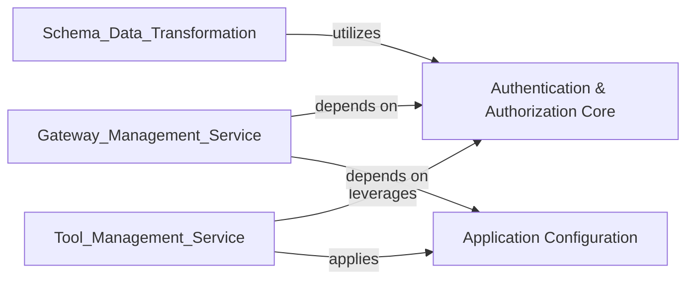

## Component Details

This graph illustrates the 'Security & Configuration' subsystem, which is responsible for managing authentication, including JWT token handling and credential verification, and centralizing application settings and environment variables. It comprises two core components: 'Authentication & Authorization Core' and 'Application Configuration', which interact with other services like Gateway and Tool Management, and Schema & Data Transformation.

### Authentication & Authorization Core
Centralized utilities for handling all aspects of authentication and authorization, including JWT token creation, encoding/decoding service-specific authentication, and credential verification.

**Related Classes/Methods**:

- `mcpgateway.utils.services_auth` (full file reference)
- <a href="https://github.com/IBM/mcp-context-forge/blob/master/mcpgateway/utils/verify_credentials.py#L64-L77" target="_blank" rel="noopener noreferrer">`mcpgateway.utils.verify_credentials` (64:77)</a>
- <a href="https://github.com/IBM/mcp-context-forge/blob/master/mcpgateway/utils/create_jwt_token.py#L90-L109" target="_blank" rel="noopener noreferrer">`mcpgateway.utils.create_jwt_token` (90:109)</a>

### Application Configuration
Provides mechanisms for retrieving application settings, validating configurations, and offering utilities for data manipulation using JSONPath expressions.

**Related Classes/Methods**:

- `mcpgateway.config` (full file reference)

### [FAQ](https://github.com/CodeBoarding/GeneratedOnBoardings/tree/main?tab=readme-ov-file#faq)