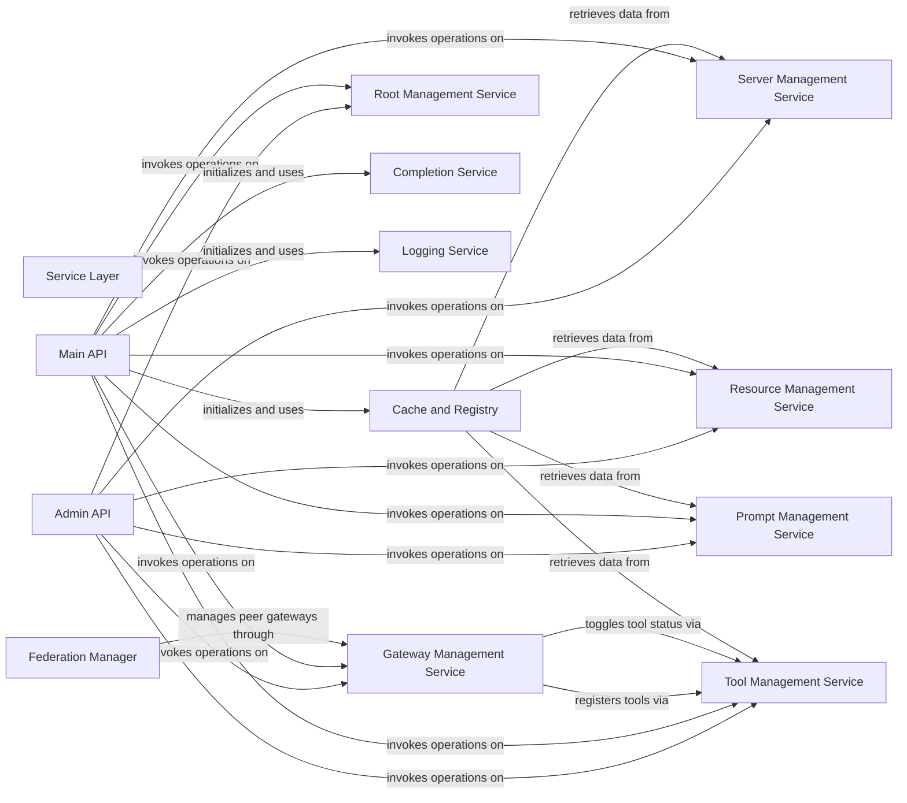

## Component Details

The mcp-context-forge system is structured around a set of core services that manage various entities such as servers, resources, prompts, gateways, and tools. These services expose their functionalities through two primary API interfaces: the Main API for public interactions and the Admin API for privileged administrative operations. Complementing these, a Federation Manager facilitates inter-gateway communication, while a Cache and Registry component optimizes data access and handles session management. Cross-cutting concerns like logging and auto-completion are handled by dedicated utility services, ensuring a modular and maintainable architecture.

### Service Layer
Provides the core business logic and management functionalities for various entities (Servers, Resources, Prompts, Gateways, Tools) and cross-cutting concerns like logging, auto-completion, and root URI management.

**Related Classes/Methods**:

- <a href="https://github.com/IBM/mcp-context-forge/blob/master/mcpgateway/services/server_service.py#L57-L624" target="_blank" rel="noopener noreferrer">`mcpgateway.services.server_service.ServerService` (57:624)</a>
- <a href="https://github.com/IBM/mcp-context-forge/blob/master/mcpgateway/services/resource_service.py#L78-L871" target="_blank" rel="noopener noreferrer">`mcpgateway.services.resource_service.ResourceService` (78:871)</a>
- <a href="https://github.com/IBM/mcp-context-forge/blob/master/mcpgateway/services/prompt_service.py#L68-L740" target="_blank" rel="noopener noreferrer">`mcpgateway.services.prompt_service.PromptService` (68:740)</a>
- <a href="https://github.com/IBM/mcp-context-forge/blob/master/mcpgateway/services/gateway_service.py#L72-L705" target="_blank" rel="noopener noreferrer">`mcpgateway.services.gateway_service.GatewayService` (72:705)</a>
- <a href="https://github.com/IBM/mcp-context-forge/blob/master/mcpgateway/services/tool_service.py#L84-L841" target="_blank" rel="noopener noreferrer">`mcpgateway.services.tool_service.ToolService` (84:841)</a>
- <a href="https://github.com/IBM/mcp-context-forge/blob/master/mcpgateway/services/completion_service.py#L29-L200" target="_blank" rel="noopener noreferrer">`mcpgateway.services.completion_service.CompletionService` (29:200)</a>
- <a href="https://github.com/IBM/mcp-context-forge/blob/master/mcpgateway/services/logging_service.py#L20-L162" target="_blank" rel="noopener noreferrer">`mcpgateway.services.logging_service.LoggingService` (20:162)</a>
- <a href="https://github.com/IBM/mcp-context-forge/blob/master/mcpgateway/services/root_service.py#L28-L176" target="_blank" rel="noopener noreferrer">`mcpgateway.services.root_service.RootService` (28:176)</a>

### Admin API
The Admin API component provides administrative functionalities for managing servers, resources, prompts, gateways, and tools within the mcp-context-forge system. It acts as an interface for privileged operations, allowing creation, retrieval, update, deletion, and status toggling of various entities. It also provides metrics and UI access.

**Related Classes/Methods**:

- `mcpgateway.admin:admin_list_servers` (full file reference)
- `mcpgateway.admin:admin_get_server` (full file reference)
- `mcpgateway.admin:admin_add_server` (full file reference)
- `mcpgateway.admin:admin_edit_server` (full file reference)
- `mcpgateway.admin:admin_toggle_server` (full file reference)
- `mcpgateway.admin:admin_delete_server` (full file reference)
- `mcpgateway.admin:admin_list_resources` (full file reference)
- `mcpgateway.admin:admin_list_prompts` (full file reference)
- `mcpgateway.admin:admin_list_gateways` (full file reference)
- `mcpgateway.admin:admin_toggle_gateway` (full file reference)
- `mcpgateway.admin:admin_ui` (full file reference)
- `mcpgateway.admin:admin_list_tools` (full file reference)
- `mcpgateway.admin:admin_get_tool` (full file reference)
- `mcpgateway.admin:admin_add_tool` (full file reference)
- `mcpgateway.admin:admin_edit_tool` (full file reference)
- `mcpgateway.admin:admin_delete_tool` (full file reference)
- `mcpgateway.admin:admin_toggle_tool` (full file reference)
- `mcpgateway.admin:admin_get_gateway` (full file reference)
- `mcpgateway.admin:admin_add_gateway` (full file reference)
- `mcpgateway.admin:admin_edit_gateway` (full file reference)
- `mcpgateway.admin:admin_delete_gateway` (full file reference)
- `mcpgateway.admin:admin_get_resource` (full file reference)
- `mcpgateway.admin:admin_add_resource` (full file reference)
- `mcpgateway.admin:admin_edit_resource` (full file reference)
- `mcpgateway.admin:admin_delete_resource` (full file reference)
- `mcpgateway.admin:admin_toggle_resource` (full file reference)
- `mcpgateway.admin:admin_get_prompt` (full file reference)
- `mcpgateway.admin:admin_add_prompt` (full file reference)
- `mcpgateway.admin:admin_edit_prompt` (full file reference)
- `mcpgateway.admin:admin_delete_prompt` (full file reference)
- `mcpgateway.admin:admin_toggle_prompt` (full file reference)
- `mcpgateway.admin:admin_add_root` (full file reference)
- `mcpgateway.admin:admin_delete_root` (full file reference)
- `mcpgateway.admin:admin_get_metrics` (full file reference)
- `mcpgateway.admin:admin_reset_metrics` (full file reference)

### Main API
The Main API component serves as the primary public interface for the mcp-context-forge system, handling various operations related to servers, tools, resources, prompts, and gateways. It manages the application's lifecycle, handles notifications, completions, and processes RPC requests. It also provides access to metrics.

**Related Classes/Methods**:

- `mcpgateway.main:lifespan` (full file reference)
- `mcpgateway.main:initialize` (full file reference)
- `mcpgateway.main:handle_notification` (full file reference)
- `mcpgateway.main:handle_completion` (full file reference)
- `mcpgateway.main:list_servers` (full file reference)
- `mcpgateway.main:get_server` (full file reference)
- `mcpgateway.main:create_server` (full file reference)
- `mcpgateway.main:update_server` (full file reference)
- `mcpgateway.main:toggle_server_status` (full file reference)
- `mcpgateway.main:delete_server` (full file reference)
- `mcpgateway.main:server_get_tools` (full file reference)
- `mcpgateway.main:server_get_resources` (full file reference)
- `mcpgateway.main:server_get_prompts` (full file reference)
- `mcpgateway.main:list_tools` (full file reference)
- `mcpgateway.main:create_tool` (full file reference)
- `mcpgateway.main:get_tool` (full file reference)
- `mcpgateway.main:update_tool` (full file reference)
- `mcpgateway.main:delete_tool` (full file reference)
- `mcpgateway.main:toggle_tool_status` (full file reference)
- `mcpgateway.main:list_resource_templates` (full file reference)
- `mcpgateway.main:toggle_resource_status` (full file reference)
- `mcpgateway.main:list_resources` (full file reference)
- `mcpgateway.main:create_resource` (full file reference)
- `mcpgateway.main:read_resource` (full file reference)
- `mcpgateway.main:update_resource` (full file reference)
- `mcpgateway.main:delete_resource` (full file reference)
- `mcpgateway.main:subscribe_resource` (full file reference)
- `mcpgateway.main:toggle_prompt_status` (full file reference)
- `mcpgateway.main:list_prompts` (full file reference)
- `mcpgateway.main:create_prompt` (full file reference)
- `mcpgateway.main:get_prompt` (full file reference)
- `mcpgateway.main:get_prompt_no_args` (full file reference)
- `mcpgateway.main:update_prompt` (full file reference)
- `mcpgateway.main:delete_prompt` (full file reference)
- `mcpgateway.main:toggle_gateway_status` (full file reference)
- `mcpgateway.main:list_gateways` (full file reference)
- `mcpgateway.main:register_gateway` (full file reference)
- `mcpgateway.main:get_gateway` (full file reference)
- `mcpgateway.main:update_gateway` (full file reference)
- `mcpgateway.main:delete_gateway` (full file reference)
- `mcpgateway.main:list_roots` (full file reference)
- `mcpgateway.main:add_root` (full file reference)
- `mcpgateway.main:remove_root` (full file reference)
- `mcpgateway.main:subscribe_roots_changes` (full file reference)
- `mcpgateway.main:handle_rpc` (full file reference)
- `mcpgateway.main:set_log_level` (full file reference)
- `mcpgateway.main:get_metrics` (full file reference)
- `mcpgateway.main:reset_metrics` (full file reference)

### Server Management Service
The Server Management Service is responsible for all business logic related to managing servers, including registration, listing, retrieval, updates, status toggling, and deletion. It handles server-specific errors and publishes events related to server lifecycle changes.

**Related Classes/Methods**:

- <a href="https://github.com/IBM/mcp-context-forge/blob/master/mcpgateway/services/server_service.py#L57-L624" target="_blank" rel="noopener noreferrer">`mcpgateway.services.server_service.ServerService` (57:624)</a>

### Resource Management Service
The Resource Management Service handles the lifecycle of resources, including registration, listing, reading content, status toggling, updates, and deletion. It also manages resource subscriptions and validates resource URIs and content types. It publishes events related to resource changes.

**Related Classes/Methods**:

- <a href="https://github.com/IBM/mcp-context-forge/blob/master/mcpgateway/services/resource_service.py#L78-L871" target="_blank" rel="noopener noreferrer">`mcpgateway.services.resource_service.ResourceService` (78:871)</a>

### Prompt Management Service
The Prompt Management Service is responsible for managing prompts, including registration, listing, retrieval, updates, status toggling, and deletion. It handles prompt template validation, argument extraction, and rendering. It also publishes events related to prompt lifecycle changes.

**Related Classes/Methods**:

- <a href="https://github.com/IBM/mcp-context-forge/blob/master/mcpgateway/services/prompt_service.py#L68-L740" target="_blank" rel="noopener noreferrer">`mcpgateway.services.prompt_service.PromptService` (68:740)</a>

### Gateway Management Service
The Gateway Management Service is responsible for registering, updating, retrieving, toggling the status, and deleting gateways. It handles the initialization and health checks of gateways, and forwards requests to them. It also publishes events related to gateway lifecycle changes.

**Related Classes/Methods**:

- <a href="https://github.com/IBM/mcp-context-forge/blob/master/mcpgateway/services/gateway_service.py#L72-L705" target="_blank" rel="noopener noreferrer">`mcpgateway.services.gateway_service.GatewayService` (72:705)</a>

### Tool Management Service
The Tool Management Service is responsible for managing tools, including registration, listing, retrieval, updates, status toggling, and deletion. It handles tool invocation, records metrics, and validates tool URLs. It also publishes events related to tool lifecycle changes.

**Related Classes/Methods**:

- <a href="https://github.com/IBM/mcp-context-forge/blob/master/mcpgateway/services/tool_service.py#L84-L841" target="_blank" rel="noopener noreferrer">`mcpgateway.services.tool_service.ToolService` (84:841)</a>

### Root Management Service
The Root Management Service manages the root configurations of the system, allowing for the addition and removal of root entries. It also provides a mechanism to subscribe to changes in the root configuration and publishes events when roots are added or removed.

**Related Classes/Methods**:

- <a href="https://github.com/IBM/mcp-context-forge/blob/master/mcpgateway/services/root_service.py#L28-L176" target="_blank" rel="noopener noreferrer">`mcpgateway.services.root_service.RootService` (28:176)</a>

### Completion Service
The Completion Service provides functionality for handling completion requests, specifically for prompt arguments and resource URIs. It aims to assist in auto-completion scenarios within the system.

**Related Classes/Methods**:

- <a href="https://github.com/IBM/mcp-context-forge/blob/master/mcpgateway/services/completion_service.py#L29-L200" target="_blank" rel="noopener noreferrer">`mcpgateway.services.completion_service.CompletionService` (29:200)</a>

### Logging Service
The Logging Service is responsible for managing and notifying about log events within the system. It allows setting the logging level and determines whether a log message should be processed based on the current level.

**Related Classes/Methods**:

- <a href="https://github.com/IBM/mcp-context-forge/blob/master/mcpgateway/services/logging_service.py#L20-L162" target="_blank" rel="noopener noreferrer">`mcpgateway.services.logging_service.LoggingService` (20:162)</a>

### Federation Manager
The Federation Manager handles inter-gateway communication and discovery. It manages the registration and unregistration of gateways, forwards requests between them, and performs health checks to ensure the connectivity and availability of federated gateways.

**Related Classes/Methods**:

- <a href="https://github.com/IBM/mcp-context-forge/blob/master/mcpgateway/federation/manager.py#L63-L73" target="_blank" rel="noopener noreferrer">`mcpgateway.federation.manager.FederationManager:__init__` (63:73)</a>
- <a href="https://github.com/IBM/mcp-context-forge/blob/master/mcpgateway/federation/manager.py#L75-L107" target="_blank" rel="noopener noreferrer">`mcpgateway.federation.manager.FederationManager:start` (75:107)</a>
- <a href="https://github.com/IBM/mcp-context-forge/blob/master/mcpgateway/federation/manager.py#L109-L132" target="_blank" rel="noopener noreferrer">`mcpgateway.federation.manager.FederationManager:stop` (109:132)</a>
- <a href="https://github.com/IBM/mcp-context-forge/blob/master/mcpgateway/federation/manager.py#L134-L175" target="_blank" rel="noopener noreferrer">`mcpgateway.federation.manager.FederationManager:register_gateway` (134:175)</a>
- <a href="https://github.com/IBM/mcp-context-forge/blob/master/mcpgateway/federation/manager.py#L177-L212" target="_blank" rel="noopener noreferrer">`mcpgateway.federation.manager.FederationManager:unregister_gateway` (177:212)</a>
- <a href="https://github.com/IBM/mcp-context-forge/blob/master/mcpgateway/federation/manager.py#L214-L237" target="_blank" rel="noopener noreferrer">`mcpgateway.federation.manager.FederationManager:get_gateway_tools` (214:237)</a>
- <a href="https://github.com/IBM/mcp-context-forge/blob/master/mcpgateway/federation/manager.py#L239-L262" target="_blank" rel="noopener noreferrer">`mcpgateway.federation.manager.FederationManager:get_gateway_resources` (239:262)</a>
- <a href="https://github.com/IBM/mcp-context-forge/blob/master/mcpgateway/federation/manager.py#L264-L287" target="_blank" rel="noopener noreferrer">`mcpgateway.federation.manager.FederationManager:get_gateway_prompts` (264:287)</a>
- <a href="https://github.com/IBM/mcp-context-forge/blob/master/mcpgateway/federation/manager.py#L289-L323" target="_blank" rel="noopener noreferrer">`mcpgateway.federation.manager.FederationManager:forward_request` (289:323)</a>
- <a href="https://github.com/IBM/mcp-context-forge/blob/master/mcpgateway/federation/manager.py#L325-L363" target="_blank" rel="noopener noreferrer">`mcpgateway.federation.manager.FederationManager:_run_sync_loop` (325:363)</a>
- <a href="https://github.com/IBM/mcp-context-forge/blob/master/mcpgateway/federation/manager.py#L365-L393" target="_blank" rel="noopener noreferrer">`mcpgateway.federation.manager.FederationManager:_run_health_loop` (365:393)</a>
- <a href="https://github.com/IBM/mcp-context-forge/blob/master/mcpgateway/federation/manager.py#L395-L431" target="_blank" rel="noopener noreferrer">`mcpgateway.federation.manager.FederationManager:_initialize_gateway` (395:431)</a>
- <a href="https://github.com/IBM/mcp-context-forge/blob/master/mcpgateway/federation/manager.py#L433-L449" target="_blank" rel="noopener noreferrer">`mcpgateway.federation.manager.FederationManager:_check_gateway_health` (433:449)</a>

### Cache and Registry
This component encompasses caching mechanisms for resources and a session registry. The ResourceCache stores and retrieves resource data to improve performance, while the SessionRegistry manages session-related logic, particularly during initialization.

**Related Classes/Methods**:

- <a href="https://github.com/IBM/mcp-context-forge/blob/master/mcpgateway/cache/resource_cache.py#L55-L59" target="_blank" rel="noopener noreferrer">`mcpgateway.cache.resource_cache.ResourceCache.initialize` (55:59)</a>
- <a href="https://github.com/IBM/mcp-context-forge/blob/master/mcpgateway/cache/resource_cache.py#L61-L64" target="_blank" rel="noopener noreferrer">`mcpgateway.cache.resource_cache.ResourceCache.shutdown` (61:64)</a>
- <a href="https://github.com/IBM/mcp-context-forge/blob/master/mcpgateway/cache/resource_cache.py#L66-L88" target="_blank" rel="noopener noreferrer">`mcpgateway.cache.resource_cache.ResourceCache.get` (66:88)</a>
- <a href="https://github.com/IBM/mcp-context-forge/blob/master/mcpgateway/cache/resource_cache.py#L90-L106" target="_blank" rel="noopener noreferrer">`mcpgateway.cache.resource_cache.ResourceCache.set` (90:106)</a>
- <a href="https://github.com/IBM/mcp-context-forge/blob/master/mcpgateway/cache/session_registry.py#L673-L761" target="_blank" rel="noopener noreferrer">`mcpgateway.cache.session_registry.SessionRegistry:generate_response` (673:761)</a>
- <a href="https://github.com/IBM/mcp-context-forge/blob/master/mcpgateway/cache/session_registry.py#L628-L671" target="_blank" rel="noopener noreferrer">`mcpgateway.cache.session_registry.SessionRegistry.handle_initialize_logic` (628:671)</a>

### [FAQ](https://github.com/CodeBoarding/GeneratedOnBoardings/tree/main?tab=readme-ov-file#faq)