```mermaid
graph LR
    API_Gateway_Core["API Gateway Core"]
    Service_Layer["Service Layer"]
    Data_Persistence_Layer["Data & Persistence Layer"]
    Communication_Infrastructure["Communication & Infrastructure"]
    Security_Configuration["Security & Configuration"]
    Federation_Management["Federation Management"]
    External_Client_Wrapper["External Client Wrapper"]
    API_Gateway_Core -- "orchestrates" --> Service_Layer
    API_Gateway_Core -- "handles communication via" --> Communication_Infrastructure
    API_Gateway_Core -- "enforces policies with" --> Security_Configuration
    Service_Layer -- "manages data in" --> Data_Persistence_Layer
    Service_Layer -- "requires authentication from" --> Security_Configuration
    Data_Persistence_Layer -- "supports" --> Service_Layer
    Data_Persistence_Layer -- "stores cached data for" --> Communication_Infrastructure
    Communication_Infrastructure -- "provides protocols to" --> API_Gateway_Core
    Communication_Infrastructure -- "caches resources from" --> Data_Persistence_Layer
    Security_Configuration -- "authenticates" --> API_Gateway_Core
    Security_Configuration -- "configures" --> Service_Layer
    Federation_Management -- "coordinates with" --> API_Gateway_Core
    Federation_Management -- "leverages" --> Security_Configuration
    External_Client_Wrapper -- "interacts with" --> API_Gateway_Core
    click API_Gateway_Core href "https://github.com/CodeBoarding/GeneratedOnBoardings/blob/main/mcp-context-forge/API Gateway Core.md" "Details"
    click Service_Layer href "https://github.com/CodeBoarding/GeneratedOnBoardings/blob/main/mcp-context-forge/Service Layer.md" "Details"
    click Data_Persistence_Layer href "https://github.com/CodeBoarding/GeneratedOnBoardings/blob/main/mcp-context-forge/Data & Persistence Layer.md" "Details"
    click Communication_Infrastructure href "https://github.com/CodeBoarding/GeneratedOnBoardings/blob/main/mcp-context-forge/Communication & Infrastructure.md" "Details"
    click Security_Configuration href "https://github.com/CodeBoarding/GeneratedOnBoardings/blob/main/mcp-context-forge/Security & Configuration.md" "Details"
    click Federation_Management href "https://github.com/CodeBoarding/GeneratedOnBoardings/blob/main/mcp-context-forge/Federation Management.md" "Details"
    click External_Client_Wrapper href "https://github.com/CodeBoarding/GeneratedOnBoardings/blob/main/mcp-context-forge/External Client Wrapper.md" "Details"
```

## Component Details

The `mcp-context-forge` project implements an API Gateway that serves as a central entry point for various client interactions, including REST, RPC, SSE, and WebSocket. Its primary purpose is to route requests, manage core entities like servers, resources, and tools, and facilitate inter-gateway communication. The system emphasizes modularity with distinct layers for services, data persistence, communication, security, and federation, ensuring robust and scalable operations.

### API Gateway Core
The central component handling all incoming API requests (REST, RPC, SSE, WebSocket), routing them to appropriate services, and managing the application's lifecycle. It acts as the primary interface for clients and orchestrates interactions between various internal services. It also exposes administrative endpoints and health checks.

**Related Classes/Methods**:

- `mcp-context-forge.mcpgateway.main` (full file reference)
- `mcp-context-forge.mcpgateway.admin` (full file reference)

### Service Layer
Provides the core business logic and management functionalities for various entities (Servers, Resources, Prompts, Gateways, Tools) and cross-cutting concerns like logging, auto-completion, and root URI management.

**Related Classes/Methods**:

- <a href="https://github.com/IBM/mcp-context-forge/blob/master/mcpgateway/services/server_service.py#L57-L624" target="_blank" rel="noopener noreferrer">`mcp-context-forge.mcpgateway.services.server_service.ServerService` (57:624)</a>
- <a href="https://github.com/IBM/mcp-context-forge/blob/master/mcpgateway/services/resource_service.py#L78-L871" target="_blank" rel="noopener noreferrer">`mcp-context-forge.mcpgateway.services.resource_service.ResourceService` (78:871)</a>
- <a href="https://github.com/IBM/mcp-context-forge/blob/master/mcpgateway/services/prompt_service.py#L68-L740" target="_blank" rel="noopener noreferrer">`mcp-context-forge.mcpgateway.services.prompt_service.PromptService` (68:740)</a>
- <a href="https://github.com/IBM/mcp-context-forge/blob/master/mcpgateway/services/gateway_service.py#L72-L705" target="_blank" rel="noopener noreferrer">`mcp-context-forge.mcpgateway.services.gateway_service.GatewayService` (72:705)</a>
- <a href="https://github.com/IBM/mcp-context-forge/blob/master/mcpgateway/services/tool_service.py#L84-L841" target="_blank" rel="noopener noreferrer">`mcp-context-forge.mcpgateway.services.tool_service.ToolService` (84:841)</a>
- <a href="https://github.com/IBM/mcp-context-forge/blob/master/mcpgateway/services/completion_service.py#L29-L200" target="_blank" rel="noopener noreferrer">`mcp-context-forge.mcpgateway.services.completion_service.CompletionService` (29:200)</a>
- <a href="https://github.com/IBM/mcp-context-forge/blob/master/mcpgateway/services/logging_service.py#L20-L162" target="_blank" rel="noopener noreferrer">`mcp-context-forge.mcpgateway.services.logging_service.LoggingService` (20:162)</a>
- <a href="https://github.com/IBM/mcp-context-forge/blob/master/mcpgateway/services/root_service.py#L28-L176" target="_blank" rel="noopener noreferrer">`mcp-context-forge.mcpgateway.services.root_service.RootService` (28:176)</a>

### Data & Persistence Layer
Defines the data structures (schemas) for all entities and messages within the system and provides an abstraction layer for persistent storage, handling database operations for various application entities.

**Related Classes/Methods**:

- `mcp-context-forge.mcpgateway.schemas` (full file reference)
- `mcp-context-forge.mcpgateway.types` (full file reference)
- `mcp-context-forge.mcpgateway.db` (full file reference)

### Communication & Infrastructure
Manages network communication protocols (SSE, WebSocket, JSON-RPC validation), handles caching of frequently accessed resources, and manages active user sessions for real-time interactions.

**Related Classes/Methods**:

- <a href="https://github.com/IBM/mcp-context-forge/blob/master/mcpgateway/transports/sse_transport.py#L28-L230" target="_blank" rel="noopener noreferrer">`mcp-context-forge.mcpgateway.transports.sse_transport.SSETransport` (28:230)</a>
- <a href="https://github.com/IBM/mcp-context-forge/blob/master/mcpgateway/transports/websocket_transport.py#L24-L139" target="_blank" rel="noopener noreferrer">`mcp-context-forge.mcpgateway.transports.websocket_transport.WebSocketTransport` (24:139)</a>
- `mcp-context-forge.mcpgateway.validation.jsonrpc` (full file reference)
- <a href="https://github.com/IBM/mcp-context-forge/blob/master/mcpgateway/cache/resource_cache.py#L33-L136" target="_blank" rel="noopener noreferrer">`mcp-context-forge.mcpgateway.cache.resource_cache.ResourceCache` (33:136)</a>
- <a href="https://github.com/IBM/mcp-context-forge/blob/master/mcpgateway/cache/session_registry.py#L104-L761" target="_blank" rel="noopener noreferrer">`mcp-context-forge.mcpgateway.cache.session_registry.SessionRegistry` (104:761)</a>

### Security & Configuration
Manages all aspects of authentication, including JWT token handling and credential verification, and provides a centralized mechanism for managing application settings and environment variables.

**Related Classes/Methods**:

- `mcp-context-forge.mcpgateway.utils.services_auth` (full file reference)
- <a href="https://github.com/IBM/mcp-context-forge/blob/master/mcpgateway/utils/verify_credentials.py#L64-L77" target="_blank" rel="noopener noreferrer">`mcp-context-forge.mcpgateway.utils.verify_credentials` (64:77)</a>
- <a href="https://github.com/IBM/mcp-context-forge/blob/master/mcpgateway/utils/create_jwt_token.py#L90-L109" target="_blank" rel="noopener noreferrer">`mcp-context-forge.mcpgateway.utils.create_jwt_token` (90:109)</a>
- `mcp-context-forge.mcpgateway.config` (full file reference)

### Federation Management
Facilitates inter-gateway communication, including peer discovery, health monitoring, and intelligent request forwarding across a distributed network of gateways.

**Related Classes/Methods**:

- <a href="https://github.com/IBM/mcp-context-forge/blob/master/mcpgateway/federation/manager.py#L53-L459" target="_blank" rel="noopener noreferrer">`mcp-context-forge.mcpgateway.federation.manager.FederationManager` (53:459)</a>
- <a href="https://github.com/IBM/mcp-context-forge/blob/master/mcpgateway/federation/discovery.py#L91-L390" target="_blank" rel="noopener noreferrer">`mcp-context-forge.mcpgateway.federation.discovery.DiscoveryService` (91:390)</a>
- <a href="https://github.com/IBM/mcp-context-forge/blob/master/mcpgateway/federation/forward.py#L37-L337" target="_blank" rel="noopener noreferrer">`mcp-context-forge.mcpgateway.federation.forward.ForwardingService` (37:337)</a>

### External Client Wrapper
An external client-side component designed to interact with the mcpgateway server, primarily for fetching metadata related to tools, prompts, and resources.

**Related Classes/Methods**:

- `mcp-context-forge.mcpgateway-wrapper.src.mcpgateway_wrapper.server` (full file reference)

### [FAQ](https://github.com/CodeBoarding/GeneratedOnBoardings/tree/main?tab=readme-ov-file#faq)