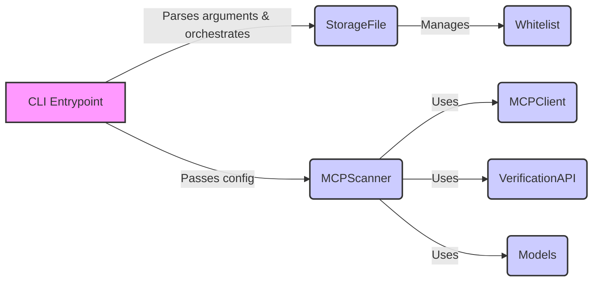

### Component Descriptions:

**Component:** `CLI Entrypoint`
   - *Description*: Parses command-line arguments using `argparse` and orchestrates the scanning, inspection, and whitelist management processes. It serves as the entry point for the `mcp-scan` tool.
   - *Functionality*: Parses arguments, determines the command to execute (scan, inspect, whitelist), and initializes the relevant components.
   - *Interaction*: Receives input from the user, passes configuration to `MCPScanner`, and interacts with `StorageFile` for whitelist management.
   - *Relevant source files*: `src.mcp_scan.cli:main`, `src.mcp_scan.cli.get_invoking_name`, `src.mcp_scan.cli.add_common_arguments`, `src.mcp_scan.cli.add_server_arguments`

**Component:** `StorageFile`
   - *Description*: Handles the storage and management of scan results and the whitelist. It persists data to disk in JSON format and provides methods for resetting, printing, adding to, and checking the whitelist.
   - *Functionality*: Reads and writes the whitelist to a file, provides methods to manipulate the whitelist.
   - *Interaction*: Interacts with `CLI Entrypoint` to manage the whitelist based on user commands.
   - *Relevant source files*: `src.mcp_scan.StorageFile.StorageFile`, `src.mcp_scan.StorageFile.StorageFile.reset_whitelist`, `src.mcp_scan.StorageFile.StorageFile.print_whitelist`, `src.mcp_scan.StorageFile.StorageFile.add_to_whitelist`, `src.mcp_scan.StorageFile.StorageFile.is_whitelisted`, `src.mcp_scan.StorageFile.StorageFile.save`

**Component:** `MCPScanner`
   - *Description*: The core scanner that performs the inspection and verification of MCP configurations. It reads configuration files, connects to MCP servers, retrieves tool, prompt, and resource information, and verifies them against a remote server.
   - *Functionality*: Reads MCP configuration files, scans servers, inspects tools, prompts, and resources, and performs security verification.
   - *Interaction*: Receives configuration from `CLI Entrypoint`, uses `MCPClient` to interact with MCP servers, uses `VerificationAPI` to verify entities, and uses `Models` for data representation.
   - *Relevant source files*: `src.mcp_scan.MCPScanner.MCPScanner`, `src.mcp_scan.MCPScanner.MCPScanner.inspect`, `src.mcp_scan.MCPScanner.MCPScanner.start`, `src.mcp_scan.MCPScanner.MCPScanner.scan`

**Component:** `MCPClient`
   - *Description*: Responsible for interacting with the MCP servers. It contains functions to scan MCP config files and check servers with a timeout.
   - *Functionality*: Connects to MCP servers, retrieves configuration information.
   - *Interaction*: Used by `MCPScanner` to interact with MCP servers.
   - *Relevant source files*: `src.mcp_scan.mcp_client.check_server_with_timeout`, `src.mcp_scan.mcp_client.scan_mcp_config_file`

**Component:** `VerificationAPI`
   - *Description*: Communicates with the verification server to validate tools, prompts and resources.
   - *Functionality*: Sends requests to the verification server and receives validation results.
   - *Interaction*: Used by `MCPScanner` to verify entities against a remote server.
   - *Relevant source files*: `src.mcp_scan.verify_api.verify_server`

**Component:** `Models`
   - *Description*: Data models representing entities like tools, prompts, resources, scan results, and scanned entities. Defines the structure for data exchange and storage.
   - *Functionality*: Provides data structures for representing MCP entities and scan results.
   - *Interaction*: Used by `MCPScanner` to represent and process data.
   - *Relevant source files*: `src.mcp_scan.models.Entity`, `src.mcp_scan.models.Result`, `src.mcp_scan.models.ScannedEntities`, `src.mcp_scan.models.ScannedEntity`, `src.mcp_scan.models.entity_type_to_str`

**Component:** `Whitelist`
   - *Description*: Stores the whitelisted entities.
   - *Functionality*: Stores and manages the whitelisted entities.
   - *Interaction*: Managed by `StorageFile`.
   - *Relevant source files*: `src.mcp_scan.StorageFile`
