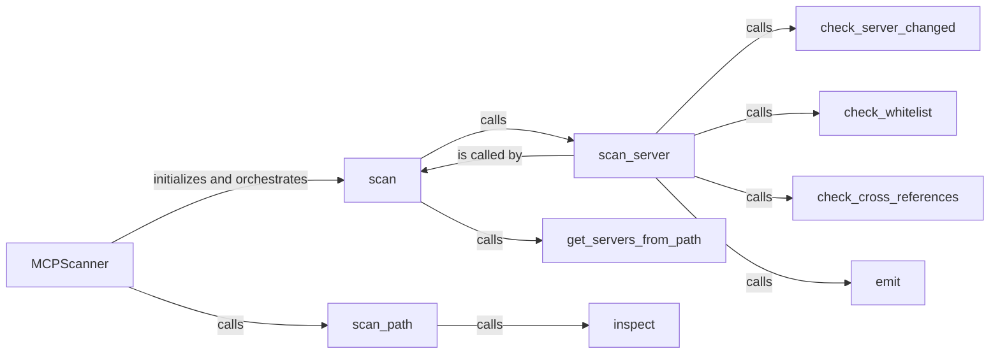

## Component Details

The Core Scanning Engine orchestrates the scanning of Minecraft server directories. It starts by retrieving a list of server paths, then iterates through each server, performing checks for changes, whitelist status, and cross-references. Findings are emitted for reporting. The central class is `MCPScanner` which manages the scanning process.

### MCPScanner
The main class responsible for orchestrating the scanning process. It initializes the scanner, manages server lists, and calls the different checks.
- **Related Classes/Methods**: `mcp-scan.src.mcp_scan.MCPScanner.MCPScanner`

### scan
Initiates the scanning process for a given path. It iterates through the files and directories, identifies server files, and calls `scan_server` for each server.
- **Related Classes/Methods**: `mcp-scan.src.mcp_scan.MCPScanner.MCPScanner:scan`

### scan_server
Scans a single Minecraft server directory. It checks for changes, verifies against a whitelist, performs cross-reference checks, and emits findings.
- **Related Classes/Methods**: `mcp-scan.src.mcp_scan.MCPScanner.MCPScanner:scan_server`

### check_server_changed
Checks if a server's configuration has changed since the last scan.
- **Related Classes/Methods**: `mcp-scan.src.mcp_scan.MCPScanner.MCPScanner:check_server_changed`

### check_whitelist
Verifies if a server is whitelisted, preventing it from being scanned.
- **Related Classes/Methods**: `mcp-scan.src.mcp_scan.MCPScanner.MCPScanner:check_whitelist`

### check_cross_references
Performs cross-reference checks within the server files to identify potential vulnerabilities.
- **Related Classes/Methods**: `mcp-scan.src.mcp_scan.MCPScanner.MCPScanner:check_cross_references`

### emit
Emits the findings of the scan, reporting any identified issues.
- **Related Classes/Methods**: `mcp-scan.src.mcp_scan.MCPScanner.MCPScanner:emit`

### get_servers_from_path
Retrieves a list of Minecraft server directories from a given path.
- **Related Classes/Methods**: `mcp-scan.src.mcp_scan.MCPScanner.MCPScanner:get_servers_from_path`

### scan_path
Scans a given path for Minecraft server files.
- **Related Classes/Methods**: `mcp-scan.src.mcp_scan.MCPScanner.MCPScanner:scan_path`

### inspect
Inspects the server files.
- **Related Classes/Methods**: `mcp-scan.src.mcp_scan.MCPScanner.MCPScanner:inspect`
