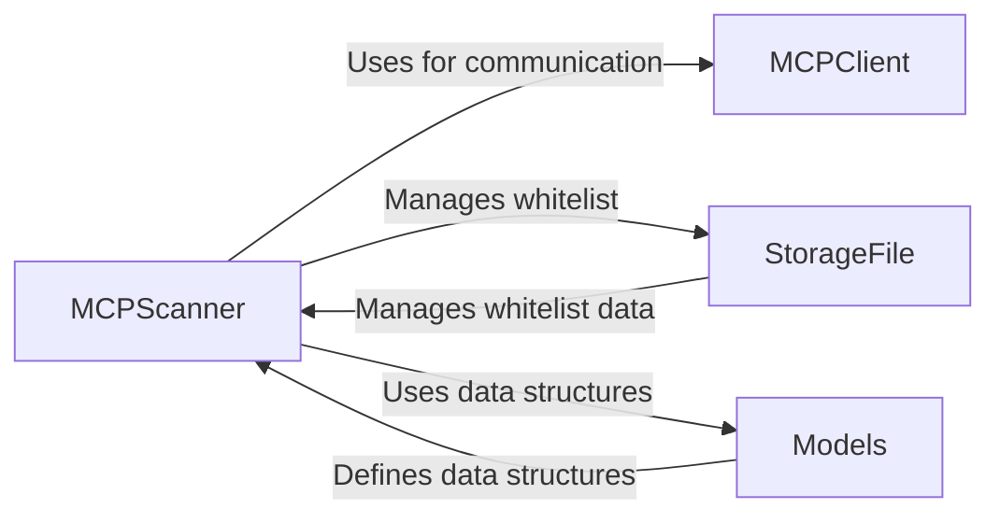

## Component Details

The Data and Configuration Management subsystem is responsible for retrieving, storing, and managing configuration data from MCP servers, as well as handling the whitelist of verified entities. It ensures data consistency and facilitates data exchange between different components by defining data models, managing whitelist operations, and providing MCP communication functionalities. The core flow involves retrieving server configurations using the MCPClient, validating and updating the whitelist using StorageFile, and representing the data using defined models.

### MCPClient
The MCPClient component handles communication with MCP servers. It provides functionalities for checking server availability and scanning server configurations. It encapsulates the logic for establishing connections, sending requests, and parsing responses from MCP servers, abstracting away the complexities of network communication.
- **Related Classes/Methods**: `mcp_scan.src.mcp_scan.mcp_client`

### MCPScanner
The MCPScanner component orchestrates the scanning process. It retrieves server information from a given path, checks if a server's status has changed, and manages the whitelist. It uses MCPClient to interact with servers and StorageFile to manage the whitelist, coordinating the overall scanning workflow.
- **Related Classes/Methods**: `mcp_scan.src.mcp_scan.MCPScanner.MCPScanner`

### StorageFile
The StorageFile component manages the whitelist of verified entities. It provides methods to reset, check and update, add to, and check if a server is whitelisted. It persists the whitelist to a file and provides methods for interacting with it, ensuring persistent storage and management of the whitelist data.
- **Related Classes/Methods**: `mcp_scan.src.mcp_scan.StorageFile.StorageFile`

### Models
The Models component defines the data structures used throughout the application. These models represent the configuration data retrieved from MCP servers and the structure of the whitelist, providing a consistent and structured way to represent data within the system.
- **Related Classes/Methods**: `mcp_scan.models`
