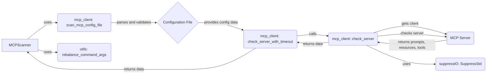

## MCP Configuration Client Overview

The MCP Configuration Client is responsible for retrieving server configurations, interacting with MCP servers, and obtaining tool, prompt, and resource definitions. It primarily uses the `mcp_client` module and its functions to achieve this.

Given the interactions between the components, a data flow diagram provides a good overview.

### Component Descriptions:

*   **MCPScanner:** Orchestrates the entire MCP scan process. It initiates the scan by calling `scan_mcp_config_file` and `check_server_with_timeout` to retrieve configurations and check server status. It also uses `utils` for rebalancing command-line arguments.
    *   Relevant source files: `src.mcp_scan.MCPScanner.MCPScanner`

*   **mcp_client: scan_mcp_config_file:** Scans the MCP configuration file, parses its content, and validates it. The parsed configuration data is then used by `check_server_with_timeout` to check the server.
    *   Relevant source files: `src.mcp_scan.mcp_client.scan_mcp_config_file`

*   **Configuration File:** Contains the configuration data for the MCP server, including server addresses, timeouts, and other settings.
    *   Relevant source files: N/A

*   **mcp_client: check_server_with_timeout:** Checks the status of the MCP server with a specified timeout. It calls `check_server` to perform the actual server check and handles potential timeout exceptions. The retrieved data is then returned to the `MCPScanner`.
    *   Relevant source files: `src.mcp_scan.mcp_client.check_server_with_timeout`

*   **mcp_client: check_server:** Checks the status of the MCP server and retrieves prompts, resources, and tools. It uses `get_client` to establish a connection with the server and `_check_server` to interact with it. It also uses `suppressIO` to suppress standard output during the server check.
    *   Relevant source files: `src.mcp_scan.mcp_client.check_server`

*   **MCP Server:** The target server being checked. It provides prompts, resources, and tools to the `check_server` component.
    *   Relevant source files: N/A

*   **utils: rebalance_command_args:** Provides utility functions, specifically for rebalancing command-line arguments. It is used by `MCPScanner` to handle complex configurations.
    *   Relevant source files: `src.mcp_scan.utils`

*   **suppressIO: SuppressStd:** Suppresses standard output during server checks. It is used by `check_server` to prevent unwanted output from being displayed.
    *   Relevant source files: `src.mcp_scan.suppressIO`