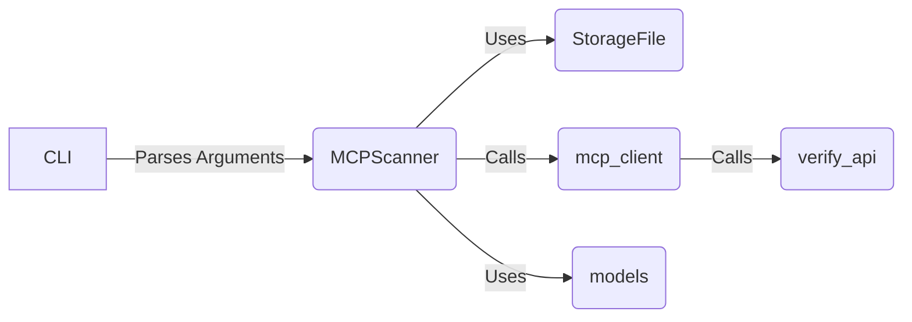

## MCP Scanner Core Overview

This document provides an overview of the MCP Scanner Core, its components, and their interactions. The core functionality revolves around scanning MCP configurations, interacting with MCP servers, and verifying their configurations.

### Data Flow Diagram

### Component Descriptions

*   **CLI:** The command-line interface. It's the entry point of the application, responsible for parsing arguments provided by the user and initiating the scan process by calling the `MCPScanner`.
    *   **Source Files:** `src.mcp_scan.cli`
*   **MCPScanner:** The central component that drives the scanning and inspection of MCP configurations. It orchestrates the scanning process, interacts with MCP servers via `mcp_client`, and manages the verification process. It uses `StorageFile` to store and retrieve scan results and `models` to represent data.
    *   **Source Files:** `src.mcp_scan.MCPScanner.MCPScanner`
*   **StorageFile:** Manages the storage and retrieval of scan results. It handles persistence, update checks, and data integrity using hashing. It's used by `MCPScanner` to save and load scan data.
    *   **Source Files:** `src.mcp_scan.StorageFile.StorageFile`
*   **mcp_client:** Provides the functionality to interact with MCP servers. It includes functions for scanning configurations and checking server status with timeout mechanisms. It's called by `MCPScanner` to perform actions on the MCP server and uses `verify_api` to verify the server's responses.
    *   **Source Files:** `src.mcp_scan.mcp_client`
*   **verify_api:** Contains functions for verifying the MCP server API. It's used by `mcp_client` to ensure the server's functionality and responses are valid.
    *   **Source Files:** `src.mcp_scan.verify_api`
*   **models:** Defines data models and utility functions for representing entities and their types. It's used by `MCPScanner` to structure and manipulate data.
    *   **Source Files:** `src.mcp_scan.models`
