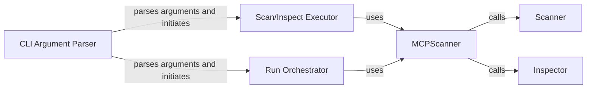

## Component Details

The Scan Orchestrator manages the overall scan workflow of the mcp-scan application. It starts with parsing command-line arguments, then initializes and coordinates the core scanner and whitelist manager. It triggers the scan process based on the provided arguments and presents the scan results to the user. The orchestrator ensures a seamless and efficient scan process by managing interactions between different components.

### CLI Argument Parser
The entry point of the application, responsible for parsing command-line arguments using `argparse`. It determines whether to initiate a scan or inspect process based on the arguments provided by the user.
- **Related Classes/Methods**: `mcp_scan.cli`

### Scan/Inspect Executor
This component decides whether to run a scan or inspect based on the CLI arguments. It instantiates the `MCPScanner` and calls the `scan` or `inspect` methods.
- **Related Classes/Methods**: `mcp_scan.cli`

### Run Orchestrator
This component orchestrates the entire scan process when the application is run without the inspect command. It initializes necessary resources, calls the scanner, and handles any post-processing or reporting.
- **Related Classes/Methods**: `mcp_scan.run`

### MCPScanner
The central class that encapsulates the scanning and inspection logic. It provides methods for performing scans, inspecting results, and managing the overall process. It initializes the scanner with configurations and target information.
- **Related Classes/Methods**: `mcp_scan.MCPScanner.MCPScanner`

### Scanner
This component performs the actual scanning of the target, identifying potential issues or vulnerabilities. It uses plugins to perform the scan.
- **Related Classes/Methods**: `mcp_scan.MCPScanner.MCPScanner`

### Inspector
This component analyzes the scan results and provides detailed information about the identified issues. It loads the scan results and provides a summary.
- **Related Classes/Methods**: `mcp_scan.MCPScanner.MCPScanner`
