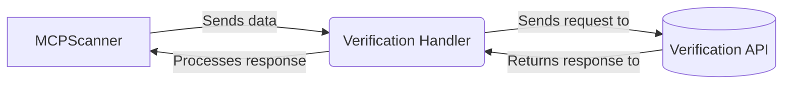

## Verification Handler Overview

The `Verification Handler` component is responsible for communicating with an external verification API to validate the configurations of MCP servers and identify potential security vulnerabilities. It sends information about tools, prompts, and resources to the API and processes the response to determine the verification status of each.

### Data Flow Diagram

### Component Descriptions

*   **MCPScanner**
    *   *Description*: Orchestrates the scan process and sends the tool, prompt, and resource data to the Verification Handler for validation.
    *   *Functionality*: Initiates the verification process by calling the Verification Handler with relevant data.
    *   *Related Files*: `src.mcp_scan.MCPScanner.MCPScanner`

*   **Verification Handler**
    *   *Description*: Communicates with the verification API, sends data, and processes the response.
    *   *Functionality*: Sends the tool, prompt, and resource information to the verification API and processes the response to determine the verification status.
    *   *Related Files*: `src.mcp_scan.verify_api.verify_server`

*   **Verification API**
    *   *Description*: External API that receives the data from the Verification Handler, validates it, and returns a response.
    *   *Functionality*: Validates the configurations and identifies potential security vulnerabilities.
    *   *Related Files*: N/A (External API)
