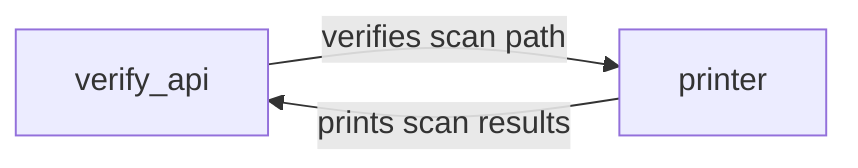

## Component Details

The Verification and Reporting component ensures the integrity and usability of scan results within the mcp_scan system. It encompasses two primary modules: `verify_api` and `printer`. The `verify_api` module validates the provided scan path, determining its accessibility and correctness either through external API calls or local checks. Upon successful validation, the scan process proceeds. The `printer` module then takes over, formatting the scan results, errors, and exceptions into a human-readable output, which is displayed on the console. This component allows external systems to verify the compliance of files and provides a user-friendly output of the scan process, allowing users to easily identify potential issues and verify the compliance of scanned files.

### verify_api
The `verify_api` module is responsible for verifying the validity and accessibility of a given scan path. It employs two methods for verification: utilizing a public API endpoint or performing local checks. The choice between these methods depends on the configuration and the nature of the scan path. This module ensures that the scan process only proceeds with valid and accessible paths, preventing potential errors and ensuring data integrity.
- **Related Classes/Methods**: `mcp_scan.verify_api:verify_scan_path_public_api`, `mcp_scan.verify_api:verify_scan_path_locally`, `mcp_scan.verify_api:verify_scan_path`

### printer
The `printer` module serves as the presentation layer for the scan results. It takes the raw scan data, including any errors or exceptions encountered during the scan, and formats it into a user-friendly output. This module provides functions to format exceptions, errors, and entity lines, as well as functions to print the overall scan result and individual scan path results. The formatted output is then displayed on the console, providing users with a clear and concise overview of the scan process and its findings.
- **Related Classes/Methods**: `mcp_scan.printer:format_exception`, `mcp_scan.printer:format_error`, `mcp_scan.printer:format_entity_line`, `mcp_scan.printer:print_scan_path_result`, `mcp_scan.printer:print_scan_result`
