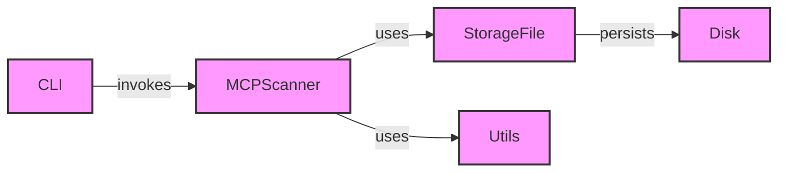

### Component Descriptions:

*   **CLI:** Handles command-line argument parsing and invokes the appropriate scanning or whitelist management functions. It serves as the entry point for user interaction. It invokes the `MCPScanner` to start the scanning process.
    *   Relevant source files: `src.mcp_scan.cli.main`

*   **MCPScanner:** Orchestrates the scanning process, interacting with `StorageFile` to manage scan results and whitelist status. It initializes and starts the scan, inspecting files and managing the overall workflow. It uses `Utils` for uploading whitelist entries.
    *   Relevant source files: `src.mcp_scan.MCPScanner.MCPScanner`

*   **StorageFile:** Manages the storage and retrieval of scan results and whitelist data. It handles file hashing, whitelist checks, and persistence of data to disk. It persists data to `Disk`.
    *   Relevant source files: `src.mcp_scan.StorageFile.StorageFile`

*   **Utils:** Provides utility functions, specifically for uploading whitelist entries. It encapsulates functionality that supports the main scanning and whitelist management processes. It is used by `MCPScanner`.
    *   Relevant source files: `src.mcp_scan.utils`

*   **Disk:** Represents the file system where scan results and whitelist data are stored. `StorageFile` persists data to disk.
    *   Relevant source files: N/A (Represents the file system)
