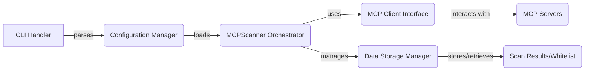

Okay, I will generate an onboarding document for the `mcp-scan` project based on the provided information.

**Project Description**

The `mcp-scan` project is a tool designed to scan and verify configurations of MCP (Meta Configuration Protocol) servers. It automates the process of checking server status, scanning configuration files for potential issues, and managing whitelists. The tool supports various configuration file types (e.g., Claude, VSCode) and server definitions (e.g., SSE, Stdio), providing a comprehensive solution for ensuring the integrity and security of MCP environments.

**Flow Diagram**

**Component Descriptions**

*   **CLI Handler:** This component serves as the entry point for the application. It parses command-line arguments provided by the user and initiates the scanning process accordingly. It essentially translates user input into actionable commands for the rest of the system.

*   **Configuration Manager:** The Configuration Manager is responsible for loading, parsing, and validating configuration files. It transforms raw configuration data into structured data models, making it easier for other components to work with the configuration information. It supports different configuration types and server definitions.

*   **MCPScanner Orchestrator:** This is the central component that orchestrates the entire scanning process. It coordinates the activities of other components, including checking server status, scanning configurations, and managing the scan lifecycle. It determines the overall flow of the scan based on the configuration and user input.

*   **MCP Client Interface:** This component provides an interface for interacting with MCP servers. It encapsulates the logic for checking server status, scanning configurations, and handling communication with the servers. It abstracts away the details of the MCP server interaction, providing a clean and consistent API for other components to use.

*   **Data Storage Manager:** The Data Storage Manager handles the storage and retrieval of scan results, whitelist data, and other persistent data. It provides functionalities for checking, updating, and resetting the whitelist. This component ensures that scan results and whitelist information are persisted between runs of the application.