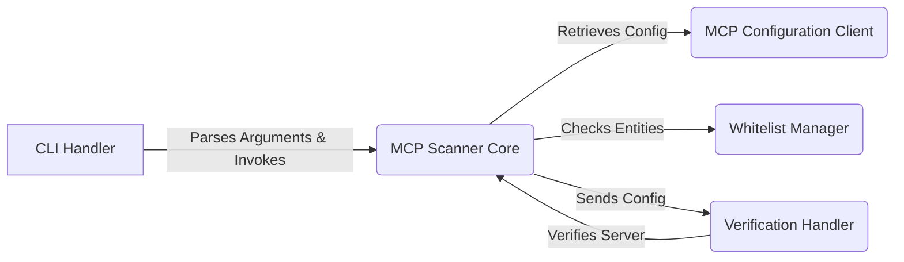

## MCP-Scan Data Flow Overview

**Project Description:**
The `mcp-scan` project is a security tool designed to scan and verify configurations of MCP (Meta Configuration Platform) servers. It identifies potential security vulnerabilities by inspecting server configurations, checking against a local whitelist, and communicating with a verification API. The tool supports command-line operation, allowing users to scan configurations, manage whitelists, and suppress standard output.

**Data Flow Diagram:**

**Component Descriptions:**

*   **CLI Handler:** This component serves as the entry point for the application. It parses command-line arguments provided by the user and orchestrates the overall scanning process by invoking the `MCP Scanner Core`. It also handles user requests related to whitelist management.

*   **MCP Scanner Core:** This is the central component responsible for driving the scanning and inspection of MCP configurations. It retrieves server configurations using the `MCP Configuration Client`, checks entities against the `Whitelist Manager`, and sends configurations to the `Verification Handler` for validation. The core then aggregates the results and presents them to the user.

*   **MCP Configuration Client:** This component handles the retrieval of server configurations from files and interacts with MCP servers to retrieve tool, prompt, and resource definitions. It provides the `MCP Scanner Core` with the necessary configuration data for scanning.

*   **Whitelist Manager:** This component manages the local whitelist of approved entities. The `MCP Scanner Core` consults the `Whitelist Manager` to determine if scanned entities are whitelisted, reducing false positives. It also provides functionality for the `CLI Handler` to add, reset, check, and persist whitelist entries.

*   **Verification Handler:** This component communicates with the verification API to validate MCP server configurations and identify potential security vulnerabilities. It receives configurations from the `MCP Scanner Core` and sends verification requests to the API, relaying the results back to the core for further processing and reporting.