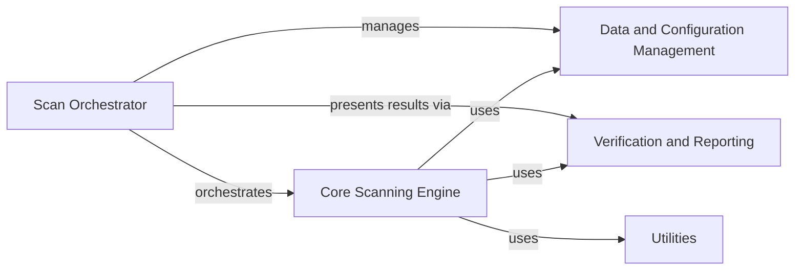

## Component Details

The MCP Scan project automates the process of scanning file paths and verifying entities against a whitelist. It provides a command-line interface for users to initiate scans, retrieve server configurations, check cross-references, and verify entities. The project leverages a whitelist to ensure that only verified entities are processed, and it provides functionalities to manage and persist the whitelist. The scan results are formatted and presented to the user in a user-friendly manner, allowing them to easily identify potential issues and verify the compliance of scanned files.

### Scan Orchestrator
The Scan Orchestrator component serves as the entry point for the application, managing the overall scan workflow. It handles command-line argument parsing, initializes the core scanner and whitelist manager, triggers the scan process, and presents the results to the user. It coordinates the interactions between different components to ensure a seamless and efficient scan process.
- **Related Classes/Methods**: `mcp_scan.cli`, `mcp_scan.run`

### Core Scanning Engine
The Core Scanning Engine component is responsible for the central scanning logic. It retrieves server configurations using the MCP Communication module, scans specified paths, checks cross-references, and verifies entities against a whitelist managed by the Whitelist Manager. It emits scan results for further processing and reporting, ensuring that only verified entities are allowed during the scan process.
- **Related Classes/Methods**: `mcp_scan.MCPScanner.MCPScanner`

### Data and Configuration Management
The Data and Configuration Management component encompasses the data models, whitelist management, and MCP communication functionalities. It defines the data structures used throughout the application, manages the whitelist of verified entities, and handles communication with MCP servers to retrieve server configurations. This component ensures data consistency and facilitates data exchange between different components.
- **Related Classes/Methods**: `mcp_scan.models`, `mcp_scan.StorageFile.StorageFile`, `mcp_scan.mcp_client`

### Verification and Reporting
The Verification and Reporting component provides functions to verify scan paths and formats and prints scan results, errors, and exceptions to the console. It allows external systems to verify the compliance of files and provides a user-friendly output of the scan process, allowing users to easily identify potential issues and verify the compliance of scanned files.
- **Related Classes/Methods**: `mcp_scan.verify_api`, `mcp_scan.printer`

### Utilities
The Utilities component provides a collection of utility functions used throughout the application, such as argument rebalancing. These functions encapsulate common tasks and improve code reusability and maintainability.
- **Related Classes/Methods**: `mcp_scan.utils`