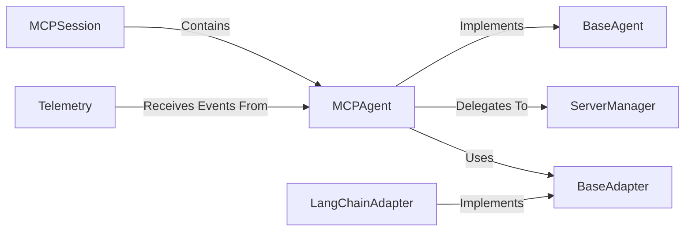

## Details

One paragraph explaining the functionality which is represented by this graph. What the main flow is and what is its purpose.

### BaseAgent
Defines the abstract interface and fundamental properties for all agent implementations in the framework. It establishes the contract that concrete agents must follow.

**Related Classes/Methods**:

- `mcp_use/agents/base.py`

### MCPAgent
The primary concrete implementation of `BaseAgent`. It contains the core logic for processing input, making decisions, and orchestrating tasks through a reasoning loop.

**Related Classes/Methods**:

- `mcp_use/agents/mcpagent.py`

### BaseAdapter
Defines the abstract interface for adapting the agent's internal requests and data structures to be compatible with various underlying AI frameworks.

**Related Classes/Methods**:

- `mcp_use/adapters/base.py`

### LangChainAdapter
A specific, concrete implementation of `BaseAdapter` that translates the agent's needs into a format that the LangChain framework can process.

**Related Classes/Methods**:

- `mcp_use/adapters/langchain_adapter.py`

### ServerManager
Manages connections to various "tool servers" and provides the `MCPAgent` with a unified interface to discover and execute external tools.

**Related Classes/Methods**:

- `mcp_use/server_manager.py`

### MCPSession
Manages the state and context of an agent's interaction, including active connections, resources, and history. It encapsulates the entire operational context for a single agent run.

**Related Classes/Methods**:

- `mcp_use/session.py`

### Telemetry
Provides a standardized mechanism for the agent and other components to emit events (like `MCPAgentExecutionEvent`) for the purpose of monitoring, logging, and debugging.

**Related Classes/Methods**:

- `mcp_use/telemetry.py`

### [FAQ](https://github.com/CodeBoarding/GeneratedOnBoardings/tree/main?tab=readme-ov-file#faq)