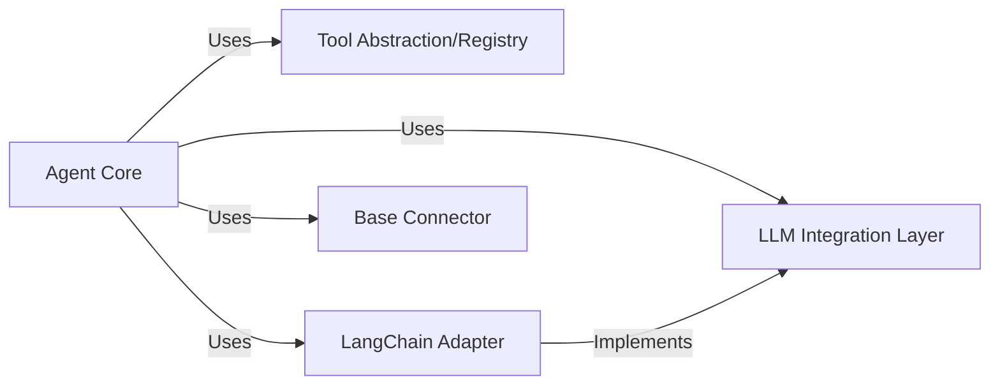

## Details

One paragraph explaining the functionality which is represented by this graph. What the main flow is and what is its purpose.

### Agent Core [[Expand]](./Agent_Core.md)
This is the central orchestrator of the agent's behavior. It manages the agent's lifecycle, makes decisions, and coordinates interactions with various internal and external systems. It serves as the primary decision-making and coordination hub.

**Related Classes/Methods**:

- <a href="https://github.com/mcp-use/mcp-use/blob/main/mcp_use/agents/mcpagent.py" target="_blank" rel="noopener noreferrer">`mcp_use.agents.mcpagent`</a>

### LLM Integration Layer [[Expand]](./LLM_Integration_Layer.md)
This layer provides the core agent with reasoning and natural language understanding capabilities by integrating with various Large Language Models. It abstracts the specifics of different LLM providers.

**Related Classes/Methods**:

- <a href="https://github.com/mcp-use/mcp-use/blob/main/mcp_use/adapters/langchain_adapter.py" target="_blank" rel="noopener noreferrer">`mcp_use.adapters.langchain_adapter.LangChainAdapter`</a>

### Tool Abstraction/Registry [[Expand]](./Tool_Abstraction_Registry.md)
This component manages and provides a standardized interface for the agent to discover and interact with external tools, APIs, and services. It abstracts the complexity of tool invocation.

**Related Classes/Methods**:

- <a href="https://github.com/mcp-use/mcp-use/blob/main/mcp_use/managers/tools/base_tool.py#L5-L18" target="_blank" rel="noopener noreferrer">`mcp_use.managers.tools.base_tool.MCPServerTool` (5:18)</a>

### LangChain Adapter
This adapter specifically integrates functionalities from the LangChain framework, such as LLM chains, agents, and tools, into the Agent Core. It bridges the Agent Core with LangChain's ecosystem.

**Related Classes/Methods**:

- <a href="https://github.com/mcp-use/mcp-use/blob/main/mcp_use/adapters/langchain_adapter.py" target="_blank" rel="noopener noreferrer">`mcp_use.adapters.langchain_adapter.LangChainAdapter`</a>

### Base Connector
This component provides a foundational interface or base class for establishing and managing connections with various external systems or communication protocols, such as MCP servers. It ensures a consistent way to interact with external endpoints.

**Related Classes/Methods**:

- <a href="https://github.com/mcp-use/mcp-use/blob/main/mcp_use/connectors/base.py" target="_blank" rel="noopener noreferrer">`mcp_use.connectors.base.BaseConnector`</a>

### [FAQ](https://github.com/CodeBoarding/GeneratedOnBoardings/tree/main?tab=readme-ov-file#faq)