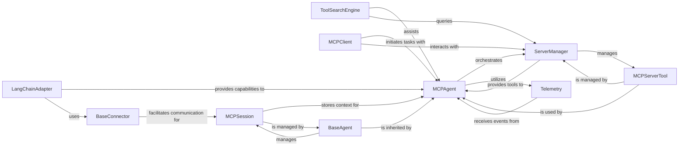

## Details

Abstract Components Overview of mcp-use framework

### MCPAgent
The core AI agent, embodying the framework's central intelligence. It orchestrates task execution, manages conversation flow, and makes decisions based on prompts and available tools.

**Related Classes/Methods**:

- <a href="https://github.com/mcp-use/mcp-use/blob/main/mcp_use/agents/mcpagent.py#L1-L1" target="_blank" rel="noopener noreferrer">`mcp_use.agents.mcpagent.MCPAgent` (1:1)</a>

### ServerManager
Manages the discovery, connection, and lifecycle of external servers and their exposed tools. It provides the MCPAgent with access to available functionalities.

**Related Classes/Methods**:

- <a href="https://github.com/mcp-use/mcp-use/blob/main/mcp_use/managers/server_manager.py#L16-L89" target="_blank" rel="noopener noreferrer">`mcp_use.managers.server_manager.ServerManager` (16:89)</a>

### Telemetry
Handles the reporting of agent actions, significant events, and performance metrics. Essential for debugging, monitoring, and understanding agent behavior.

**Related Classes/Methods**:

- <a href="https://github.com/mcp-use/mcp-use/blob/main/mcp_use/telemetry/telemetry.py#L55-L305" target="_blank" rel="noopener noreferrer">`mcp_use.telemetry.telemetry.Telemetry` (55:305)</a>

### LangChainAdapter
Integrates LangChain-specific tools, prompts, and resources within the mcp-use framework, allowing the agent to leverage LangChain's extensive ecosystem.

**Related Classes/Methods**:

- <a href="https://github.com/mcp-use/mcp-use/blob/main/mcp_use/adapters/langchain_adapter.py#L1-L1" target="_blank" rel="noopener noreferrer">`mcp_use.adapters.langchain_adapter.LangChainAdapter` (1:1)</a>

### MCPSession
Maintains the state and context of an ongoing agent session, including conversational history, active resources, and session-specific configurations.

**Related Classes/Methods**:

- <a href="https://github.com/mcp-use/mcp-use/blob/main/mcp_use/session.py#L1-L1" target="_blank" rel="noopener noreferrer">`mcp_use.session.session.MCPSession` (1:1)</a>

### MCPServerTool
Represents specific functionalities provided by connected servers that the agent can execute. These are the actionable units the agent interacts with.

**Related Classes/Methods**:

- <a href="https://github.com/mcp-use/mcp-use/blob/main/mcp_use/managers/tools/base_tool.py#L5-L18" target="_blank" rel="noopener noreferrer">`mcp_use.managers.tools.base_tool.MCPServerTool` (5:18)</a>

### ToolSearchEngine
Identifies and helps the agent discover and select specific functionalities (tools) provided by connected servers based on the agent's current task or query.

**Related Classes/Methods**:

- <a href="https://github.com/mcp-use/mcp-use/blob/main/mcp_use/managers/tools/search_tools.py#L57-L327" target="_blank" rel="noopener noreferrer">`mcp_use.managers.tools.search_tools.ToolSearchEngine` (57:327)</a>

### MCPClient
Serves as the primary interface through which external systems or users initiate agent tasks and receive results, acting as the entry point to the agent's capabilities.

**Related Classes/Methods**:

- <a href="https://github.com/mcp-use/mcp-use/blob/main/mcp_use/client.py#L1-L1" target="_blank" rel="noopener noreferrer">`mcp_use.client.client.MCPClient` (1:1)</a>

### BaseAgent
An abstract base class defining the fundamental interface and common behaviors for all agents within the framework. MCPAgent inherits from this class.

**Related Classes/Methods**:

- <a href="https://github.com/mcp-use/mcp-use/blob/main/mcp_use/agents/base.py#L1-L1" target="_blank" rel="noopener noreferrer">`mcp_use.agents.base.BaseAgent` (1:1)</a>

### BaseConnector
An abstract base class for various communication connectors (e.g., HTTP, WebSocket, Sandbox). It defines the interface for how the agent interacts with different environments and services.

**Related Classes/Methods**:

- <a href="https://github.com/mcp-use/mcp-use/blob/main/mcp_use/connectors/base.py#L1-L1" target="_blank" rel="noopener noreferrer">`mcp_use.connectors.base.BaseConnector` (1:1)</a>

### [FAQ](https://github.com/CodeBoarding/GeneratedOnBoardings/tree/main?tab=readme-ov-file#faq)