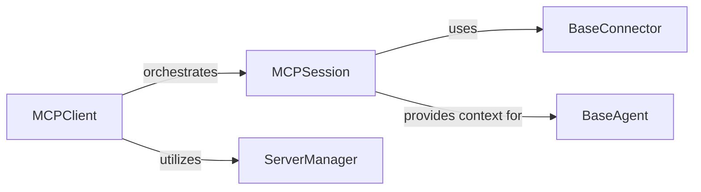

## Details

This component serves as the primary interface for users and agents to interact with multiple MCP servers. It orchestrates server connections, manages individual user sessions, and provides the foundational context for agent interactions by abstracting the underlying communication mechanisms.

### MCPClient
The central entry point for the entire client-side interaction. It manages the lifecycle of multiple `MCPSession` instances, allowing users to connect to and manage various MCP servers. It acts as a facade, simplifying the complexity of server management.

**Related Classes/Methods**:

- <a href="https://github.com/mcp-use/mcp-use/blob/main/mcp_use/client.py" target="_blank" rel="noopener noreferrer">`mcp_use.client.MCPClient`</a>

### MCPSession
Represents a single, active, and isolated connection to a specific MCP server. It encapsulates the state and logic for a particular server interaction, including session initialization, tool discovery, and managing the low-level communication via a `BaseConnector`.

**Related Classes/Methods**:

- <a href="https://github.com/mcp-use/mcp-use/blob/main/mcp_use/session.py" target="_blank" rel="noopener noreferrer">`mcp_use.session.MCPSession`</a>

### ServerManager
Responsible for maintaining a registry of configured MCP servers and their associated details. It handles the addition, retrieval, and management of server configurations, ensuring `MCPClient` has access to available server endpoints.

**Related Classes/Methods**:

- <a href="https://github.com/mcp-use/mcp-use/blob/main/mcp_use/managers/server_manager.py#L16-L89" target="_blank" rel="noopener noreferrer">`mcp_use.managers.server_manager.ServerManager` (16:89)</a>

### BaseConnector
An abstract base class defining the interface for low-level communication with an MCP server. Its concrete implementations handle the specifics of different communication protocols (e.g., HTTP, WebSockets, local sandbox, standard I/O).

**Related Classes/Methods**:

- <a href="https://github.com/mcp-use/mcp-use/blob/main/mcp_use/connectors/base.py" target="_blank" rel="noopener noreferrer">`mcp_use.connectors.base.BaseConnector`</a>

### BaseAgent
An abstract base class for AI agents that interact with MCP servers. It defines the core interface for agents to utilize the tools and resources exposed through an `MCPSession`.

**Related Classes/Methods**:

- <a href="https://github.com/mcp-use/mcp-use/blob/main/mcp_use/agents/base.py" target="_blank" rel="noopener noreferrer">`mcp_use.agents.base.BaseAgent`</a>

### [FAQ](https://github.com/CodeBoarding/GeneratedOnBoardings/tree/main?tab=readme-ov-file#faq)