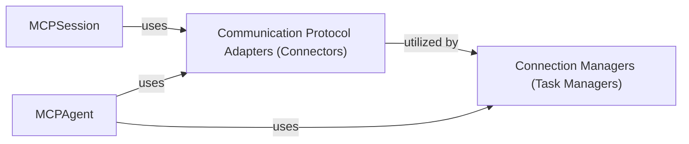

## Details

One paragraph explaining the functionality which is represented by this graph. What the main flow is and what is its purpose.

### Communication Protocol Adapters (Connectors)
This component provides concrete implementations for various communication protocols (HTTP, WebSocket, Stdio, Sandbox). Each adapter adheres to the `BaseConnector` interface, abstracting low-level network complexities. They are responsible for establishing and maintaining raw connections and handling the fundamental details of data transmission and reception. This design aligns with the Adapter Pattern, allowing the system to integrate new communication methods seamlessly.

**Related Classes/Methods**:

- <a href="https://github.com/mcp-use/mcp-use/blob/main/mcp_use/connectors/base.py" target="_blank" rel="noopener noreferrer">`mcp_use.connectors.base.BaseConnector`</a>
- <a href="https://github.com/mcp-use/mcp-use/blob/main/mcp_use/connectors/http.py" target="_blank" rel="noopener noreferrer">`mcp_use.connectors.http.HttpConnector`</a>
- <a href="https://github.com/mcp-use/mcp-use/blob/main/mcp_use/connectors/websocket.py" target="_blank" rel="noopener noreferrer">`mcp_use.connectors.websocket.WebSocketConnector`</a>
- <a href="https://github.com/mcp-use/mcp-use/blob/main/mcp_use/connectors/stdio.py" target="_blank" rel="noopener noreferrer">`mcp_use.connectors.stdio.StdioConnector`</a>
- <a href="https://github.com/mcp-use/mcp-use/blob/main/mcp_use/connectors/sandbox.py" target="_blank" rel="noopener noreferrer">`mcp_use.connectors.sandbox.SandboxConnector`</a>

### Connection Managers (Task Managers)
This component manages the lifecycle and asynchronous operations of established connections, particularly for streaming data and long-running tasks. It defines an abstract interface (`ConnectionManager`) for managing connections. Concrete implementations of `Connection Managers` (e.g., `SseConnectionManager`, `WebSocketConnectionManager`) utilize specific `Communication Protocol Adapters` to establish and manage their respective connections. This component is crucial for the Asynchronous Design and Event-Driven Architecture of the framework, orchestrating the flow of information and managing the state of active communication sessions.

**Related Classes/Methods**:

- <a href="https://github.com/mcp-use/mcp-use/blob/main/mcp_use/task_managers/base.py" target="_blank" rel="noopener noreferrer">`mcp_use.task_managers.base.ConnectionManager`</a>
- <a href="https://github.com/mcp-use/mcp-use/blob/main/mcp_use/task_managers/sse.py" target="_blank" rel="noopener noreferrer">`mcp_use.task_managers.sse.SseConnectionManager`</a>
- <a href="https://github.com/mcp-use/mcp-use/blob/main/mcp_use/task_managers/websocket.py" target="_blank" rel="noopener noreferrer">`mcp_use.task_managers.websocket.WebSocketConnectionManager`</a>
- <a href="https://github.com/mcp-use/mcp-use/blob/main/mcp_use/task_managers/stdio.py" target="_blank" rel="noopener noreferrer">`mcp_use.task_managers.stdio.StdioConnectionManager`</a>
- <a href="https://github.com/mcp-use/mcp-use/blob/main/mcp_use/task_managers/streamable_http.py" target="_blank" rel="noopener noreferrer">`mcp_use.task_managers.streamable_http.StreamableHttpConnectionManager`</a>

### [FAQ](https://github.com/CodeBoarding/GeneratedOnBoardings/tree/main?tab=readme-ov-file#faq)