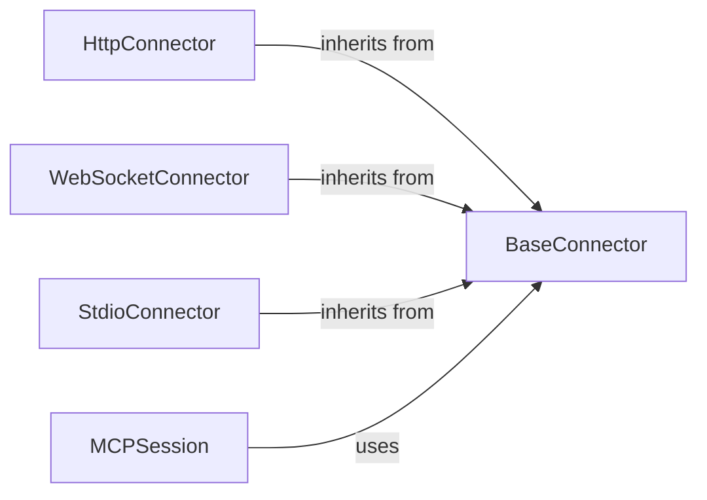

## Details

This analysis outlines the architecture of the `Connector` subsystem, a critical component responsible for abstracting communication protocols within the `mcp-use` framework. The design follows the Adapter and Strategy patterns, where a central `BaseConnector` defines a common interface, and concrete implementations adapt it for specific protocols like HTTP, WebSocket, and even local subprocess I/O.

### BaseConnector
This abstract base class is the cornerstone of the subsystem. It defines the standardized interface (the "contract") for all communication protocols, ensuring that higher-level components can interact with different transport layers in a uniform way.

**Related Classes/Methods**:

- `BaseConnector`

### HttpConnector
As a direct implementation of `BaseConnector`, this component is fundamental for web-based interactions. It adapts the stateless, request-response nature of HTTP and also handles streaming via Server-Sent Events (SSE), making it a versatile and essential connector.

**Related Classes/Methods**:

- `HttpConnector`

### WebSocketConnector
This component provides support for persistent, bidirectional communication, which is critical for real-time, interactive applications. Its existence highlights the framework's capacity for handling more complex, stateful interaction patterns beyond simple HTTP requests.

**Related Classes/Methods**:

- `WebSocketConnector`

### StdioConnector
This connector is architecturally significant because it demonstrates the power of the `BaseConnector` abstraction. By treating a local subprocess's standard I/O as a data stream, it allows the framework to manage and interact with local command-line tools as if they were remote services, unifying local and remote operations.

**Related Classes/Methods**:

- `StdioConnector`

### MCPSession
This component represents the client of the Connector subsystem. It utilizes a `BaseConnector` instance to execute tasks, effectively decoupling the application's core logic from the underlying communication protocol. Its role is essential for understanding the subsystem's purpose and boundaries.

**Related Classes/Methods**:

- `MCPSession`

### [FAQ](https://github.com/CodeBoarding/GeneratedOnBoardings/tree/main?tab=readme-ov-file#faq)