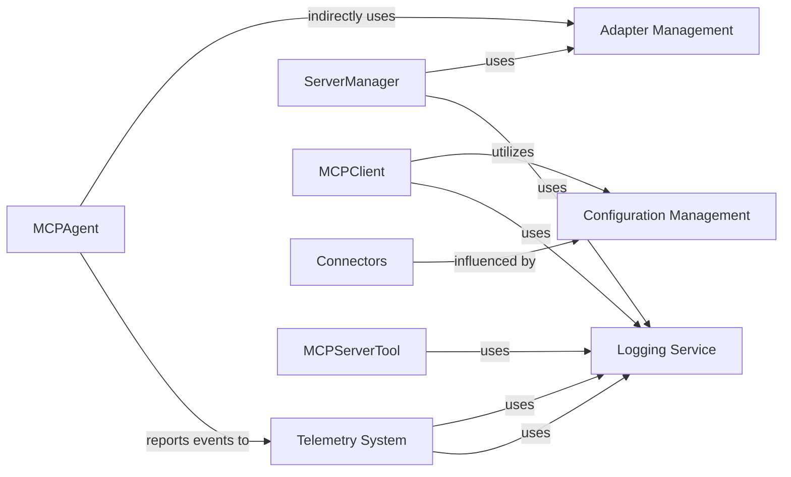

## Details

One paragraph explaining the functionality which is represented by this graph. What the main flow is and what is its purpose.

### Adapter Management
This component provides a standardized way to integrate with various external AI frameworks and tool sources. It leverages the Adapter Pattern to convert and manage tools, resources, and prompts from diverse connectors into a unified format consumable by the MCP framework. This ensures the framework's extensibility and ability to work with a wide range of external systems without tightly coupling to their specific interfaces.

**Related Classes/Methods**:

- <a href="https://github.com/mcp-use/mcp-use/blob/main/mcp_use/adapters/base.py#L1-L1" target="_blank" rel="noopener noreferrer">`mcp_use/adapters/base.py` (1:1)</a>
- <a href="https://github.com/mcp-use/mcp-use/blob/main/mcp_use/adapters/langchain_adapter.py#L1-L1" target="_blank" rel="noopener noreferrer">`mcp_use/adapters/langchain_adapter.py` (1:1)</a>

### Telemetry System
Responsible for collecting, processing, and reporting telemetry data, such as package downloads and agent execution events. This component is vital for monitoring framework usage, understanding performance, and enabling data-driven improvements. It exemplifies an Event-Driven Architecture by capturing and processing various events within the system.

**Related Classes/Methods**:

- <a href="https://github.com/mcp-use/mcp-use/blob/main/mcp_use/telemetry/telemetry.py#L1-L1" target="_blank" rel="noopener noreferrer">`mcp_use/telemetry/telemetry.py` (1:1)</a>
- <a href="https://github.com/mcp-use/mcp-use/blob/main/mcp_use/telemetry/events.py#L1-L1" target="_blank" rel="noopener noreferrer">`mcp_use/telemetry/events.py` (1:1)</a>

### Configuration Management
Provides a centralized mechanism for managing application configurations. It ensures that various parts of the framework can access and utilize consistent settings, promoting configurability, ease of deployment, and adaptability to different environments. This component is crucial for maintaining the framework's flexibility.

**Related Classes/Methods**:

- <a href="https://github.com/mcp-use/mcp-use/blob/main/mcp_use/config.py#L1-L1" target="_blank" rel="noopener noreferrer">`mcp_use/config.py` (1:1)</a>

### Logging Service
Offers a centralized and consistent logging mechanism across the entire framework. It's used by various components to record events, debug information, warnings, and errors, which is crucial for monitoring, troubleshooting, and auditing the framework's operations. This promotes maintainability and provides visibility into the system's behavior.

**Related Classes/Methods**:

- <a href="https://github.com/mcp-use/mcp-use/blob/main/mcp_use/logging.py#L1-L1" target="_blank" rel="noopener noreferrer">`mcp_use/logging.py` (1:1)</a>

### [FAQ](https://github.com/CodeBoarding/GeneratedOnBoardings/tree/main?tab=readme-ov-file#faq)