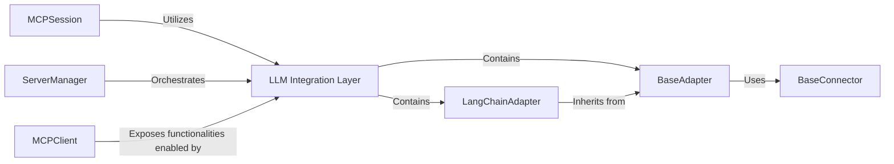

## Details

One paragraph explaining the functionality which is represented by this graph. What the main flow is and what is its purpose.

### LLM Integration Layer [[Expand]](./LLM_Integration_Layer.md)
Offers a pluggable and standardized interface for integrating the `mcp-use` library with various external Large Language Model (LLM) frameworks (e.g., LangChain) and other external tool ecosystems. It translates `mcp-use`'s internal agent requests, tools, resources, and prompts into framework-specific formats, facilitating interaction with LLMs and external tools. This enables the agent to leverage advanced AI capabilities for reasoning and generation, as well as utilize a diverse set of external functionalities.

**Related Classes/Methods**:

- <a href="https://github.com/mcp-use/mcp-use/blob/main/mcp_use/adapters/langchain_adapter.py" target="_blank" rel="noopener noreferrer">`mcp_use.adapters.langchain_adapter`</a>
- <a href="https://github.com/mcp-use/mcp-use/blob/main/mcp_use/adapters/base.py" target="_blank" rel="noopener noreferrer">`mcp_use.adapters.base`</a>

### BaseAdapter
Defines the foundational interface for adapting various `mcp-use` entities (tools, resources, prompts) into formats compatible with external frameworks. It also provides common methods for creating and loading tools, potentially involving different connectors. This component is crucial for the extensibility of the LLM Integration Layer.

**Related Classes/Methods**:

- <a href="https://github.com/mcp-use/mcp-use/blob/main/mcp_use/adapters/base.py" target="_blank" rel="noopener noreferrer">`mcp_use.adapters.base`</a>

### LangChainAdapter
A concrete implementation of `BaseAdapter` specialized for handling LangChain-specific tool conversions and schema adjustments. It translates `mcp-use` tools, resources, and prompts into LangChain-compatible formats, enabling interaction with LangChain-based LLMs and tools. This demonstrates the pluggable nature of the LLM Integration Layer.

**Related Classes/Methods**:

- <a href="https://github.com/mcp-use/mcp-use/blob/main/mcp_use/adapters/langchain_adapter.py" target="_blank" rel="noopener noreferrer">`mcp_use.adapters.langchain_adapter`</a>

### BaseConnector
Represents the underlying connection mechanism for tools, providing the means for adapters to interact with external services or APIs.

**Related Classes/Methods**:

- <a href="https://github.com/mcp-use/mcp-use/blob/main/mcp_use/connectors/base.py" target="_blank" rel="noopener noreferrer">`mcp_use.connectors.base.BaseConnector`</a>

### ServerManager
Orchestrates the use of adapters for tool management, likely responsible for selecting and configuring the appropriate adapter based on the agent's needs or system configuration.

**Related Classes/Methods**:

- <a href="https://github.com/mcp-use/mcp-use/blob/main/mcp_use/managers/server_manager.py#L16-L89" target="_blank" rel="noopener noreferrer">`mcp_use.managers.server_manager.ServerManager` (16:89)</a>

### MCPSession
The central orchestrator within the `mcp-use` library that utilizes the LLM Integration Layer to leverage LLM and external tool capabilities for agent reasoning and action execution.

**Related Classes/Methods**:

- <a href="https://github.com/mcp-use/mcp-use/blob/main/mcp_use/session.py" target="_blank" rel="noopener noreferrer">`mcp_use.session.MCPSession`</a>

### MCPClient
The primary entry point for external applications to interact with the `mcp-use` library, indirectly exposing functionalities enabled by the LLM Integration Layer to facilitate agent-driven operations.

**Related Classes/Methods**:

- <a href="https://github.com/mcp-use/mcp-use/blob/main/mcp_use/client.py" target="_blank" rel="noopener noreferrer">`mcp_use.client.MCPClient`</a>

### [FAQ](https://github.com/CodeBoarding/GeneratedOnBoardings/tree/main?tab=readme-ov-file#faq)