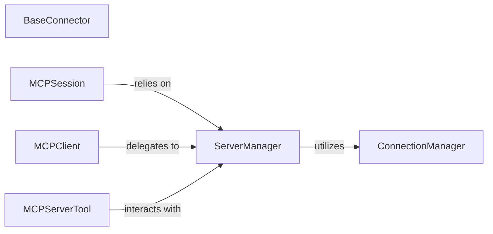

## Details

One paragraph explaining the functionality which is represented by this graph. What the main flow is and what is its purpose.

### BaseConnector
Defines the abstract interface and contract for various communication protocols (e.g., HTTP, WebSocket, Stdio, Sandbox). It serves as the foundational abstraction for protocol-specific implementations.

**Related Classes/Methods**:

- `mcp_use.connectors` (1:1)

### ConnectionManager
Manages the lifecycle of individual protocol-level connections, building upon the BaseConnector interface. This includes establishing, maintaining, and terminating connections, ensuring reliable message exchange at a granular level.

**Related Classes/Methods**:

- `mcp_use.connectors` (1:1)

### ServerManager
Manages connections to MCP servers, including establishing, terminating, and listing active server connections. It orchestrates the use of underlying ConnectionManager instances to interact with servers.

**Related Classes/Methods**:

- <a href="https://github.com/mcp-use/mcp-use/blob/main/mcp_use/session.py#L1-L1" target="_blank" rel="noopener noreferrer">`mcp_use.session` (1:1)</a>

### MCPSession
Manages the overall session with the MCP system, coordinating higher-level interactions between agents, servers, and tools. It acts as a central orchestrator for MCP interactions, ensuring reliable message exchange and session state management.

**Related Classes/Methods**:

- <a href="https://github.com/mcp-use/mcp-use/blob/main/mcp_use/session.py#L1-L1" target="_blank" rel="noopener noreferrer">`mcp_use.session` (1:1)</a>

### MCPClient
Serves as the primary entry point for external applications to interact with the mcp-use library's communication capabilities. It provides a simplified API for initiating and managing communication with MCP servers and sessions.

**Related Classes/Methods**:

- <a href="https://github.com/mcp-use/mcp-use/blob/main/mcp_use/client.py#L1-L1" target="_blank" rel="noopener noreferrer">`mcp_use.client` (1:1)</a>

### MCPServerTool
Provides a base for tools that directly interact with MCP servers, such as connecting, disconnecting, searching for, and utilizing tools. It represents the interface for tools that leverage the communication layer's capabilities.

**Related Classes/Methods**:

- `mcp_use.task_managers` (1:1)

### [FAQ](https://github.com/CodeBoarding/GeneratedOnBoardings/tree/main?tab=readme-ov-file#faq)