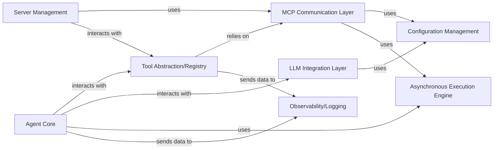

## Details

One paragraph explaining the functionality which is represented by this graph. What the main flow is and what is its purpose.

### Agent Core [[Expand]](./Agent_Core.md)
The central orchestrator of the AI agent, responsible for decision-making, task planning, and coordinating interactions between various components, including tool execution and LLM interactions.

**Related Classes/Methods**:

- <a href="https://github.com/mcp-use/mcp-use/blob/main/mcp_use/agents/mcpagent.py" target="_blank" rel="noopener noreferrer">`mcp_use.agents.mcpagent.MCPAgent`</a>

### Tool Abstraction/Registry [[Expand]](./Tool_Abstraction_Registry.md)
Provides a standardized interface for the Agent Core to discover, list, activate, and execute tools exposed by remote MCP servers. It abstracts the underlying communication complexities with the MCP Communication Layer, allowing the agent to seamlessly interact with external functionalities.

**Related Classes/Methods**:

- <a href="https://github.com/mcp-use/mcp-use/blob/main/mcp_use/managers/tools/base_tool.py#L5-L18" target="_blank" rel="noopener noreferrer">`mcp_use.managers.tools.base_tool.MCPServerTool` (5:18)</a>
- <a href="https://github.com/mcp-use/mcp-use/blob/main/mcp_use/managers/tools/search_tools.py#L57-L327" target="_blank" rel="noopener noreferrer">`mcp_use.managers.tools.search_tools.ToolSearchEngine` (57:327)</a>
- <a href="https://github.com/mcp-use/mcp-use/blob/main/mcp_use/managers/tools/search_tools.py#L22-L54" target="_blank" rel="noopener noreferrer">`mcp_use.managers.tools.search_tools.SearchToolsTool` (22:54)</a>
- <a href="https://github.com/mcp-use/mcp-use/blob/main/mcp_use/managers/tools/use_tool.py#L21-L153" target="_blank" rel="noopener noreferrer">`mcp_use.managers.tools.use_tool.UseToolFromServerTool` (21:153)</a>
- <a href="https://github.com/mcp-use/mcp-use/blob/main/mcp_use/managers/tools/connect_server.py#L15-L68" target="_blank" rel="noopener noreferrer">`mcp_use.managers.tools.connect_server.ConnectServerTool` (15:68)</a>
- <a href="https://github.com/mcp-use/mcp-use/blob/main/mcp_use/managers/tools/disconnect_server.py#L15-L42" target="_blank" rel="noopener noreferrer">`mcp_use.managers.tools.disconnect_server.DisconnectServerTool` (15:42)</a>
- <a href="https://github.com/mcp-use/mcp-use/blob/main/mcp_use/managers/tools/get_active_server.py#L13-L28" target="_blank" rel="noopener noreferrer">`mcp_use.managers.tools.get_active_server.GetActiveServerTool` (13:28)</a>
- <a href="https://github.com/mcp-use/mcp-use/blob/main/mcp_use/managers/tools/list_servers_tool.py#L15-L51" target="_blank" rel="noopener noreferrer">`mcp_use.managers.tools.list_servers_tool.ListServersTool` (15:51)</a>

### MCP Communication Layer [[Expand]](./MCP_Communication_Layer.md)
Handles the low-level communication protocols and mechanisms for connecting to, sending requests to, and receiving responses from remote MCP servers. It manages network connections and data serialization/deserialization.

**Related Classes/Methods**:

- <a href="https://github.com/mcp-use/mcp-use/blob/main/mcp_use/connectors/base.py" target="_blank" rel="noopener noreferrer">`mcp_use.connectors.base.BaseConnector`</a>

### LLM Integration Layer [[Expand]](./LLM_Integration_Layer.md)
Provides a unified interface for interacting with various Large Language Models (LLMs), abstracting away the specifics of different LLM providers (e.g., OpenAI, Anthropic) and frameworks (e.g., LangChain). It handles prompt formatting, response parsing, and model invocation.

**Related Classes/Methods**:

- <a href="https://github.com/mcp-use/mcp-use/blob/main/mcp_use/adapters/langchain_adapter.py" target="_blank" rel="noopener noreferrer">`mcp_use.adapters.langchain_adapter.LangChainAdapter`</a>

### Server Management
Responsible for managing the lifecycle of connections to MCP servers, including connecting, disconnecting, listing active servers, and retrieving server-specific information. It ensures reliable and persistent server interactions.

**Related Classes/Methods**:

- <a href="https://github.com/mcp-use/mcp-use/blob/main/mcp_use/managers/server_manager.py#L16-L89" target="_blank" rel="noopener noreferrer">`mcp_use.managers.server_manager.ServerManager` (16:89)</a>

### Configuration Management
Manages the loading, parsing, and access of application-wide configurations, including API keys, server endpoints, and other operational parameters. It ensures the system operates with correct settings.

**Related Classes/Methods**: _None_

### Asynchronous Execution Engine
Provides mechanisms for executing tasks asynchronously, enabling non-blocking operations and improving the responsiveness and scalability of the agent. It manages concurrent execution of various agent processes.

**Related Classes/Methods**: _None_

### Observability/Logging
Provides mechanisms for monitoring the agent's runtime behavior, capturing logs, metrics, and traces to aid in debugging, performance analysis, and operational insights.

**Related Classes/Methods**:

- <a href="https://github.com/mcp-use/mcp-use/blob/main/mcp_use/telemetry/telemetry.py#L55-L305" target="_blank" rel="noopener noreferrer">`mcp_use.telemetry.telemetry.Telemetry` (55:305)</a>

### [FAQ](https://github.com/CodeBoarding/GeneratedOnBoardings/tree/main?tab=readme-ov-file#faq)