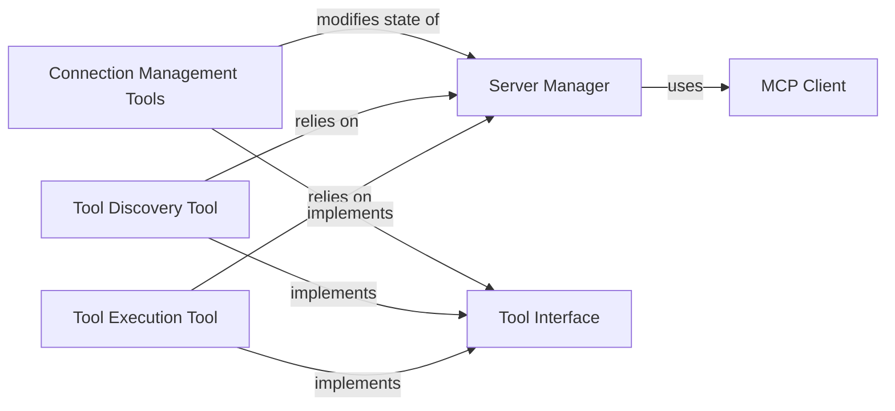

## Details

One paragraph explaining the functionality which is represented by this graph. What the main flow is and what is its purpose.

### Server Manager
The central facade and state manager for server interactions. It orchestrates the connection lifecycle and tool management, providing a simplified interface for the tools to use. It holds the active server state and delegates communication tasks to the MCP Client.

**Related Classes/Methods**:

- <a href="https://github.com/mcp-use/mcp-use/blob/main/mcp_use/managers/server_manager.py#L16-L89" target="_blank" rel="noopener noreferrer">`mcp_use.managers.server_manager.ServerManager` (16:89)</a>

### Tool Interface
An abstract base class (`MCPServerTool`) that defines a common interface for all server-related tools. It ensures consistency in how tools are structured, named, and executed.

**Related Classes/Methods**:

- <a href="https://github.com/mcp-use/mcp-use/blob/main/mcp_use/managers/tools/base_tool.py#L5-L18" target="_blank" rel="noopener noreferrer">`mcp_use.managers.tools.base_tool.MCPServerTool` (5:18)</a>

### Connection Management Tools
A set of concrete tools (`ConnectServerTool`, `DisconnectServerTool`, `ListServersTool`) that expose server connection and lifecycle operations to an agent. These tools directly manipulate the state of the Server Manager.

**Related Classes/Methods**:

- `mcp_use.managers.tools.connect_server`
- `mcp_use.managers.tools.disconnect_server`
- `mcp_use.managers.tools.list_servers`

### Tool Discovery Tool
A concrete tool (`SearchToolsTool`) that allows an agent to query a connected server for a list of its available tools, enabling dynamic capability discovery.

**Related Classes/Methods**:

- <a href="https://github.com/mcp-use/mcp-use/blob/main/mcp_use/managers/tools/search_tools.py#L22-L54" target="_blank" rel="noopener noreferrer">`mcp_use.managers.tools.search_tools.SearchToolsTool` (22:54)</a>

### Tool Execution Tool
The primary tool (`UseToolFromServerTool`) for executing a specified function on a remote server. It relies on the Server Manager to handle the underlying connection and tool invocation.

**Related Classes/Methods**:

- <a href="https://github.com/mcp-use/mcp-use/blob/main/mcp_use/managers/tools/use_tool.py#L21-L153" target="_blank" rel="noopener noreferrer">`mcp_use.managers.tools.use_tool.UseToolFromServerTool` (21:153)</a>

### MCP Client
A client responsible for handling the low-level communication with remote servers. It manages server configurations and sessions, including the underlying connectors used to send and receive data. It is used by the Server Manager to perform its tasks.

**Related Classes/Methods**:

- `mcp_use.managers.client.Client`

### [FAQ](https://github.com/CodeBoarding/GeneratedOnBoardings/tree/main?tab=readme-ov-file#faq)